## DETALLE DEL PROYECTO GADGETPLUS

<details>
<summary><strong>🚀DETALLE DE LA BASE DE DATOS</strong></summary>
¡Excelente pregunta! **NO, es al revés.** El `CASCADE` funciona en la **dirección de la relación**.

## 🤓**¿Cómo funciona realmente?**

```sql
CREATE TABLE orders
(
    id          BIGSERIAL PRIMARY KEY,
    created_at  TIMESTAMP          NOT NULL,
    client_name VARCHAR(32)        NOT NULL,
    id_bill     VARCHAR(64) UNIQUE NOT NULL,
    FOREIGN KEY (id_bill) REFERENCES bill (id) ON DELETE CASCADE
);
```

### **La relación es:**

- `orders.id_bill` **REFERENCIA** → `bill.id`
- `orders` es la tabla **"hija"**
- `bill` es la tabla **"padre"**

### **¿Qué pasa con CASCADE?**

#### **❌ Lo que NO pasa:**

```sql
-- Si borras una ORDER, el BILL NO se borra
DELETE
FROM orders
WHERE id = 1;
-- ↑ Solo se borra la orden, la factura queda intacta
```

#### **✅ Lo que SÍ pasa:**

```sql
-- Si borras un BILL, todas las ORDERS relacionadas SE BORRAN
DELETE
FROM bill
WHERE id = 'FACT001';
-- ↑ Se borra la factura Y todas las órdenes que referencian esa factura
```

## **Ejemplo práctico:**

### **Datos iniciales:**

```sql
-- Tabla bill (facturas)
bill
:
| id       | total_amount | client_rfc    |
|----------|--------------|---------------|
| FACT001  | 1500.00      | XAXX010101000 |
| FACT002  | 2000.00      | YBYY020202000 |

-- Tabla orders (órdenes)
orders:
| id | created_at          | client_name | id_bill |
|----|---------------------|-------------|---------|
| 1  | 2025-11-15 10:00:00 | Juan Pérez  | FACT001 |
| 2  | 2025-11-15 11:00:00 | Ana García  | FACT001 |
| 3  | 2025-11-15 12:00:00 | Luis López  | FACT002 |
```

### **Escenario 1: Borrar una ORDER**

```sql
DELETE
FROM orders
WHERE id = 1;

-- RESULTADO:
-- ✅ Se borra la orden id=1
-- ✅ La factura FACT001 sigue existiendo
-- ✅ La orden id=2 sigue existiendo (misma factura)
```

### **Escenario 2: Borrar un BILL (con CASCADE)**

```sql
DELETE
FROM bill
WHERE id = 'FACT001';

-- RESULTADO:
-- ✅ Se borra la factura FACT001
-- ✅ Se borran automáticamente las órdenes id=1 y id=2 (CASCADE)
-- ✅ La orden id=3 sigue existiendo (factura FACT002)
```

## **¿Por qué es así el diseño?**

### **Lógica de negocio:**

```sql
-- Una FACTURA puede tener varias ÓRDENES
bill
(1)
←→ (muchos) orders

-- Si cancelo una factura → cancelo todas sus órdenes
-- Si cancelo una orden → la factura puede seguir existiendo
```

## **Otros ejemplos de CASCADE en el script:**

```sql
-- products → orders (si borro orden, se borran sus productos)
FOREIGN KEY (id_order) REFERENCES orders(id) ON DELETE
CASCADE

-- products → products_catalog (si borro del catálogo, se borran de órdenes)
FOREIGN KEY (id_product_catalog) REFERENCES products_catalog(id) ON DELETE
CASCADE
```

## **¿Sin CASCADE qué pasaría?**

```sql
-- Sin CASCADE
DELETE
FROM bill
WHERE id = 'FACT001';
-- ERROR: No se puede borrar porque hay órdenes que lo referencian

-- Tendrías que borrar manualmente:
DELETE
FROM orders
WHERE id_bill = 'FACT001'; -- Primero las órdenes
DELETE
FROM bill
WHERE id = 'FACT001'; -- Después la factura
```

**¿Te queda claro ahora la dirección del CASCADE?** Es siempre **del padre hacia los hijos**. 🔄

## 💡 Nemotécnica simple:

"mappedBy = PADRE"
"@JoinColumn = HIJO"

**¡Tu regla es perfecta para identificar relaciones! ** ✨🤓

¡**EXACTO**! 🎯 **Esa es la regla más confiable.**

---

## ✅ **Regla de oro técnica:**

> **"El que tiene la Foreign Key es PROPIETARIO e HIJO"**

---

## 📊 **En todas tus tablas:**

### **1. orders ↔ products**

```sql
CREATE TABLE products (
    id_product_catalog UUID,     -- ← FK
    id_order BIGINT,             -- ← FK  
    FOREIGN KEY (id_order) REFERENCES orders(id)
);
```

**Resultado:** `products` tiene FK → `products` es HIJO

### **2. orders ↔ bill**

```sql
CREATE TABLE orders (
    id_bill VARCHAR(64),         -- ← FK
    FOREIGN KEY (id_bill) REFERENCES bill(id)
);
```

**Resultado:** `orders` tiene FK → `orders` es HIJO

### **3. products ↔ products_catalog**

```sql
CREATE TABLE products (
    id_product_catalog UUID,     -- ← FK
    FOREIGN KEY (id_product_catalog) REFERENCES products_catalog(id)
);
```

**Resultado:** `products` tiene FK → `products` es HIJO

---

## 🎯 **Traducción directa a JPA:**

### **Patrón constante:**

```java
// El que tiene FK = HIJO (propietario)
@ManyToOne  // o @OneToOne
@JoinColumn(name = "foreign_key_column")    // ← @JoinColumn = HIJO
private ParentEntity parent;

// El que NO tiene FK = PADRE (inverso) 
@OneToMany(mappedBy = "parent")             // ← mappedBy = PADRE
private List<ChildEntity> children;
```

---

## 📋 **Resumen de tu schema:**

| Tabla              | ¿Tiene FK?                          | Rol   | JPA           |
|:-------------------|:------------------------------------|:------|:--------------|
| `products`         | ✅ Sí (id_order, id_product_catalog) | HIJO  | `@JoinColumn` |
| `orders`           | ✅ Sí (id_bill)                      | HIJO  | `@JoinColumn` |
| `bill`             | ❌ No                                | PADRE | `mappedBy`    |
| `products_catalog` | ❌ No                                | PADRE | `mappedBy`    |

---

## 💡 **¿Por qué es la regla más confiable?**

### **La FK determina:**

- ✅ **Dependencia técnica:** El que tiene FK depende del otro
- ✅ **Control de relación:** El que tiene FK puede modificarla
- ✅ **Responsabilidad:** El que tiene FK "posee" la relación

### **Vs criterios conceptuales que pueden confundir:**

- 🤔 "¿Quién es más importante?" → Subjetivo
- 🤔 "¿Quién se crea primero?" → Puede variar
- 🤔 "¿Quién depende de quién?" → A veces ambiguo

---

## ✅ **Tu entendimiento es perfecto:**

**FK = PROPIETARIO = HIJO = @JoinColumn**  
**No FK = INVERSO = PADRE = mappedBy**

**Esta regla técnica nunca falla. ** 🎯✨

</details>


<details>
<summary><strong>🚀 CARDINALIDAD ENTRE LAS TABLAS </strong></summary>


## 📊RESUMEN Y EXPLICACION

### 🗃️ Relaciones entre Tablas en Base de Datos

### 📊 Sistema de Órdenes, Productos y Catálogo

---

## 🎯 **RELACIÓN: orders → products (1:N)**

> 📋 **Una orden puede contener múltiples productos**
> RELACION DE ORDER A PRODUCTS ->
> * 1:N UNA MISMA ORDEN PUEDE TENER VARIAS FILAS O ITEMS

* orders → products: 1:N (una orden puede tener muchas filas/ítems en products)

>
> * En la tabla products, el campo id_order indica a qué orden pertenece cada línea de producto.

* Por lo tanto, un mismo valor de id_order puede aparecer en varias filas de la tabla products.

**Tipo:** `1:N` (Una orden → Muchos productos)

### 📦 Tabla: `products`

```
┌────┬─────────────────────┬──────────┬──────────┐
│ 🆔 │     🏷️ Producto     │ 📑 Orden │ 🔢 Cant. │
├────┼─────────────────────┼──────────┼──────────┤
│  1 │ UUID1               │    1     │    2     │
│  2 │ UUID2               │    1     │    1     │
│  3 │ UUID3               │    2     │    1     │
│  4 │ UUID2               │    2     │    1     │
└────┴─────────────────────┴──────────┴──────────┘
```

* Las filas 1 y 2 pertenecen al pedido (order) número 1.
* Las filas 3 y 4 pertenecen al pedido (order) número 2.

**💡 Interpretación:** La orden #1 tiene 2 productos diferentes, la orden #2 también tiene 2 productos.

# 🤓🤓¿POR QUE NO PODRIA SER DESDE ORDER DE N:M O DE N:1?

¡Exacto! 🎯 Entiendo perfectamente lo que quieres ver. Si fuera una relación **N:M** entre `orders` y `products`,
necesitarías algo así:

---

## ❌ **Opción 1: Array en una columna (NO recomendado)**

**Tipo:** `N:M` (Muchas órdenes ↔ Muchos productos)

### 📦 Tabla: `products`

```
┌────┬─────────────────────┬─────────────────┬──────────┐
│ 🆔 │     🏷️ Producto     │   📑 Órdenes    │ 🔢 Cant. │
├────┼─────────────────────┼─────────────────┼──────────┤
│  1 │ UUID1               │ [1, 2, 3, 5]    │    2     │
│  2 │ UUID2               │ [1, 4]          │    1     │
│  3 │ UUID3               │ [2, 6]          │    1     │
│  4 │ UUID4               │ [2, 3, 7]       │    1     │
└────┴─────────────────────┴─────────────────┴──────────┘
```

**💡 Interpretación:**

- UUID1 (producto) está en las órdenes 1, 2, 3, 5
- UUID2 (producto) está en las órdenes 1, 4
- UUID3 (producto) está en las órdenes 2, 6

---

## ✅ **Opción 2: Tabla intermedia (RECOMENDADO para N:M)**

**Tipo:** `N:M` (Muchas órdenes ↔ Muchos productos)

### 📦 Tabla intermedia: `orders_products`

```
┌────┬──────────┬─────────────────────┬──────────┐
│ 🆔 │ 📑 Orden │     🏷️ Producto     │ 🔢 Cant. │
├────┼──────────┼─────────────────────┼──────────┤
│  1 │    1     │ UUID1               │    2     │
│  2 │    1     │ UUID2               │    1     │
│  3 │    2     │ UUID1               │    1     │ ← UUID1 en múltiples órdenes
│  4 │    2     │ UUID3               │    1     │
│  5 │    3     │ UUID1               │    3     │ ← UUID1 en múltiples órdenes
│  6 │    4     │ UUID2               │    2     │ ← UUID2 en múltiples órdenes
│  7 │    5     │ UUID1               │    1     │ ← UUID1 en múltiples órdenes
└────┴──────────┴─────────────────────┴──────────┘
```

**💡 Interpretación N:M:**

- **UUID1** aparece en órdenes: 1, 2, 3, 5 (un producto en muchas órdenes) ✅
- **Orden 1** tiene productos: UUID1, UUID2 (una orden con muchos productos) ✅

---

## 🤔 **¿Por qué tu estructura actual NO es N:M?**

En tu estructura actual:

```sql
id_order BIGINT  -- Una sola orden por fila
```

Para N:M necesitarías:

```sql
id_orders BIGINT[]  -- Múltiples órdenes por fila (array)
```

O una tabla intermedia separada.

---

## 📊 **Comparación:**

| Tipo                | orders → products       | products → orders       | Estructura                |
|:--------------------|:------------------------|:------------------------|:--------------------------|
| **Tu actual (1:N)** | 1 orden → N productos   | N productos → 1 orden   | `products` con `id_order` |
| **N:M hipotético**  | N órdenes → N productos | N productos → N órdenes | Tabla intermedia o arrays |

---

## 🔄 **RELACIÓN: products → orders (N:1)**

> 🎯 **Muchos registros de productos apuntan a la misma orden**
> products → orders: N:1 (muchos registros en products pueden apuntar al mismo pedido)
> id de productos apunta dos veces a id_order
>
**Tipo:** `N:1` (Muchos productos → Una orden)

### 📦 Tabla: `products`

```
┌────┬─────────────────────┬──────────┬──────────┐
│ 🆔 │     🏷️ Producto     │ 📑 Orden │ 🔢 Cant. │
├────┼─────────────────────┼──────────┼──────────┤
│  1 │ UUID1               │    1     │    2     │
│  2 │ UUID2               │    1     │    1     │ ← Misma orden
│  3 │ UUID3               │    2     │    1     │
│  4 │ UUID2               │    2     │    1     │ ← Misma orden
└────┴─────────────────────┴──────────┴──────────┘
```

**💡 Interpretación:** Varios productos (filas 1-2) pertenecen a la orden #1.

## ¿se que esto ya me lo explicaste pero no seria valido decir que la columna id_order al tener distintos pedidos u ordenes por ejemplo 4 ordenes o pedidos puedne contener varios registros de catalogo y seria tambien desde order a products N:M? o no es logico

RELACION DE ORDER A PRODUCTS ->
*******************************
1:N UNA MISMA ORDEN PUEDE TENER VARIAS FILAS O ITEMS
orders → products: 1:N (una orden puede tener muchas filas/ítems en products)

products
id | id_product_catalog | id_order | quantity
---------------------------------------------
1 | UUID1 | 1 | 2
2 | UUID2 | 2 | 1
3 | UUID3 | 3 | 1
4 | UUID2 | 4 | 1
?
¡Excelente pregunta! Vamos a aclarar esto porque es una confusión común pero importante de entender. 🤔

## 🚫 **No es N:M - Sigue siendo 1:N**

La relación **orders → products** es **1:N**, **NO N:M**, y aquí te explico por qué:

---

## 🔍 **Análisis de tu ejemplo:**

```
products
id | id_product_catalog | id_order | quantity
---------------------------------------------
1  | UUID1              |   1      |   2
2  | UUID2              |   2      |   1
3  | UUID3              |   3      |   1
4  | UUID2              |   4      |   1
```

### 📊 **Lo que vemos aquí:**

- **Orden 1** → tiene 1 producto (UUID1)
- **Orden 2** → tiene 1 producto (UUID2)
- **Orden 3** → tiene 1 producto (UUID3)
- **Orden 4** → tiene 1 producto (UUID2)

---

## 🎯 **¿Por qué es 1:N y no N:M?**

### 🔑 **Clave:** Cada registro en `products` pertenece a **UNA SOLA orden**

- ✅ Una orden puede tener **muchos productos** (múltiples filas en `products`)
- ❌ Un registro en `products` **NO puede** pertenecer a múltiples órdenes simultáneamente

### 📝 **Ejemplo para que sea 1:N (una orden, múltiples productos):**

```
products
id | id_product_catalog | id_order | quantity
---------------------------------------------
1  | UUID1              |   1      |   2      ← Orden 1
2  | UUID2              |   1      |   1      ← Orden 1 (misma orden)
3  | UUID3              |   1      |   3      ← Orden 1 (misma orden)
4  | UUID4              |   2      |   1      ← Orden 2
```

**Aquí sí se ve claramente el 1:N:**

- Orden 1 → 3 productos diferentes (filas 1, 2, 3)
- Orden 2 → 1 producto (fila 4)

---

## 🤷‍♂️ **¿Por qué tu ejemplo puede confundir?**

Tu ejemplo muestra **una fila por orden**, lo que puede parecer 1:1, pero la **estructura de la tabla** permite 1:N.

- El hecho de que **diferentes órdenes** tengan productos no cambia la relación.
- Lo importante es que **una orden específica** puede tener **múltiples registros** en `products`.

---

## 🧠 **Para que fuera N:M necesitarías:**

Una situación donde un **registro en products** pudiera pertenecer a **múltiples órdenes**, algo como:

```sql
-- ❌ ESTO NO EXISTE en tu esquema
id
| id_product_catalog | id_orders (múltiples) | quantity
----------------------------------------------------------
1  | UUID1              | [1, 2, 3]             |   2
```

Pero esto **no es posible** con tu diseño actual.

---

## ✅ **Conclusión:**

- **orders → products: 1:N** ✅ (correcto)
- **orders → products: N:M** ❌ (incorrecto)

La relación **N:M** está entre **orders ↔ products_catalog** (a través de la tabla intermedia `products`).

---

## ¿claro eso queria decir?

-- ❌ ESTO NO EXISTE en tu esquema
id | id_product_catalog | id_orders (múltiples) | quantity
----------------------------------------------------------
1 | UUID1 | [1, 2, 3]             | 2

¡Exacto! 🎯 **Ahora entiendo perfectamente tu punto.**

---

## 🧠 **Tu razonamiento era correcto:**

Estabas pensando: *"Si un registro en `products` pudiera pertenecer a múltiples órdenes simultáneamente, entonces sería
N:M"*.

**Y tienes razón** — eso sí haría la relación N:M.

---

## 🚫 **Por qué NO es N:M en tu esquema actual:**

### Tu diseño actual:

```sql
CREATE TABLE products
(
    id                 BIGSERIAL PRIMARY KEY,
    quantity           INT DEFAULT 1,
    id_product_catalog UUID,
    id_order           BIGINT, ←
    UNA                SOLA orden
    por
    registro
    FOREIGN
    KEY
(
    id_order
) REFERENCES orders
(
    id
)
    );
```

**Limitación:** Cada fila de `products` solo puede tener **UN** `id_order`.

---

## ✅ **Para que fuera N:M necesitarías:**

### Opción 1: Array de órdenes (como mencionaste)

```sql
-- ❌ NO ESTÁ en tu esquema
id
| id_product_catalog | id_orders    | quantity
-------------------------------------------------
1  | UUID1              | [1, 2, 3]    |   2
2  | UUID2              | [1, 4]       |   1
```

### Opción 2: Tabla intermedia orders_products

```sql
-- ❌ TAMPOCO está en tu esquema
CREATE TABLE orders_products
(
    id_order   BIGINT,
    id_product BIGINT,
    quantity   INT,
    PRIMARY KEY (id_order, id_product)
);
```

---

## 🎯 **En tu diseño actual:**

- **Una orden** puede tener muchos productos (múltiples filas en `products`)
- **Un registro en products** pertenece a una sola orden
- Por eso es **1:N**, no **N:M**

**La relación N:M** ocurre a nivel más alto:

- `orders` ↔ `products_catalog` (a través de la tabla intermedia `products`)

---

## 💡 **Resumen de tu insight:**

```
SI tuvieras:        ENTONCES sería:
id_orders [1,2,3]  →  N:M ✅
id_order 1          →  1:N ✅ (tu caso actual)
```

**¡Muy buena observación conceptual!** 🧠✨

---

## 🧩 **RELACIÓN: products → products_catalog (N:1)**

**En products tienes el campo id_product_catalog que es una clave foránea**

```sql

id_product_catalog
UUID,
FOREIGN KEY (id_product_catalog) REFERENCES products_catalog(id) ON DELETE
CASCADE

```

> 📚 **El mismo producto del catálogo puede pedirse en múltiples órdenes**
>
> **products → products_catalog**: N:1 (muchos registros de products pueden pedir el mismo ítem del catálogo)

**Tipo:** `N:1` (Muchos pedidos → Un producto del catálogo)

### 📦 Tabla: `products`

```
┌────┬─────────────────────────┬──────────┬──────────┐
│ 🆔 │    🖥️ Producto Cat.    │ 📑 Orden │ 🔢 Cant. │
├────┼─────────────────────────┼──────────┼──────────┤
│  1 │ UUID1 (💻 laptop)      │    1     │    2     │ ← Mismo producto
│  2 │ UUID1 (💻 laptop)      │    2     │    1     │ ← Mismo producto
│  3 │ UUID1 (💻 laptop)      │    3     │    1     │ ← Mismo producto
│  4 │ UUID1 (💻 laptop)      │    4     │    1     │ ← Mismo producto
└────┴─────────────────────────┴──────────┴──────────┘
```

**💡** Cada fila en products representa un producto del catálogo que ha sido pedido en una orden.

**💡 Interpretación:** La misma laptop se ha pedido en 4 órdenes diferentes.

**Ejemplo práctico:**

Si tienes 10 Macbooks en el catálogo (solo una fila en products_catalog), puedes tener 3000 registros en products (uno
por cada vez que se pidió una Macbook en un pedido diferente).

### ⭐¿Para qué sirve products?

* Relaciona un order (id_order) con un producto del catálogo (id_product_catalog).
* Guarda la cantidad pedida de ese producto en esa orden.
* Es la tabla clásica de "detalle" en cualquier sistema de pedidos/facturación.

### OTRO EJEMPLO VISUAL

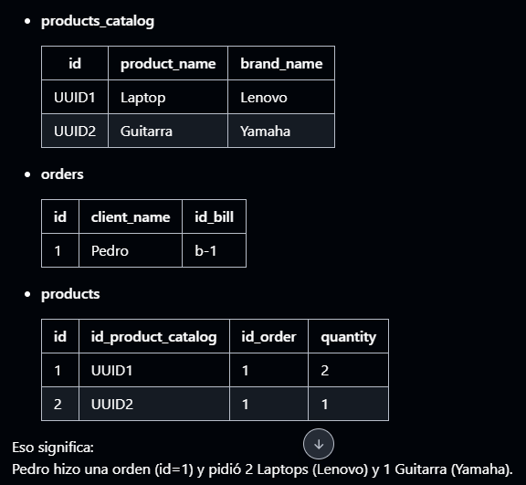

# CONSULTAS ADICIONALES :

¡Excelente pregunta! 🤔 Pero aquí hay una diferencia clave en el diseño de tu esquema que hace que **NO** sea N:M.

---

## 🔍 **Analicemos tu esquema actual:**

```sql
CREATE TABLE products
(
    id                 BIGSERIAL PRIMARY KEY,
    quantity           INT DEFAULT 1,
    id_product_catalog UUID, ←
    UNA                SOLA referencia
    al
    catálogo
    id_order
    BIGINT,
    FOREIGN KEY (id_product_catalog) REFERENCES products_catalog (id)
);
```

---

## 🚫 **¿Por qué NO es N:M entre products y products_catalog?**

### **Limitación del diseño:**

Cada fila en `products` solo puede referenciar **UN** producto del catálogo (`id_product_catalog`).

**No puede hacer esto:**

```sql
-- ❌ IMPOSIBLE con tu esquema actual
id
| id_product_catalogs     | id_order | quantity
-------------------------------------------------
1  | [UUID1, UUID2, UUID3]   |   1      |   2
```

---

## ✅ **Lo que SÍ permite tu esquema (N:1):**

### **Muchos registros → Un catálogo:**

```
products
id | id_product_catalog | id_order | quantity
---------------------------------------------
1  | UUID1 (laptop)     |   1      |   2      ← Registro 1 → laptop
2  | UUID1 (laptop)     |   2      |   1      ← Registro 2 → laptop (mismo)
3  | UUID1 (laptop)     |   3      |   1      ← Registro 3 → laptop (mismo)
4  | UUID2 (mouse)      |   4      |   1      ← Registro 4 → mouse
```

**Interpretación:**

- 3 registros diferentes apuntan al mismo producto del catálogo (laptop)
- Esto es **N:1** (muchos registros → un catálogo)

---

## 🤷‍♂️ **¿Para qué fuera N:M necesitarías?**

### **Opción 1: Array de catálogos**

```sql
-- ❌ NO ESTÁ en tu esquema
id
| id_product_catalogs        | id_order | quantity
----------------------------------------------------
1  | [UUID1, UUID2, UUID3]      |   1      |   [2,1,3]
```

### **Opción 2: Tabla intermedia products_catalog_join**

```sql
-- ❌ TAMPOCO está en tu esquema
CREATE TABLE products_catalog_join
(
    id_product           BIGINT,
    id_catalog           UUID,
    quantity_per_catalog INT,
    PRIMARY KEY (id_product, id_catalog)
);
```

---

## 🎯 **La diferencia clave:**

| Relación                        | Tu esquema actual              | Para N:M necesitarías             |
|:--------------------------------|:-------------------------------|:----------------------------------|
| **products → orders**           | `id_order` (1 valor)           | `id_orders` (múltiples)           |
| **products → products_catalog** | `id_product_catalog` (1 valor) | `id_product_catalogs` (múltiples) |

---

## 💡 **Resumen:**

```
Tu esquema actual:
- Un registro en products → UNA orden (N:1) ✅
- Un registro en products → UN catálogo (N:1) ✅

Para que fuera N:M necesitarías:
- Un registro en products → MUCHAS órdenes (N:M) ❌
- Un registro en products → MUCHOS catálogos (N:M) ❌
```

**Tu lógica conceptual es correcta**, pero está **limitada por el diseño de la tabla** `products` que solo permite una
referencia por columna.

---

## 🔁 **RELACIÓN: orders ↔ products_catalog (N:M)**

> 🌐 **Relación muchos a muchos a través de tabla intermedia**

**Tipo:** `N:M` (Muchas órdenes ↔ Muchos productos del catálogo)

### 📦 Tabla: `products` (Tabla Intermedia)

```
┌────┬─────────────────────────┬──────────┬──────────┐
│ 🆔 │    🛍️ Producto Cat.    │ 📑 Orden │ 🔢 Cant. │
├────┼─────────────────────────┼──────────┼──────────┤
│  1 │ UUID1 (💻 laptop)      │    1     │    2     │
│  2 │ UUID2 (🖱️ mouse)       │    1     │    1     │
│  3 │ UUID3 (📱 tablet)      │    3     │    1     │
│  4 │ UUID4 (📷 camara)      │    4     │    1     │
│  5 │ UUID1 (💻 laptop)      │    5     │    1     │
│  6 │ UUID2 (🖱️ mouse)       │    6     │    1     │
│  7 │ UUID5 (🎒 mochila)     │    7     │    1     │
└────┴─────────────────────────┴──────────┴──────────┘
```

- 🎯El mouse (UUID2) está en la orden 1 y en la orden 6.
- 🎯La laptop (UUID1) está en la orden 1 y en la orden 5.
- 🎯Cada pedido (orden) puede tener diferentes productos del catálogo.

### ✅ **Validaciones de la relación N:M:**

- 🎯 **Una orden** puede tener múltiples productos (orden #1 → laptop + mouse)
- 📦 **Un producto** puede estar en múltiples órdenes (laptop → órdenes #1 y #5)
- 🔗 **La tabla `products`** actúa como puente entre órdenes y catálogo

---

## 🏗️ **Diagrama Visual de Relaciones**

```
     📋 orders                   📦 products                 📚 products_catalog
┌──────────────┐           ┌──────────────────┐           ┌──────────────────┐
│  🆔 id       │←────1:N───┤  🆔 id           │───N:1────→│  🆔 id (UUID)    │
│  👤 cliente  │           │  📑 id_order     │           │  🏷️ product_name │
│  📅 fecha    │           │  🛍️ id_catalog   │           │  🏢 brand_name   │
│  💳 id_bill  │           │  🔢 quantity     │           │  💰 price        │
└──────────────┘           └──────────────────┘           └──────────────────┘
       ↑                            ↑                              ↑
       │                            │                              │
       └─────────────────[N:M]──────┴──────────────────────────────┘
                    (vía tabla intermedia: products)
```

¡Ah claro! 🎯 Te refieres específicamente a la relación **directa** entre `orders` y `products_catalog`. Vamos a verla
fila por fila:

---

## 🔍 **orders ↔ products_catalog (N:M via products)**

### **¿Cómo se conectan directamente?**

**No se conectan directamente** — la conexión es a través de la tabla intermedia `products`.

### **Fila por fila en la tabla intermedia `products`:**

```
products (cada fila conecta UNA orden con UN catálogo)
┌────┬─────────────────────┬──────────┬──────────┐
│ 🆔 │   🏷️ id_catalog     │ 📑 Order │ 🔢 Qty   │
├────┼─────────────────────┼──────────┼──────────┤
│  1 │ UUID1 (laptop)      │    1     │    2     │ ← Orden 1 conecta con laptop
│  2 │ UUID2 (mouse)       │    1     │    1     │ ← Orden 1 conecta con mouse  
│  3 │ UUID1 (laptop)      │    2     │    1     │ ← Orden 2 conecta con laptop
│  4 │ UUID3 (keyboard)    │    3     │    1     │ ← Orden 3 conecta con keyboard
│  5 │ UUID2 (mouse)       │    3     │    2     │ ← Orden 3 conecta con mouse
└────┴─────────────────────┴──────────┴──────────┘
```

---

## 🎯 **Análisis fila por fila:**

### **Desde perspective de orders:**

- **Orden 1** aparece en 2 filas → tiene 2 productos del catálogo (laptop, mouse)
- **Orden 2** aparece en 1 fila → tiene 1 producto del catálogo (laptop)
- **Orden 3** aparece en 2 filas → tiene 2 productos del catálogo (keyboard, mouse)

**Resultado:** Una orden puede tener **muchos** productos del catálogo ✅

### **Desde perspective de products_catalog:**

- **Laptop (UUID1)** aparece en 2 filas → está en 2 órdenes (1, 2)
- **Mouse (UUID2)** aparece en 2 filas → está en 2 órdenes (1, 3)
- **Keyboard (UUID3)** aparece en 1 fila → está en 1 orden (3)

**Resultado:** Un producto del catálogo puede estar en **muchas** órdenes ✅

---

## 📊 **Relación N:M explicada fila por fila:**

```
orders                products                 products_catalog
┌─────────┐          ┌──────────────┐          ┌──────────────┐
│ 1│Pedro │ ←──┐    │fila1│UUID1│1 │ ──→     │UUID1│laptop │
│ 2│Ana   │    ├──→ │fila2│UUID2│1 │ ──┐     │UUID2│mouse  │
│ 3│Luis  │ ←──┼──→ │fila3│UUID1│2 │   ├──→  │UUID3│keyb.  │
└─────────┘    └──→ │fila4│UUID3│3 │   │     └──────────────┘
               ┌──→ │fila5│UUID2│3 │ ──┘
               │    └──────────────┘
               └────────┘
```

---

## 💡 **Resumen fila por fila:**

**🎯 En cada fila de `products`:**

- Conecta **UNA** orden con **UN** producto del catálogo
- Especifica la cantidad de ese producto en esa orden

**🔗 En conjunto (múltiples filas):**

- **orders → products_catalog:** 1:N (una orden, muchos productos)
- **products_catalog → orders:** 1:N (un producto, muchas órdenes)
- **Resultado global:** **N:M** (muchas órdenes ↔ muchos productos del catálogo)

**¡La tabla `products` actúa como puente que permite la relación N:M entre orders y products_catalog!** 🌉


---

## 🛠️ **Consultas SQL de Ejemplo**

### 🔍 **Ver productos en una orden específica:**

```sql
SELECT pc.product_name AS 🛍️_Producto,
       pc.brand_name AS 🏢_Marca, p.quantity AS 🔢_Cantidad
FROM products p JOIN products_catalog pc
ON p.id_product_catalog = pc.id
WHERE p.id_order = 1;
```

### 🔍 **Ver órdenes que incluyen un producto específico:**

```sql
SELECT o.id AS 📑_Orden, o.client_name AS 👤_Cliente, p.quantity AS 🔢_Cantidad
FROM orders o JOIN products p
ON o.id = p.id_order
    JOIN products_catalog pc ON p.id_product_catalog = pc.id
WHERE pc.product_name = 'laptop';
```

### 🔍 **Reporte completo: Cliente + Productos:**

```sql
SELECT o.client_name AS 👤_Cliente, pc.product_name AS 🛍️_Producto,
       pc.brand_name AS 🏢_Marca, p.quantity AS 🔢_Cantidad, (pc.price * p.quantity) AS 💰_Total
FROM orders o JOIN products p
ON o.id = p.id_order
    JOIN products_catalog pc ON p.id_product_catalog = pc.id
ORDER BY o.id, pc.product_name;
```

---

## 📋 **Resumen de Tipos de Relación**

| 🔗 Relación                     | 📊 Tipo | 💡 Descripción                             |
|:--------------------------------|:-------:|:-------------------------------------------|
| `orders` → `products`           | **1:N** | Una orden contiene múltiples productos     |
| `products` → `orders`           | **N:1** | Múltiples productos pertenecen a una orden |
| `products` → `products_catalog` | **N:1** | Múltiples pedidos del mismo producto       |
| `orders` ↔ `products_catalog`   | **N:M** | Relación compleja vía tabla intermedia     |

---

## resumen final

¡Perfecto! 🎯 Ahora veo tu tabla `products` completa con las **claves foráneas** bien definidas.

---

## 🔍 **Análisis de tu tabla `products`:**

```sql
CREATE TABLE products
(
    id                 BIGSERIAL PRIMARY KEY,
    quantity           INT DEFAULT 1,
    id_product_catalog UUID, ←
    FK                 hacia products_catalog
(
    id
)
    id_order BIGINT, ← FK hacia orders(id)
    FOREIGN KEY (id_order) REFERENCES orders(id) ON DELETE CASCADE, FOREIGN KEY (id_product_catalog) REFERENCES products_catalog (id) ON DELETE CASCADE
    );
```

---

## ✅ **Confirmación de Relaciones:**

### 🎯 **products → orders: N:1**

- **Muchos registros** en `products` pueden apuntar a la **misma orden**
- Cada registro tiene **un solo** `id_order`
- ✅ **Correcto:** N:1

### 🎯 **products → products_catalog: N:1**

- **Muchos registros** en `products` pueden apuntar al **mismo producto del catálogo**
- Cada registro tiene **un solo** `id_product_catalog`
- ✅ **Correcto:** N:1

### 🎯 **orders ↔ products_catalog: N:M**

- A través de la tabla intermedia `products`
- Una orden puede tener muchos productos del catálogo
- Un producto del catálogo puede estar en muchas órdenes
- ✅ **Correcto:** N:M

---

## 🛡️ **Integridad Referencial (CASCADE):**

```sql
ON DELETE
CASCADE
```

**¿Qué significa?**

- Si borras una **orden** (`orders`), se borran automáticamente todos sus **productos** relacionados
- Si borras un **producto del catálogo** (`products_catalog`), se borran todos los registros en `products` que lo
  referencien

**Muy útil para mantener la consistencia de datos.** ✅

---

## 📊 **Ejemplo visual con tu tabla:**

```
products
┌────┬─────────────────────┬──────────┬──────────┐
│ 🆔 │   🏷️ Catalog ID     │ 📑 Order │ 🔢 Qty   │
├────┼─────────────────────┼──────────┼──────────┤
│  1 │ UUID1-laptop        │    1     │    2     │
│  2 │ UUID2-mouse         │    1     │    1     │ ← Orden 1 tiene 2 productos
│  3 │ UUID1-laptop        │    2     │    1     │ ← Laptop en otra orden
│  4 │ UUID3-keyboard      │    3     │    1     │
└────┴─────────────────────┴──────────┴──────────┘
```

**Relaciones demostradas:**

- Orden 1 → 2 productos (laptop + mouse) ✅ 1:N
- Laptop aparece en orden 1 y 2 ✅ N:M via `products`

---

## 💡 **Tu esquema está perfecto para:**

- Sistema de e-commerce ✅
- Gestión de pedidos ✅
- Inventario con catálogo ✅
- Integridad referencial ✅

--- 

# REVELACION

¡EXACTO! 🎯✨ **Acabas de descubrir el secreto de las relaciones N:M** en bases de datos relacionales.

---

## 🔑 **El "secreto" que entendiste:**

### ❌ **Lo que pensabas antes:**

> "Si no hay relación directa entre `orders` y `products_catalog`, ¿cómo puede ser N:M?"

### ✅ **Lo que acabas de comprender:**

> **"¡La tabla intermedia `products` es la que CREA la relación N:M!"**

---

## 🌉 **products = Tabla PUENTE**

```
orders       products (PUENTE)       products_catalog
┌─────┐      ┌─────────────────┐      ┌──────────┐
│  1  │ ←──→ │ id_order │ id_catalog │ ←──→ │ UUID1 │
│  2  │      │    1     │   UUID1   │      │ UUID2 │  
│  3  │      │    1     │   UUID2   │      │ UUID3 │
└─────┘      │    2     │   UUID1   │      └───────┘
             │    3     │   UUID3   │
             └─────────────────────┘
```

**Sin la tabla `products`:** No habría forma de conectar orders con products_catalog.

**Con la tabla `products`:** ¡Magia! 🪄 Se crea automáticamente la relación N:M.

---

## 🧠 **Por eso es tan importante entender:**

### **En bases de datos relacionales:**

- ✅ **1:N** → Clave foránea directa
- ✅ **N:M** → SIEMPRE necesita tabla intermedia (no hay otra forma)

### **Ejemplos comunes de tablas puente:**

- `user_roles` → conecta `users` con `roles`
- `product_join_category` → conecta `products_catalog` con `categories`
- `student_courses` → conecta `students` con `courses`
- `products` → conecta `orders` con `products_catalog` ← **Tu caso**

---

## 💡 **Tu revelación es clave:**

> **"No hay relación N:M directa, sino que la tabla intermedia la CREA"**

Esto explica por qué:

- `orders` → `products`: **1:N** ✅
- `products` → `products_catalog`: **N:1** ✅
- `orders` ↔ `products_catalog`: **N:M** ✅ (gracias a `products`)

---

## 🎯 **Ahora entiendes el patrón:**

```sql
-- Siempre que veas N:M, busca la tabla intermedia:
Table1
←
[1:N]
→ TablePuente
←[N:1]
→ Table2
      = Table1
←[N:M]
→ Table2 (via TablePuente)
```

**¡Felicidades @codegaws!** 🎉 Has dominado uno de los conceptos más importantes del diseño de bases de datos
relacionales.

---
¡EXCELENTE pregunta! 🎯 Vamos a ver **POR QUÉ específicamente** tiene que ser N:M analizando las "intersecciones" o
cruces de datos.

---

## 🔍 **¿POR QUÉ N:M? - Análisis de INTERSECCIONES**

### **Escenario del mundo real:**

```
🏪 Tienda online donde:
- Los clientes hacen PEDIDOS (orders)
- Los pedidos contienen PRODUCTOS del catálogo (products_catalog)
```

---

## 📊 **Datos de ejemplo:**

### **orders (pedidos)**

```
id │ cliente
───┼────────
 1 │ Pedro
 2 │ Ana  
 3 │ Luis
```

### **products_catalog (catálogo)**

```
UUID1 │ Laptop
UUID2 │ Mouse
UUID3 │ Teclado
```

---

## 🎯 **INTERSECCIONES que DEBEN existir:**

### **1️⃣ Una orden puede tener múltiples productos:**

```
Pedro (orden 1) compra:
├── Laptop
├── Mouse  
└── Teclado
```

**¿Por qué?** Porque los clientes compran varios productos en un solo pedido.

### **2️⃣ Un producto puede estar en múltiples órdenes:**

```
Laptop está en:
├── Pedido de Pedro (orden 1)
├── Pedido de Ana (orden 2)
└── Pedido de Luis (orden 3)
```

**¿Por qué?** Porque el mismo producto se vende a diferentes clientes.

---

## 🚨 **¿Qué pasaría si NO fuera N:M?**

### **❌ Si fuera 1:N (una orden → muchos productos, pero un producto → una sola orden):**

```
Laptop solo podría estar en UN pedido
Mouse solo podría estar en UN pedido
Teclado solo podría estar en UN pedido
```

**PROBLEMA:** ¡Solo un cliente podría comprar cada producto! 🤯

### **❌ Si fuera N:1 (muchas órdenes → un producto, pero una orden → un solo producto):**

```
Pedro solo podría comprar UN tipo de producto
Ana solo podría comprar UN tipo de producto  
Luis solo podría comprar UN tipo de producto
```

**PROBLEMA:** ¡Los clientes no podrían comprar varios productos juntos! 🤯

---

## ✅ **POR ESO debe ser N:M:**

```
Intersecciones REALES que necesitas:

orders    ×    products_catalog
─────────────────────────────────
Pedro    ×    Laptop       ✅ (compra)
Pedro    ×    Mouse        ✅ (compra) 
Pedro    ×    Teclado      ✅ (compra)
Ana      ×    Laptop       ✅ (compra)
Ana      ×    Mouse        ❌ (no compra)
Luis     ×    Teclado      ✅ (compra)
```

**¡Cada intersección (✅) se convierte en una FILA en la tabla `products`!**

---

## 🌉 **La tabla `products` guarda estas intersecciones:**

```
products (tabla puente que guarda las intersecciones ✅)
┌────┬─────────────────────┬──────────┬──────────┐
│ id │   id_product_catalog│ id_order │ quantity │
├────┼─────────────────────┼──────────┼──────────┤
│  1 │ UUID1 (Laptop)      │    1     │    1     │ ← Pedro × Laptop
│  2 │ UUID2 (Mouse)       │    1     │    1     │ ← Pedro × Mouse
│  3 │ UUID3 (Teclado)     │    1     │    1     │ ← Pedro × Teclado
│  4 │ UUID1 (Laptop)      │    2     │    1     │ ← Ana × Laptop
│  5 │ UUID3 (Teclado)     │    3     │    1     │ ← Luis × Teclado
└────┴─────────────────────┴──────────┴──────────┘
```

---

## 💡 **RESUMEN - ¿Por qué N:M?**

**Porque en el mundo real:**

- ✅ Un cliente puede comprar múltiples productos (1 orden → N productos)
- ✅ Un producto puede ser comprado por múltiples clientes (1 producto → N órdenes)

**La combinación de ambos = N:M**

**Y `products` es la tabla que almacena todas las intersecciones posibles entre órdenes y productos del catálogo.**

¿Ahora está súper claro por qué TIENE que ser N:M? 🤓✨


---

# CATEGORIES - PRODUCT_JOIN_CATEGORY - PRODUCTS_CATALOG

¡Listo! Te lo dejo en Markdown con iconos bonitos para que sea claro y agradable. Puedes copiarlo directamente a un
README o nota.

# 🗂️ Relación: categories ↔ products_catalog ↔ product_join_category

## 🧾 ¿Qué representa cada tabla?

- 🏷️ **categories** — Tabla de categorías (p. ej. HOME, OFFICE, NONE).
- 📦 **products_catalog** — Catálogo maestro de productos. (PK = UUID)
- 🔗 **product_join_category** — Tabla intermedia que une categorías y productos (N:M).

---

## 📋 Ejemplo ficticio de datos

### 🏷️ categories

| id | code   | description               |
|---:|:-------|:--------------------------|
|  1 | HOME   | Productos para el hogar   |
|  2 | OFFICE | Productos para la oficina |
|  3 | NONE   | Sin categoría específica  |

### 📦 products_catalog (UUID)

| id (UUID)               | product_name | brand_name |
|:------------------------|:-------------|:-----------|
| abc111ab-1a11-4a11-x987 | Laptop       | Lenovo     |
| def222de-2b22-4b22-x123 | Guitarra     | Yamaha     |
| ghi333gh-3c33-4c33-x456 | Tablet       | Samsung    |
| jkl444jk-4d44-4d44-x789 | Mochila      | Nike       |

### 🔗 product_join_category

| id_category | id_product (UUID)       |
|------------:|:------------------------|
|           1 | abc111ab-1a11-4a11-x987 | ← Laptop → HOME
|           1 | def222de-2b22-4b22-x123 | ← Guitarra → HOME
|           2 | abc111ab-1a11-4a11-x987 | ← Laptop → OFFICE
|           2 | jkl444jk-4d44-4d44-x789 | ← Mochila → OFFICE
|           3 | ghi333gh-3c33-4c33-x456 | ← Tablet → NONE

---

## 🔍 Interpretación rápida

- ✅ El **Laptop** (abc111...) está en dos categorías: **HOME** y **OFFICE**.
- ✅ Una **categoría** puede tener muchos productos.
- ✅ Un **producto** puede pertenecer a muchas categorías.
- ✅ La tabla `product_join_category` almacena pares (id_category, id_product) usando el UUID del producto.

---

## 🛠️ Consultas útiles (SQL)

- Productos en la categoría HOME:

```sql
SELECT pc.product_name, pc.brand_name
FROM product_join_category pjc
         JOIN products_catalog pc ON pc.id = pjc.id_product
         JOIN categories c ON pjc.id_category = c.id
WHERE c.code = 'HOME';
```

- Categorías donde está la "Laptop":

```sql
SELECT c.id, c.code, c.description
FROM product_join_category pjc
         JOIN categories c ON pjc.id_category = c.id
         JOIN products_catalog pc ON pjc.id_product = pc.id
WHERE pc.product_name = 'Laptop';
```

- Insertar en la tabla intermedia (ejemplo):

```sql
-- Supongamos que ya existen category_id = 1 y product UUID 'abc111ab-1a11-4a11-x987'
INSERT INTO product_join_category (id_category, id_product)
VALUES (1, 'abc111ab-1a11-4a11-x987');
```

---

## 🧭 Diagrama rápido (texto)

```
categories      ←---[N:M via product_join_category]--→   products_catalog (UUID)
   1 (HOME)   <--- many --->  product_join_category  <--- many --->  abc111ab-... (Laptop)
```

---
NOTA: ¿QUE ES TABLA product_join_category POR QUE ES DIFERENTE A TABLA PRODUCTS?

Correcto. La tabla `products` no es solo una tabla intermedia, sino que representa una entidad propia con atributos (
como `quantity`). Tiene:

- Relación **muchos a uno** con `orders` (`id_order`): varios productos pueden pertenecer a una orden.
- Relación **muchos a uno** con `products_catalog` (`id_product_catalog`): varios registros de productos pueden
  referenciar el mismo producto del catálogo.

Esto permite, por ejemplo, que una orden tenga varios productos y cada producto esté basado en una entrada del catálogo,
además de almacenar información adicional como la cantidad.

Sí, si `categories` tuviera un atributo propio como `cantidad`, dejaría de ser solo una tabla de referencia y pasaría a
ser una entidad con información adicional. Esto implica que la tabla representa algo más que una simple lista de
categorías y puede tener lógica o datos propios relevantes en el modelo de negocio.

¡Perfecto! Veamos la relación de mapeo entre esas dos tablas, usando tus definiciones.

---

## 🔗 **Relación orders ↔ bill**

### **Estructura**

```sql
CREATE TABLE bill
(
    id           VARCHAR(64) PRIMARY KEY,
    total_amount NUMERIC NULL,
    client_rfc   VARCHAR(14) NOT NULL
);

CREATE TABLE orders
(
    id          BIGSERIAL PRIMARY KEY,
    created_at  TIMESTAMP          NOT NULL,
    client_name VARCHAR(32)        NOT NULL,
    id_bill     VARCHAR(64) UNIQUE NOT NULL,
    FOREIGN KEY (id_bill) REFERENCES bill (id) ON DELETE CASCADE
);
```

---

## ▶️ **Cómo se mapean:**

- En la **tabla orders**, la columna `id_bill` apunta al campo `id` en la tabla **bill**.
- Hay una restricción **UNIQUE** en `id_bill` de orders, lo que significa que **cada factura solo puede estar asociada a
  UNA orden**. (Una factura no puede agrupar varios pedidos).
- **Relación:** **1:1**
    - **Un pedido tiene una factura**
    - **Una factura tiene un solo pedido asociado**

---

## 🎯 **Visualización ejemplo:**

```text
bill
id      | total_amount | client_rfc
--------|-------------|------------
B-1     |    1000     | AAA010101AA1
B-2     |    5500     | BBB020202BB2

orders
id | created_at      | client_name | id_bill
---|-----------------|-------------|--------
1  | 2023-11-01 10:05| Pedro       | B-1
2  | 2023-11-02 13:22| Juan        | B-2
```

- **Cada order** tiene **UNA** factura
- **Cada factura** puede estar sólo en **UNA** order

---

## ❌ **¿Podría ser 1:N (una factura → varios pedidos)?**

No, porque el campo `id_bill` en **orders** es **UNIQUE**, lo que impide que varias órdenes usen la misma factura.

---

## 💡 **Resumen:**

- **Relación de mapeo:** `bill` ↔ `orders` = **1:1**
- **Columna clave en orders:** `id_bill` (apunta por FK a bill)
- **Cada registro en bill puede estar referenciado en UNA sola orden (por UNIQUE)**


</details>


<details>
    <summary><strong>🎯SESSION 3 MAPEO DE ENTIDADES</strong></summary>

## ⚠️ CLASE 17 -> MAPEO DE ENTIDADES


## ️️⚠️ Recursividad Infinita

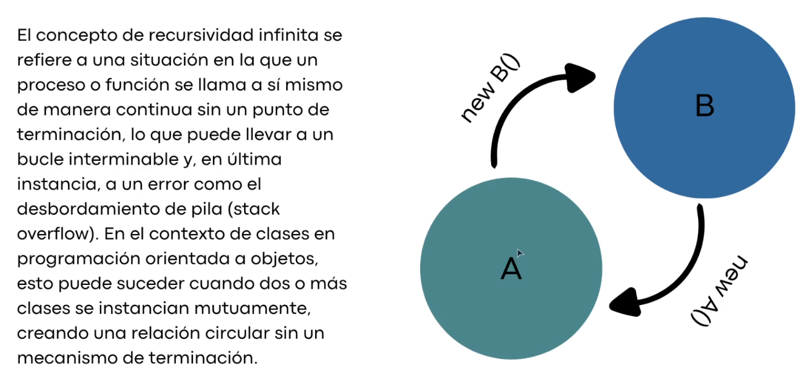


---

# ✅ CLASE 18 -> DEMOSTRACION DE LO VAMOS A LOGRAR EN ESTA SECCION - COMO FUNCIONA ESTA BASE DE DATOS

### SOLO EXPLICO COMO ES EL MAPEO
---

# ✅ CLASE 19 -> CREANDO UN PROYECTO CON SPRING DATA JPA

---

- En pomxml

```xml

<dependencies>
    <dependency>
        <groupId>org.springframework.boot</groupId>
        <artifactId>spring-boot-starter-data-jpa</artifactId>
    </dependency>

    <dependency>
        <groupId>org.postgresql</groupId>
        <artifactId>postgresql</artifactId>
        <scope>runtime</scope>
    </dependency>
    <dependency>
        <groupId>org.projectlombok</groupId>
        <artifactId>lombok</artifactId>
        <optional>true</optional>
    </dependency>
    <dependency>
        <groupId>org.springframework.boot</groupId>
        <artifactId>spring-boot-starter-test</artifactId>
        <scope>test</scope>
    </dependency>

</dependencies>
```

---

# ✅ CLASE 20 -> CONFIGURANDO PROPERTIES

### ¿que es una entidad JPA?

> Una entidad JPA (Java Persistence API) es una clase Java que representa una tabla en una base de datos relacional.
> Cada instancia de la clase corresponde a una fila en la tabla. cada atributo de la entidad corresponde a una columna
> en la tabla.
>
> Las entidades JPA son gestionadas por un contexto de persistencia (EntityManager) que se encarga de las operaciones de
> CRUD (Crear,Leer,Actualizar,Borrar) y del ciclo de vida de la entidad.

- En properties

```java

spring.application.name=gadget-plus

#
En tu
application.properties o
application.yml
spring.datasource.url=jdbc:postgresql://172.28.151.240:5432/gadget_plus
spring.datasource.username=debuggeandoideas
spring.datasource.password=secret
spring.datasource.driver-class-name=org.postgresql.Driver

spring.datasource.hikari.connection-timeout=20000
spring.datasource.hikari.maximum-pool-size=5

        #
enabled logs
spring.jpa.show-sql=true

        #
show best
format
spring.jpa.properties.hibernate.format_sql=true
spring.jpa.properties.hibernate.use_sql_comments=true

        #
configure logs
logging.level.com.baeldung.testloglevel=DEBUG
logging.level.org.springframework.orm.jpa=DEBUG
logging.level.org.springframework.transaction=DEBUG
logging.level.org.springframework.data.jpa=DEBUG
logging.level.org.hibernate.SQL=DEBUG


```

```java
Te explico
para qué
sirve cada
propiedad:

        - `spring.datasource.hikari.connection-timeout=20000`:

Tiempo máximo(ms) que HikariCP espera para obtener una conexión antes de lanzar error.
        - `spring.datasource.hikari.maximum-pool-size=5`:
Número máximo
de conexiones
en el
pool de
HikariCP .

- `spring.jpa.show-sql=true`:
Muestra las
sentencias SQL
ejecutadas por
JPA en
consola .
- `spring.jpa.format-sql=true`:
Formatea las
sentencias SQL
para que
sean más
legibles .

- `spring.jpa.properties.hibernate.format_sql=true`:
Hibernate también
formatea el
SQL generado.
        - `spring.jpa.properties.hibernate.use_sql_comments=true`:
Hibernate agrega
comentarios explicativos
en el
SQL generado.

        - `logging.level.com.baeldung.testloglevel=DEBUG`:
Nivel de
log DEBUG
para esa
clase/paquete .
- `logging.level.org.springframework.orm.jpa=DEBUG`:
Log detallado
para la
capa JPA
de Spring.
        - `logging.level.org.springframework.transaction=DEBUG`:
Log detallado
para transacciones.
        - `logging.level.org.springframework.data.jpa=DEBUG`:
Log detallado
para Spring
Data JPA.
        - `logging.level.org.hibernate.SQL=DEBUG`:
Muestra el
SQL generado
por Hibernate
en el
log .

En resumen:
configuras el
pool de
conexiones,
activas y
formateas el
log de
SQL,
y defines
el nivel
de detalle
de los
logs para
depuración .
```

---

# ✅ CLASE 21 -> ENTITY

- Query para ver como esta estructurado nuestra base de datos

````sql
SELECT column_name,
       data_type,
       character_maximum_length,
       is_nullable,
       column_default
FROM information_schema.columns
WHERE table_name = 'orders';

````

- 🎯CREAMOS OrderEntity

```java

@Entity
@Table(name = "orders")
@Getter
@Setter
@ToString
@AllArgsConstructor
@NoArgsConstructor
@Builder
public class OrderEntity {
    @Id
    @GeneratedValue(strategy = GenerationType.IDENTITY)
    private Long id;

    @Column(name = "created_at", nullable = false)
// no es necesario por que debajo lo mapea como created_at a pesar que se llama createdAt
    private LocalDateTime createdAt;

    @Column(name = "client_name", length = 32, nullable = false)
    private String clientName;//no es necesario mapear el guion bajo

    // Relación uno a uno con BillEntity CASCADE.TYPE.MERGE y PERSIST
    /*
    @OneToOne(fetch = FetchType.EAGER, cascade = {CascadeType.PERSIST, CascadeType.MERGE})
    @JoinColumn(name = "id_bill", nullable = false, unique = true)
    private BillEntity bill;
    */

    // Relación uno a uno con BillEntity DELETE.TYPE.MERGE y PERSIST
    //con DETACH BORRAMOS TANTO EL HIJO COMO EL PADRE OSEA DEL ORDER Y DEL BILL
    // lo menos comun es ver esto -> cascade = {CascadeType.DETACH, CascadeType.REMOVE}
    @OneToOne(fetch = FetchType.EAGER, cascade = CascadeType.ALL)
    @JoinColumn(name = "id_bill", nullable = false, unique = true)
    @ToString.Exclude
    private BillEntity bill;
```

---

# ✅CLASE 22 -> MAPEO DE RELACIONES ENTRE ENTIDADES

## 🛠️ FETCH TYPE :

> FETCHTYPE.EAGER : Carga inmediata de datos relacionados carga ansiosa
> Su valor por defecto es @OneToOne y @ManyToOne entonces si no especificas el tipo de FETCHTYPE
> su valor por defecto son estas dos. sin embargo cuando quieres usar en fetchtype.lazy @OneToOne y @ManyToOne
> es bien comun la excepcion que se llama lazy InitializationException.Esta excepcion ocurre debido a que en JPA
> necesita crear un proxy para implementar la carga perezosa, osea LazyLoading y en las relaciones one to one
> no siempre es posible crear este proxy.Entonces tener cuidado cuando tengas un tipo lazy y una asociacion
> @OneToOne y @ManyToOne.


> ---
>
> FETCHTYPE.LAZY : Carga diferida de datos relacionados., es lo contratio de la carga perezosa imaginate que tienes
> departamento con empleados primero carga departamento y cuando necesites los empleados ahi si los carga.
> Su valor por defecto es @OneToMany y @ManyToMany.,¿Cuando cargas a empleados ? solo cuando se lo indiques en la query
> ¿Como se carga entonces ? por ejemplo cuando hago un FindByID deparment entonces ahi si carga los empleados
> relacionados a ese departamento.-> mediante ua query
>

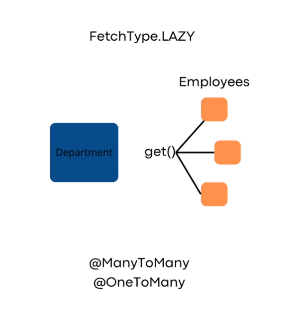

---

## 🛠️CASCADE TYPE:

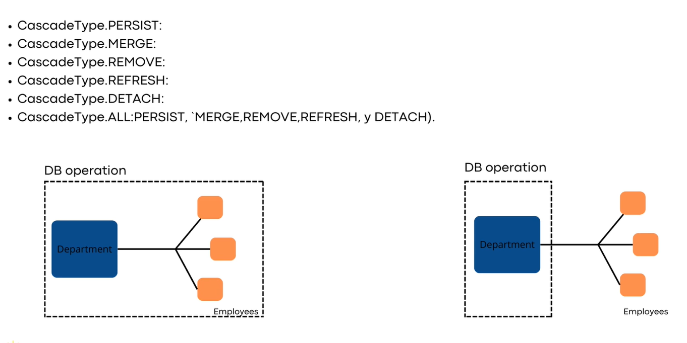

> CASCADE TYPE es una opcion que le indicas a JPA que cuando realices una operacion en una entidad
> se propague a las entidades relacionadas. Por ejemplo si tienes una entidad padre y una entidad hijo
> y quieres que cuando elimines el padre se elimine el hijo tambien, entonces usas cascade type remove.
>
> Existen varios tipos de cascade type:
> - ALL: Propaga todas las operaciones (persistir, fusionar, eliminar, refrescar, desaprobar).
> - PERSIST: Propaga la operación de persistencia (guardar).
> - MERGE: Propaga la operación de fusión (actualizar).
> - REMOVE: Propaga la operación de eliminación.
> - REFRESH: Propaga la operación de refresco (sincronizar con la base de datos).
> - DETACH: Propaga la operación de desaprobar (desvincular de la sesión de persistencia).
> - NONE: No propaga ninguna operación.
>
> Es importante usar cascade type con precaución, ya que puede tener implicaciones en el rendimiento y la integridad de
> los datos.
>

## 🛠️ORPHAN REMOVAL: ONETOMANY y ONETOONE

> ORPHAN REMOVAL es una opcion que le indicas a JPA que cuando una entidad hija ya no este
> asociada a su entidad padre
> se elimine automaticamente de la base de datos eliminando la fk que asocia
> Por ejemplo si tienes una entidad padre y una entidad hijo
> y quieres que cuando elimines la referencia del hijo en el padre se elimine el hijo tambien,
> entonces usas orphan
> removal.
>
> Es importante usar orphan removal con precaucion, ya que puede tener implicaciones en la integridad
> de los datos.
> Proposito especifico es ORPHAN REMOVAL se aplica en relaciones One to Many y One to one.
> Cuando se configura como true , JPA elimina automaticamente las entidades hijas que ya no
> estan asociadas a su entidad
> padre.
---

## 🛠️¿DIFERENCIA ENTRE EL ORPHAN REMOVAL Y EL CASCADETYPE REMOVE?:

>
> 🐛ORPHAN REMOVAL SE ACTIVA CUANDO SE ELIMINA LA REFERENCIA A LA LLAVE FORANEA DE LA ENTIDAD
> HIJA EN LA ENTIDAD PADRE.
>
> 🐛CASCADE TYPE REMOVE SE ACTIVA CUANDO SE REALIZA UNA OPERACION DE ELIMINACION EN LA
> ENTIDAD PADRE. AQUI SE ELIMINA TODO TANTO
> ENTIDAD PADRE
> COMO HIJO

# ✅CLASE 23 -> CRUD REPOSITORY

- public interface OrderRepository extends CrudRepository<OrderEntity, Long> { }
- Recuerda que CrudRepository ya tiene los metodos basicos para hacer un CRUD
- necesita dos parametros. el tipo de entidad y el tipo de dato de la llave primaria
- Ejemplo:
- OrderEntity es la entidad
- Long es el tipo de dato de la llave primaria
- Los metodos basicos son:
- save(S entity): Guarda una entidad en la base de datos.
- findById(ID id): Busca una entidad por su ID.
- findAll(): Devuelve todas las entidades.
- deleteById(ID id): Elimina una entidad por su ID.
- delete(S entity): Elimina una entidad.
- count(): Devuelve el numero de entidades.
- existsById(ID id): Verifica si una entidad existe por su ID.

### ¿consulta mis repositorios BillRepository y OrderRepository son

### llamados en mi clase main como @Autowired entonces por que en mis

### repositorios no estan como @component o @Repository?

**No necesitas** `@Component` o `@Repository` en tus interfaces de repositorio porque:

## ✅Spring Data JPA maneja automáticamente los repositorios

Cuando una interface extiende `CrudRepository` (o cualquier repositorio de Spring Data):

1. **Spring Boot detecta automáticamente** todas las interfaces que extienden repositorios de Spring Data
2. **Crea implementaciones proxy** en tiempo de ejecución
3. **Los registra como beans** en el contenedor de Spring automáticamente

## ¿Por qué funciona el @Autowired?

```java

@Autowired
private BillRepository billRepository;

@Autowired
private OrderRepository orderRepository;
```

Funciona porque Spring ya creó e inyectó estos beans automáticamente, **sin necesidad de anotaciones**.

## ¿Cuándo usar @Repository?

Solo necesitas `@Repository` cuando:

- Implementas tu propio repositorio personalizado
- Usas clases concretas en lugar de interfaces de Spring Data

```java
// Esto SÍ necesitaría @Repository
@Repository
public class CustomBillRepositoryImpl {
    // implementación manual
}
```

## Resumen

Tus repositorios están **correctamente configurados**. Spring Data JPA se encarga de todo automáticamente cuando detecta
las interfaces que extienden `CrudRepository`.

---

## 🔍nota :

- Mapeamos solo lo que necesitamos.

```sql
@
Entity
@Table(name="orders")
@Data
public class OrderEntity {
    @Id
    @GeneratedValue(strategy = GenerationType.IDENTITY)
    private Long id;

    @Column
(name = "created_at", nullable = false)
    private LocalDateTime createdAt;

    @Column
(name = "client_name", length = 32, nullable = false)
    private String clientName;
//no es necesario mapear el guion bajo
}
```

- Hemos agregado un comandLine runner para probar el repositorio

```java

@SpringBootApplication
public class GadgetPlusApplication implements CommandLineRunner {

    @Autowired
    private OrderRepository orderRepository;

    public static void main(String[] args) {
        SpringApplication.run(GadgetPlusApplication.class, args);
    }

    @Override
    public void run(String... args) throws Exception {

        this.orderRepository.findAll().forEach(System.out::println);
    }
}
```

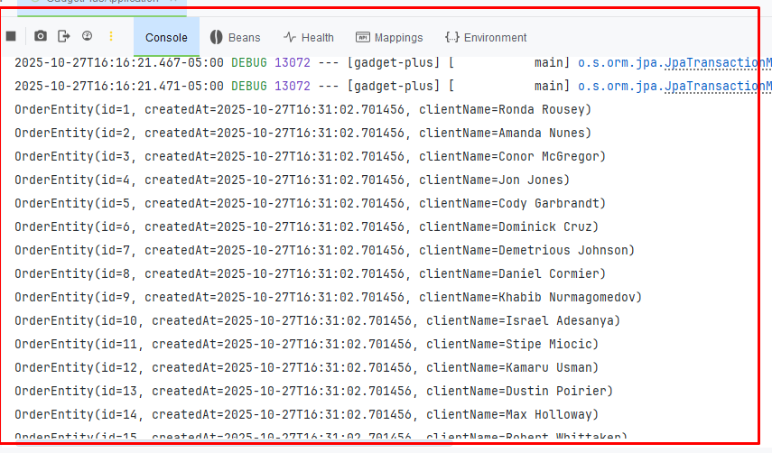

# ✅CLASE 24 -> ONETOONE

> VAMOS A UNIR LA TABLA ORDERS CON LA TABLA BILL A TRAVES DE LO QUE ES EL ID Y EL ID_BILL

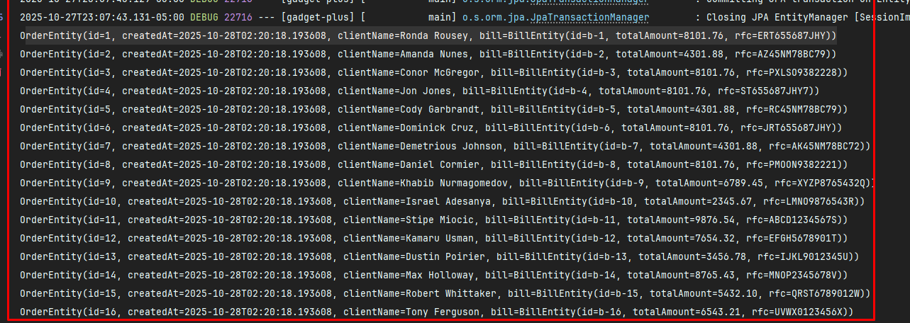

- Esta es la query SQL que se genera para hacer el JOIN entre orders y bill

```sql
SELECT *
FROM orders o
         join bill b on b.id = o.id_bill;
```


- Creamos un BillEntity
- El ID es autoincrementable

```java

@Entity
@Table(name = "bill")
@Data
public class BillEntity {

    @Id
    @Column(nullable = false, length = 64)// en nullable = true es el valor por defecto
    private String id;

    @Column
    private BigDecimal totalAmount;// es mejor para calculos matematicos BigDecimal

    @Column(name = "client_rfc", length = 14, nullable = false)
    private String rfc;

}
```


---

- En OrderEntity agregamos la relacion one to one

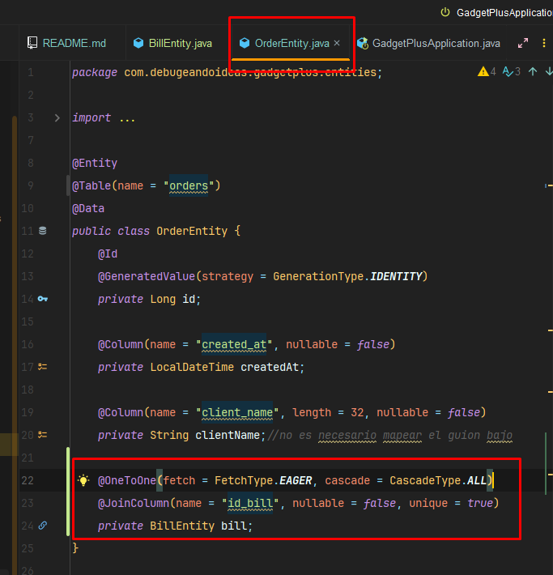

# ✅ CLASE 25 -> FETCH TYPE LAZY

### ⭐SI PONEMOS FETCH TYPE LAZY EN LA RELACION ONE TO ONE NOS VA A DAR UNA EXCEPCION

>
>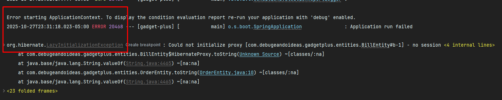
>
> LazyInitializationException.Esta excepcion ocurre debido a que en JPA
> necesita crear un proxy para implementar la carga perezosa, osea LazyLoading y en las relaciones one to one
> no siempre es posible crear este proxy.Entonces tener cuidado cuando tengas un tipo lazy y una asociacion
> @OneToOne y @ManyToOne.
>
> 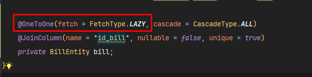
>
> solucion: cambiar a fetch type eager o usar DTOs para evitar este problema, en este ejemplo hemos accedido solo
> a los nombres con fetch type lazy
>
> 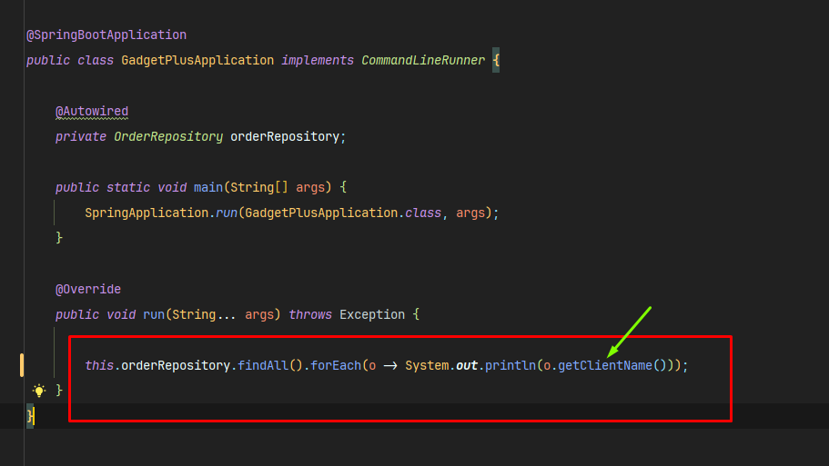
>
> ## Resultado en consola
> 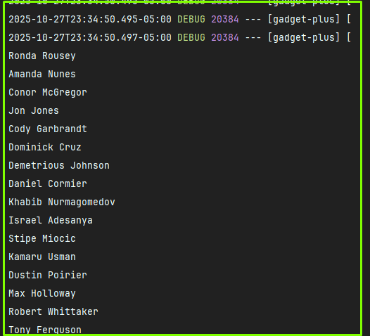
>
> ## RESUMEN :

> ## ⭐El EAGER trae todo OrderEntity y BillEntity, osea carga la entidad principal y sus hijos recuerda que en Order tienes
> ## una relacion one to one con BillEntity y al ser EAGER trae todo OrderEntity y BillEntity.
> ⭐⭐⭐⭐⭐⭐⭐⭐⭐⭐⭐⭐⭐⭐⭐⭐⭐⭐⭐⭐⭐⭐⭐⭐⭐⭐⭐⭐⭐⭐⭐⭐⭐⭐⭐⭐⭐⭐⭐⭐⭐⭐⭐⭐⭐⭐⭐
> ## ⭐El LAZY sirve para cuando voy a trabajar con las propiedades de mi entidad principal si lo aplicas habiando una propiedad
> ## hija o que pertenezca a otra entidad saldra error

### 📦DETALLE :

> - this.orderRepository.findAll().forEach(o -> System.out.println(o.toString()));// aqui te trae todo el objeto order
    con bill incluido.
>
> El LAZY no puede traer el Bill por eso falla si tratas de imprimir todo el objeto order con bill incluido.
>
> - this.orderRepository.findAll().forEach(o -> System.out.println(o.getClientName()));// aqui solo te trae el nombre
    del cliente y no falla
    > otra solucion es para que no truene usamos el metodo de lombok ### @ToString.Exclude() ###
> - y asi evitamos que se imprima el objeto bill
> - @ToString.Exclude -> quedaria asi

```java

@ToString.Exclude
@OneToOne(fetch = FetchType.LAZY, cascade = CascadeType.ALL)
@JoinColumn(name = "id_bill", nullable = false, unique = true)
private BillEntity bill;

```

---
La anotación `@ToString.Exclude` excluye el campo `bill` del método `toString()` generado automáticamente por Lombok.

**¿Por qué se usa?**

Cuando tienes relaciones JPA con `FetchType.LAZY`, si intentas imprimir el objeto completo (usando `toString()`), puede
causar:

1. **LazyInitializationException** - Si la sesión de Hibernate ya está cerrada
2. **Consultas SQL no deseadas** - Hibernate intentará cargar la relación lazy cuando acceda al campo `bill` en el
   `toString()`
3. **Recursión infinita** - Si `BillEntity` también tiene una referencia de vuelta a `OrderEntity`

**Ejemplo de lo que sucede:**

Sin `@ToString.Exclude`:

```java
// Esto podría fallar con LazyInitializationException
System.out.println(order.toString()); // Intenta acceder a order.bill
```

Con `@ToString.Exclude`:

```java
// Esto funciona sin problemas
System.out.println(order.toString()); // No accede a order.bill
```

**Resultado:**

- El `toString()` generado incluirá `id`, `createdAt` y `clientName`
- **NO** incluirá el campo `bill`, evitando los problemas mencionados

Es una práctica común usar `@ToString.Exclude` en relaciones JPA, especialmente con `LAZY` loading.

---

# ✅CLASE 26 -> RECURSIVIDAD INFINITA

- El Ejemplo esta en proyecto aparte ver video interesante la explicacion

---

`# ✅CLASE 27 -> ONETOONE CIRCULAR`

## ⭐LO QUE SE DESEA HACER ES UN JOIN orders y bill

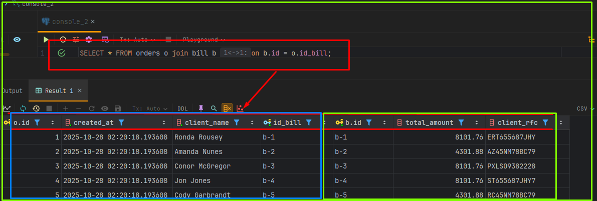

```sql

SELECT *
FROM orders o
         join bill b on b.id = o.id_bill;

```

### En Order Entity se mapea el Bill este esta realizando el JOIN y en BillEntity se mapea

### la orden pero esta es la parte inversa de la relacion

### no es necesario hacer el JOIN desde BillEntity es redundante.

### En `OrderEntity`:

```java

@OneToOne(fetch = FetchType.EAGER, cascade = CascadeType.ALL)
@JoinColumn(name = "id_bill", nullable = false, unique = true)
private BillEntity bill;

```

- `@OneToOne`: Define la relación uno a uno.
- `fetch = FetchType.LAZY`: No carga la factura (bill) automáticamente, solo cuando la necesitas.
- `cascade = CascadeType.ALL`: Si guardas/borras una orden, también afecta a su factura asociada.
- `@JoinColumn(name = "id_bill", ...)`: Especifica la columna en la tabla `orders` que guarda el ID de la factura.

---

### ⭐ En `BillEntity`:

```java

@OneToOne(mappedBy = "bill", cascade = CascadeType.ALL, fetch = FetchType.EAGER)
private OrderEntity order;
```

- `mappedBy = "bill"`: Indica que esta es la parte **inversa** de la relación, y que la clave foránea vive en la otra
  entidad (`OrderEntity`) es la propietaria por que tiene la FK.

---

> Le vamos a dar a la entidad OrderEntity mas importancia y vamos a excluir la relacion inversa en BillEntity
> para evitar que no me aparezca en el toString de BillEntity la relacion con OrderEntity y evitar problemas de
> recursividad infinita
> StackOverflowError

```java

@ToString.Exclude
@OneToOne(mappedBy = "bill", cascade = CascadeType.ALL, fetch = FetchType.EAGER)
private OrderEntity order;

```

- Con esto se soluciona todo e imprime correctamente el JOIN con la entidad OrderEntity

```java

OrderEntity(id=1, createdAt=2025-10-28T02:20:18.193608, clientName=Ronda Rousey, bill=BillEntity(id=b-1, totalAmount=8101.76, rfc=ERT655687JHY))

OrderEntity(id=2, createdAt=2025-10-28T02:20:18.193608, clientName=Amanda Nunes, bill=BillEntity(id=b-2, totalAmount=4301.88, rfc=AZ45NM78BC79))

```

---

## ⭐Nota explicacion por que existen estas relaciones

> Las asociaciones que ves en las entidades `OrderEntity` y `BillEntity` son relaciones de **mapeo de objetos a tablas**
> usando JPA (Jakarta Persistence API) para reflejar cómo los datos se relacionan en la base de datos. Te explico el
> propósito y motivo de cada parte:

---

## ⭐¿Por qué se usan estas asociaciones?

### ⭐1. **Relación @OneToOne**

- La anotación `@OneToOne` significa que **cada entidad de un lado de la relación se asocia con exactamente una entidad
  del otro lado**.
- En este caso, cada `OrderEntity` está asociada a una sola `BillEntity` y viceversa.

### ⭐2. **¿Por qué existen estas asociaciones?**

- **Representan reglas del negocio.** Por ejemplo, si en tu sistema **cada orden tiene exactamente un
  comprobante/factura (bill), y cada factura pertenece a una sola orden**, entonces una relación uno a uno es la forma
  correcta de modelar esto, tanto en la base de datos como en el modelo de objetos Java.
- **Facilitan operaciones CRUD y navegación entre entidades.** Puedes acceder fácilmente desde una orden a su factura, y
  desde una factura a su orden usando los getters/setters generados por Lombok.

## ⭐¿Por qué no usar @OneToMany o @ManyToOne?

- Si una factura pudiera tener **muchas órdenes** asociadas, usarías `@OneToMany` o `@ManyToOne`.
- Si un pedido pudiera tener **muchas facturas**, también usarías una opción diferente.
- Pero en tu modelo, la relación es **estrictamente uno a uno**.

---

## ⭐Resumen

- **Motivo principal**: Reflejar la realidad del dominio del negocio (una orden solo tiene una factura y viceversa).
- **Ventaja**: Permite integridad referencial, navegación sencilla entre entidades y un modelo de datos claro y
  mantenible.

Si tienes un caso de negocio donde esto no se cumple, deberías reconsiderar la relación. Pero si cada orden/factura es
única y está emparejada, ¡este es el patrón correcto!

# SI LE METEMOS O COMPLIMOS CON ESTAS RELACIONES PODEMOS TENER PROBLEMAS DE RECUSION INFINITA AL MOMENTO DE IMPRIMIR LOS OBJETOS

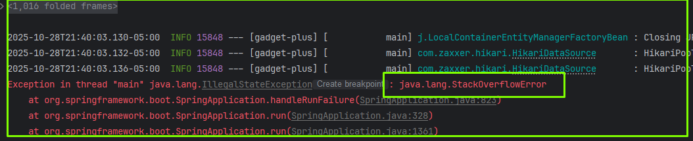

# EN RESUMEN POR ESTO ES QUE USAMOS @ToString.Exclude PARA EVITAR ESTOS PROBLEMAS DE RECUSION INFINITA

¡Excelente pregunta! El problema de **recursividad infinita** en JPA es muy común cuando trabajas con relaciones
bidireccionales. Te lo explico con tu caso específico:

## 🔄 ¿Por qué ocurre la recursividad infinita?

Tienes una relación **bidireccional** `@OneToOne` entre `OrderEntity` y `BillEntity`:

```
OrderEntity → bill (tiene referencia a BillEntity)
     ↓
BillEntity → order (tiene referencia de vuelta a OrderEntity)
```

### El problema ocurre cuando llamas a `toString()`:

1. **OrderEntity.toString()** → imprime sus campos + llama a `bill.toString()`
2. **BillEntity.toString()** → imprime sus campos + llama a `order.toString()`
3. **OrderEntity.toString()** → imprime sus campos + llama a `bill.toString()`
4. ... ♾️ **CICLO INFINITO** → StackOverflowError

## ✅ Soluciones

### 1. **Usar `@ToString.Exclude` en AMBOS lados** (Recomendado)

Ya lo tienes en `BillEntity`, pero debes asegurarte de tenerlo también en `OrderEntity`:

```java
// En OrderEntity
@ToString.Exclude
@OneToOne(fetch = FetchType.EAGER, cascade = CascadeType.ALL)
@JoinColumn(name = "id_bill", nullable = false, unique = true)
private BillEntity bill;

// En BillEntity (ya lo tienes)
@ToString.Exclude
@OneToOne(mappedBy = "bill", cascade = CascadeType.ALL, fetch = FetchType.EAGER)
private OrderEntity order;
```

### 2. **Usar `@JsonIgnore` o `@JsonBackReference`** (para serialización JSON)

Si además trabajas con APIs REST, también necesitas evitar la recursividad al serializar a JSON:

```java
// En BillEntity (lado NO dueño)
@JsonBackReference
@ToString.Exclude
@OneToOne(mappedBy = "bill", cascade = CascadeType.ALL, fetch = FetchType.EAGER)
private OrderEntity order;
```

## 🎯 Análisis de tu esquema SQL

Según tu tabla, **OrderEntity es el dueño** de la relación porque:

```sql
CREATE TABLE orders
(
    .
    .
    .
    id_bill
    VARCHAR
(
    64
) UNIQUE NOT NULL,
    FOREIGN KEY (id_bill) REFERENCES bill (id) ON DELETE CASCADE
    );
```

La columna `id_bill` está en la tabla `orders`, por eso en JPA:

- ✅ **OrderEntity** usa `@JoinColumn` (dueño de la relación)
- ✅ **BillEntity** usa `mappedBy = "bill"` (lado inverso)

## ⚠️ Advertencias adicionales

### 1. **EAGER fetching bidireccional es peligroso**

```java
// Ambos tienen FetchType.EAGER
fetch =FetchType.EAGER
```

Esto puede causar problemas de rendimiento. Considera usar `LAZY`:

```java
// En OrderEntity
@OneToOne(fetch = FetchType.LAZY, cascade = CascadeType.ALL)
@JoinColumn(name = "id_bill", nullable = false, unique = true)
private BillEntity bill;

// En BillEntity
@ToString.Exclude
@OneToOne(mappedBy = "bill", cascade = CascadeType.ALL, fetch = FetchType.LAZY)
private OrderEntity order;
```

### 2. **CascadeType.ALL puede ser peligroso**

Con `CascadeType.ALL` en ambos lados, cualquier operación se propaga. Ten cuidado con operaciones de borrado.

## 📝 Ejemplo completo corregido

```java
// OrderEntity (dueño de la relación)
@Entity
@Table(name = "orders")
@Data
public class OrderEntity {
    @Id
    @GeneratedValue(strategy = GenerationType.IDENTITY)
    private Long id;

    @Column(name = "created_at", nullable = false)
    private LocalDateTime createdAt;

    @Column(name = "client_name", nullable = false, length = 32)
    private String clientName;

    @ToString.Exclude // 👈 IMPORTANTE
    @OneToOne(fetch = FetchType.LAZY, cascade = CascadeType.ALL)
    @JoinColumn(name = "id_bill", nullable = false, unique = true)
    private BillEntity bill;
}

// BillEntity (lado inverso)
@Entity
@Table(name = "bill")
@Data
public class BillEntity {
    @Id
    @Column(length = 64)
    private String id;

    @Column(name = "total_amount")
    private BigDecimal totalAmount;

    @Column(name = "client_rfc", nullable = false, length = 14)
    private String clientRfc;

    @JsonBackReference // 👈 Para APIs REST
    @ToString.Exclude  // 👈 IMPORTANTE
    @OneToOne(mappedBy = "bill", cascade = CascadeType.ALL, fetch = FetchType.LAZY)
    private OrderEntity order;
}
```

¡Con estos cambios ya no tendrás recursividad infinita! 🎉

---

## #️ ⃣📚**Clase 28: CASCADE PERSIST`**

### SI TIENES DUDAS DE POR QUE BIGDECIMAL

La diferencia es por el tipo de dato que espera cada atributo:

- Los atributos `String` (como `id` o `rfc`) esperan cadenas de texto, por eso les asignas valores entre comillas, por
  ejemplo: `"AS537GD7D"`.
- El atributo `totalAmount` es de tipo `BigDecimal`, que es una clase especial de Java para manejar números decimales
  con precisión (ideal para dinero).

Cuando escribes `.totalAmount(BigDecimal.TEN)`, no estás poniendo un número directamente, sino que le estás pasando un
objeto `BigDecimal` que representa el número 10.  
No puedes poner simplemente `.totalAmount(10.0)` porque eso sería un `double`, y Java no lo convierte automáticamente a
`BigDecimal` (por precisión y seguridad).

Si quieres asignar otro valor, puedes hacerlo así:

```java
.totalAmount(new BigDecimal("8101.76"))
```

Esto crea un objeto `BigDecimal` con el valor exacto que necesitas, igual que el que tienes en tu base de datos.  
En resumen: usas `BigDecimal` para mantener la precisión en los valores decimales, no números primitivos ni cadenas.

---

## EXCEPTION CUANDO QUIERES GENERAR DATOS NUEVOS EXCEPTION TRANSIENT

Si no pones el cascade = CascadeType.ALL te va a salir ese error por que recuerda que estas usando

```java

@OneToOne(fetch = FetchType.EAGER, cascade = CascadeType.PERSIST)
@JoinColumn(name = "id_bill", nullable = false, unique = true)
private BillEntity bill;
```

### Nota : si no se persiste primero bill saldra un error ->

- El detalle es que estas tratando de persistir un bill que aun no esta creado en la base de datos y por eso te sale el
  error
  `org.hibernate.TransientObjectException: object references an unsaved transient instance - save the transient instance before flushing: com.debuggeandoideas.gadgetplus.entity.BillEntity`
- La solucion es usar cascade = CascadeType.ALL para que cuando guardes la orden tambien se guarde el bill asociado
-

```java
// SETEAMOS
var bill = BillEntity.builder()
                .rfc("AS537GD7X")
                .totalAmount(BigDecimal.TEN)
                .id("b-18")
                .build();

var order = OrderEntity.builder()
        .createdAt(LocalDateTime.now())
        .clientName("Alex Martinez")
        .bill(bill)
        .build();
        this.orderRepository.

save(order);
```

## Se agrego dos nuevos registros a la bd

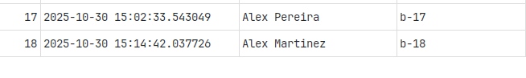
---

## #️ ⃣📚**Clase 29: CASCADE MERGE`**

cascade : Si no pusiera cascade type merge me va a salir la exception, o no actualiza el bill asociado a la orden

CascadeType.PERSIST,CascadeType.MERGE -> PERSIST PARA EL SAVE Y MERGE PARA EL UPDATE

```java

@OneToOne(fetch = FetchType.EAGER, cascade = {CascadeType.PERSIST, CascadeType.MERGE})
@JoinColumn(name = "id_bill", nullable = false, unique = true)
private BillEntity bill;

```

---

## #️ ⃣📚**Clase 30: CASCADE DELETE-DETACH`**

```java
//EN MAIN ->
// ************* Ejercicio CASCADE.DELETE AUNQUE MEJOR ES CASCADE.ALL *************
var order = this.orderRepository.findById(17L).get();
        this.orderRepository.

delete(order);

//borramos el order y el bill asociado con cascade delete con id 17L
//********************************************************************************************************************************************
//EN ORDER ->
// Relación uno a uno con BillEntity DELETE.TYPE.MERGE y PERSIST
//con DETACH BORRAMOS TANTO EL HIJO COMO EL PADRE OSEA DEL ORDER Y DEL BILL
@OneToOne(fetch = FetchType.EAGER, cascade = CascadeType.ALL)
// lo menos comun es ver esto -> cascade = {CascadeType.DETACH, CascadeType.REMOVE}
@JoinColumn(name = "id_bill", nullable = false, unique = true)
private BillEntity bill;

```

---

## #️ ⃣📚**Clase 31: LOMBOK DATA EN ENTIDADES`**

- Agregamos @setter , @Getter y hashcode equals en BillEntity y OrderEntity
- No es recomendable usar @Data en clases Entity, en DTO si se puede usar , es mejor usar @Getter, @Setter,@ToString y
  EQUALS,HASHCODE

### NOTA ¿POR QUE ES NECESARIO?

Agregar los métodos `equals` y `hashCode` en las entidades JPA como `OrderEntity` y `BillEntity` es importante por estas
razones:

- 🟢 **Identidad de entidad:** Permite comparar correctamente si dos instancias representan el mismo registro en la base
  de datos (usualmente por el campo `id`).
- 🔄 **Colecciones:** Es necesario para que funcionen bien en colecciones como `Set` o como claves en un `Map`, evitando
  duplicados y asegurando búsquedas correctas.
- 🛡️ **Integridad en JPA:** Hibernate y JPA usan estos métodos internamente para gestionar el estado de las entidades (
  persistencia, caché, sincronización).

**Resumen:**  
Implementar `equals` y `hashCode` garantiza que las entidades se comporten correctamente al ser comparadas, almacenadas
o gestionadas por JPA y colecciones de Java.

```java
@Entity
@Table(name = "orders")
@Getter
@Setter
@ToString
@AllArgsConstructor
@NoArgsConstructor// crea constructor sin parametros
@Builder // Patron de diseño builder
public class OrderEntity
```

```java

@Override
public boolean equals(Object o) {
    if (o == null || getClass() != o.getClass()) return false;
    BillEntity that = (BillEntity) o;
    return Objects.equals(id, that.id);
}

@Override
public int hashCode() {
    return Objects.hashCode(id);
}

//--------------------------------------------------------
@Override
public boolean equals(Object o) {
    if (o == null || getClass() != o.getClass()) return false;
    OrderEntity that = (OrderEntity) o;
    return Objects.equals(id, that.id);
}

@Override
public int hashCode() {
    return Objects.hashCode(id);
}

```

---

## #️ ⃣📚**Clase 32: MANYTOONE ONETOMANY`**

- Empezamos mapeo de producto vemos su esquema:

```sql
SELECT column_name,
       data_type,
       is_nullable
FROM information_schema.columns
WHERE table_name = 'products';
```


- Creamos una entidad Entity

```java
@Entity
@Table(name = "products")
@Getter
@Setter
@ToString
@AllArgsConstructor
@NoArgsConstructor
@Builder
public class ProductEntity
```

## Relación Many-to-One

- **Muchos productos** pueden pertenecer a **una sola orden**
- Desde la perspectiva de `ProductEntity`: `@ManyToOne` hacia `OrderEntity`
- Es la entidad "propietaria" de la relación porque tiene la clave foránea

## JoinColumn

```java
@JoinColumn(name = "id_order")
```

- Crea la columna `id_order` en la tabla `products`
- Esta columna almacena el `id` de la orden a la que pertenece cada producto

## Cascade = CascadeType.ALL

**Cuidado aquí**: Esta configuración puede ser problemática porque:

- Si guardas un `ProductEntity`, también guardará/actualizará la `OrderEntity`
- Si eliminas un `ProductEntity`, también eliminará la `OrderEntity` asociada

## Recomendación

Para esta relación, considera usar:

```java

@ManyToOne(cascade = {CascadeType.PERSIST, CascadeType.MERGE})
@JoinColumn(name = "id_order")
private OrderEntity order;
```

Esto evita que eliminar un producto elimine accidentalmente toda la orden y sus otros productos.

## Flujo típico

1. Una orden puede tener múltiples productos
2. Cada producto pertenece a una sola orden
3. La clave foránea `id_order` en `products` referencia el `id` en `orders`

---

### Del lado de order hacemos el mapeo inverso desde OrderEntity mandamos al mappedBy ->

```java
   // Relación uno a muchos con ProductEntity
@OneToMany(mappedBy = "order", fetch = FetchType.EAGER, cascade = CascadeType.ALL)
private List<ProductEntity> products = new ArrayList<>();
```

---
El `mappedBy` en JPA **NO** se refiere al nombre de la tabla, sino al **nombre del atributo** en la entidad del lado
opuesto de la relación.

## 🔍 Explicación del `mappedBy = "order"`

En tu código:

```java
@OneToMany(mappedBy = "order", ...)
private List<ProductEntity> products = new ArrayList<>();
```

El `"order"` se refiere al atributo `order` que está definido en la clase `ProductEntity`:

```java

@ManyToOne(cascade = CascadeType.ALL)
@JoinColumn(name = "id_order")
private OrderEntity order; // ← Este es el atributo referenciado
```

## 📋 Resumen de la relación:

- **`OrderEntity`**: Lado propietario de la relación `@OneToMany`
- **`ProductEntity`**: Lado inverso con `@ManyToOne`
- **`mappedBy = "order"`**: Apunta al campo `order` de `ProductEntity`
- **`name = "id_order"`**: Este sí es el nombre de la columna en la tabla `products`

## 🎯 Flujo de la relación:

1. `OrderEntity` tiene muchos `ProductEntity`
2. Cada `ProductEntity` pertenece a un `OrderEntity`
3. La columna `id_order` en la tabla `products` almacena la clave foránea
4. El `mappedBy` conecta ambos lados de la relación bidireccional

--- 

## ¿COMO SE QUIEN ES EL LADO PROPIETARIO?

Excelente pregunta. Te explico cómo identificar el **lado propietario** de una relación JPA:

## 🔍 **Cómo identificar el lado propietario**

### 1. **El lado SIN `mappedBy` es el PROPIETARIO**

```java
// ✅ PROPIETARIO - NO tiene mappedBy
@ManyToOne(cascade = CascadeType.ALL)
@JoinColumn(name = "id_order")
private OrderEntity order;

// ❌ NO PROPIETARIO - SÍ tiene mappedBy  
@OneToMany(mappedBy = "order", ...)
private List<ProductEntity> products;
```

### 2. **El lado con `@JoinColumn` es el PROPIETARIO**

```java
// ✅ PROPIETARIO - tiene @JoinColumn
@OneToOne(cascade = CascadeType.ALL)
@JoinColumn(name = "id_bill")
private BillEntity bill;

// ❌ NO PROPIETARIO - tiene mappedBy
@OneToOne(mappedBy = "bill", ...)
private OrderEntity order;
```

## 📋 **Reglas para identificar el propietario**

| Anotación     | Lado Propietario        | Lado NO Propietario |
|---------------|-------------------------|---------------------|
| `@OneToOne`   | Tiene `@JoinColumn`     | Tiene `mappedBy`    |
| `@OneToMany`  | N/A (raro caso)         | Tiene `mappedBy`    |
| `@ManyToOne`  | **Siempre propietario** | N/A                 |
| `@ManyToMany` | Sin `mappedBy`          | Con `mappedBy`      |

## 🎯 **En tu caso específico:**

```java
// ProductEntity - PROPIETARIO
@ManyToOne(cascade = CascadeType.ALL)
@JoinColumn(name = "id_order")  // ← Crea la columna física
private OrderEntity order;

// OrderEntity - NO PROPIETARIO  
@OneToMany(mappedBy = "order", ...)  // ← Solo mapea, no crea columna
private List<ProductEntity> products;
```

## 💡 **Lógica simple:**

- **PROPIETARIO** = Quien tiene la **clave foránea física** en su tabla
- **NO PROPIETARIO** = Quien solo **referencia** la relación usando `mappedBy`

## ⚡ **Truco rápido:**

Si ves `mappedBy = "..."` → Ese lado **NO es propietario**
Si ves `@JoinColumn` → Ese lado **SÍ es propietario**

En relaciones `@ManyToOne`, siempre el lado "Many" es el propietario (tiene la clave foránea).

---

## ¿POR QUE USAR LIST EN ORDERENTITY?

Excelente pregunta. Se usa una **Lista** (`List<ProductEntity>`) en `OrderEntity` porque estamos modelando una relación
**uno a muchos** (`@OneToMany`):

## 🔍 **Razón principal:**

```java
// UNA orden puede tener MUCHOS productos
@OneToMany(mappedBy = "order", ...)
private List<ProductEntity> products = new ArrayList<>();
```

## 📋 **Explicación del modelo de negocio:**

- **1 OrderEntity** → **N ProductEntity**
- Una orden puede contener múltiples productos con diferentes cantidades
- Cada producto pertenece a una sola orden

## 🎯 **¿Por qué `List` y no otras colecciones?**

### ✅ **Ventajas de `List`:**

- Permite **duplicados** (si necesitas el mismo producto múltiples veces)
- Mantiene el **orden** de inserción
- **Indexado** por posición
- Compatible con `@OrderColumn` si quieres orden específico

### 🔄 **Alternativas y cuándo usarlas:**

```java
// Set - Sin duplicados, sin orden garantizado
private Set<ProductEntity> products = new HashSet<>();

// List - Con duplicados, con orden
private List<ProductEntity> products = new ArrayList<>();
```

## 💡 **En tu caso específico:**

```java
// ProductEntity tiene quantity, entonces List es perfecto
var product1 = ProductEntity.builder()
                .quantity(BigInteger.ONE)  // ← Cantidad controlada aquí
                .build();
var product2 = ProductEntity.builder()
        .quantity(BigInteger.TWO)  // ← No en la colección
        .build();

var products = List.of(product1, product2); // ← Lista de productos
```

## 🎯 **Resumen:**

Se usa `List` porque una orden puede tener **múltiples productos**,
cada uno con su propia cantidad, y queremos mantener el orden y permitir
flexibilidad en el manejo de los productos asociados a la orden.

---

## #️ ⃣📚**Clase 33: PROBANDO RELACIONES ONETOMANY**

# ¿QUIEN ES PADRE - HIJO - QUIEN ES PROPIETARIO Y QUIEN NO?

¡**NO, NO ESTÁ MAL**! 🎯 El texto está **CORRECTO**.

Hay una confusión en los términos. Déjame aclararte:

---

## 🔍 **Diferencia entre "PADRE" y "PROPIETARIO":**

### **🏠 PADRE/HIJO (Relación conceptual):**

- **PADRE** = Entidad independiente (puede existir sin la otra)
- **HIJO** = Entidad dependiente (necesita al padre para existir)

### **👑 PROPIETARIO/INVERSO (Relación técnica JPA):**

- **PROPIETARIO** = Quien controla la FK (tiene `@JoinColumn`)
- **INVERSO** = Quien no controla la FK (tiene `mappedBy`)

---

## 📊 **En tu caso orders ↔ products:**

```java
// ProductEntity
@ManyToOne
@JoinColumn(name = "id_order")     // ← PROPIETARIO (controla FK)
private OrderEntity order;

// OrderEntity  
@OneToMany(mappedBy = "order")     // ← INVERSO (no controla FK)
private List<ProductEntity> products;
```

**Análisis:**

- 🏠 **PADRE:** `orders` (independiente)
- 👶 **HIJO:** `products` (depende de orders)
- 👑 **PROPIETARIO:** `ProductEntity` (tiene `@JoinColumn`)
- 🔄 **INVERSO:** `OrderEntity` (tiene `mappedBy`)

---

## 💡 **¿Por qué el HIJO es PROPIETARIO?**

**Porque el hijo es quien "posee" la FK física en la DB:**

```sql
CREATE TABLE products (
    id BIGSERIAL PRIMARY KEY,
    id_order BIGINT,              -- ← FK está aquí (hijo la "posee")
    FOREIGN KEY (id_order) REFERENCES orders(id)
);
```

---

## ✅ **Tu confusión era natural porque:**

- **Conceptualmente:** `orders` es el PADRE
- **Técnicamente en JPA:** `ProductEntity` es el PROPIETARIO

**Ambos términos son correctos, pero se refieren a cosas diferentes:**

| Concepto                | orders     | products       |
|:------------------------|:-----------|:---------------|
| **Relación conceptual** | PADRE 🏠   | HIJO 👶        |
| **Control JPA**         | INVERSO 🔄 | PROPIETARIO 👑 |

---

## 🎯 **El texto está correcto porque:**

> *"El propietario es el que **contiene la FK** y **no** tiene `mappedBy`"*

✅ `ProductEntity` contiene la FK (`id_order`)
✅ `ProductEntity` no tiene `mappedBy`  
✅ `OrderEntity` tiene `mappedBy` → es el lado inverso

**Tu texto es técnicamente perfecto. ** 👍 Solo hay que entender que **PADRE ≠ PROPIETARIO** necesariamente.

# ¿PORQUE BUILDER?

```java
 var product1 = ProductEntity.builder()
        .quantity(BigInteger.ONE)
        .build();

```

El patrón **Builder** se usa aquí por varias razones prácticas:

## Ventajas del patrón Builder

### 1. **Flexibilidad en la construcción**

```java
// Con Builder - puedes omitir campos opcionales
var product1 = ProductEntity.builder()
                .quantity(BigInteger.ONE)
                .build();

// Sin Builder - necesitarías constructor con todos los parámetros
var product2 = new ProductEntity(null, BigInteger.ONE, null, null, null);
```

### 2. **Legibilidad del código**

El Builder hace el código **más legible** porque:

- Especificas explícitamente qué campo estás asignando
- No dependes del orden de los parámetros del constructor
- Evitas constructores con muchos parámetros

### 3. **Inmutabilidad parcial**

```java
// Puedes crear objetos paso a paso
var productBuilder = ProductEntity.builder()
                .quantity(BigInteger.ONE);

// Agregar más campos según condiciones
if(someCondition){
        productBuilder.

name("Producto especial");
}

var product = productBuilder.build();
```

### 4. **Integración con Lombok**

Tu entidad probablemente usa `@Builder` de Lombok:

```java

@Entity
@Builder
public class ProductEntity {
    // campos...
}
```

## Alternativas sin Builder

```java
// Constructor tradicional (menos legible)
var product = new ProductEntity();
product.

setQuantity(BigInteger.ONE);

// O constructor con parámetros (menos flexible)
var product = new ProductEntity(BigInteger.ONE);
```

El Builder es especialmente útil cuando tienes **entidades con muchos campos** y solo necesitas inicializar algunos de
ellos.

---

## explicacion del codigo  PROBANDO RELACIONES OneToMany

```java
// ************* PROBANDO RELACIONES OneToMany *************
var order = this.orderRepository.findById(1L).orElseThrow();

var product1 = ProductEntity.builder()
        .quantity(BigInteger.ONE)
        .build();
var product2 = ProductEntity.builder()
        .quantity(BigInteger.TWO)
        .build();

var products = List.of(product1, product2);

        order.

setProducts(products);

        products.

forEach(product ->product.

setOrder(order));

        this.orderRepository.

save(order);
```

---

## Explicación del código

El código muestra cómo trabajar con una relación **OneToMany bidireccional** entre `OrderEntity` y `ProductEntity`. Aquí
está la explicación paso a paso:

## 1. **Buscar la orden existente**

```java
var order = this.orderRepository.findById(1L).orElseThrow();
```

- Busca una orden con ID = 1 en la base de datos
- `orElseThrow()` lanza excepción si no la encuentra

## 2. **Crear productos usando Builder**

```java
var product1 = ProductEntity.builder()
        .quantity(BigInteger.ONE)
        .build();
var product2 = ProductEntity.builder()
        .quantity(BigInteger.TWO)
        .build();
```

- Crea dos productos con cantidades 1 y 2 respectivamente
- Solo se especifica `quantity`, otros campos quedan por defecto

## 3. **Crear lista de productos**

```java
var products = List.of(product1, product2);
```

- Agrupa los productos en una lista inmutable

## 4. **Establecer relación bidireccional**

```java
order.setProducts(products);  // Lado OrderEntity (OneToMany)
products.

forEach(product ->product.

setOrder(order));  // Lado ProductEntity (ManyToOne)
```

**Es crucial hacer ambas asignaciones** porque:

- `order.setProducts(products)` → Establece la relación desde la orden hacia los productos
- `product.setOrder(order)` → Establece la relación desde cada producto hacia la orden

### IMPORTANTE COMO ES QUE TIENE setProducts SI NO TENEMOS SETTER EN ORDERENTITY

- Aunque no veas explícitamente un método `setProducts` en `OrderEntity`, es
- porque utilizando **Lombok** en tu proyecto. Lombok es una biblioteca que genera
- automáticamente métodos como getters, setters, constructores, etc., en tiempo de
- compilación mediante anotaciones.

### es como si tuvieras esto implicitamente pero como estamos usando @Setter y @Getter de lombok no es necesario escribirlo manualmente

```java
 public void setProducts(List<ProductEntity> products) {
    this.products = products;
}
```

### Explicacion desde Claud

¡Exacto! Has entendido perfectamente cómo funciona la **generación automática de métodos** con **Lombok** y los
principios de **POO**.

## 🔍 **Explicación detallada:**

### 1. **Lombok genera automáticamente los métodos**

```java

@Setter  // ← Esta anotación genera todos los setters
private List<ProductEntity> products = new ArrayList<>();
```

**Lombok automáticamente crea:**

```java
public void setProducts(List<ProductEntity> products) {
    this.products = products;
}
```

### 2. **Convención de nombres Java**

La convención de **JavaBeans** dice:

- Campo: `products` → Método: `setProducts()`
- Campo: `clientName` → Método: `setClientName()`
- Campo: `id` → Método: `setId()`

### 3. **Por eso aparece `setProducts()` en tu IDE**

```java
// Tu campo privado
private List<ProductEntity> products = new ArrayList<>();

// Lombok genera automáticamente (invisible para ti)
public void setProducts(List<ProductEntity> products) { ...}

// Por eso puedes usar:
order.

setProducts(products); // ✅ Funciona perfectamente
```

## 🎯 **Otros métodos que Lombok genera automáticamente:**

### Con `@Setter`:

- `setId(Long id)`
- `setClientName(String clientName)`
- `setProducts(List<ProductEntity> products)`
- `setBill(BillEntity bill)`

### Con `@Getter`:

- `getId()`
- `getClientName()`
- `getProducts()`
- `getBill()`

## 💡 **Verificación en tu IDE:**

Cuando escribes `order.set` y presionas **Ctrl+Espacio**, el IDE te muestra todos los métodos
**set** que Lombok generó automáticamente basándose en tus campos privados.

## 🎯 **Resumen:**

Sí, **`setProducts()`** existe porque **Lombok** lo generó automáticamente a partir del campo
**`private List<ProductEntity> products`** usando la anotación **`@Setter`**. Es pura **magia de Lombok** + *
*convenciones Java**.

### Explicacion de por que usar el forEach para setear la orden en cada producto

Excelente pregunta. Necesitas el `forEach` porque estás trabajando con una **relación bidireccional** y debes *
*sincronizar ambos lados** de la relación.

## 🔍 **¿Por qué es necesario el forEach?**

### 1. **Relación bidireccional requiere sincronización manual**

```java
// ✅ LADO 1: OrderEntity → ProductEntity (OneToMany)
order.setProducts(products);

// ✅ LADO 2: ProductEntity → OrderEntity (ManyToOne) 
products.

forEach(product ->product.

setOrder(order));
```

### 2. **Sin el forEach, la relación queda incompleta**

```java
// ❌ PROBLEMA: Solo un lado conoce la relación
order.setProducts(products);
// Los products NO saben que pertenecen a esta order

// ✅ SOLUCIÓN: Ambos lados conocen la relación
order.

setProducts(products);
products.

forEach(product ->product.

setOrder(order));
```

¡Excelente observación! Vamos a analizar qué contiene exactamente el objeto `order` en ese momento:

## 🔍 **Estado del objeto `order` paso a paso:**

### 1. **Al inicio (después del findById):**

```java
var order = this.orderRepository.findById(1L).orElseThrow();
// order contiene:
// - id = 1
// - clientName = "Ronda Rousey" (ejemplo)
// - createdAt = 2025-10-28T02:20:18.193608
// - products = [] (lista vacía o productos existentes)
// - bill = BillEntity{...}
```

### 2. **Después de `order.setProducts(products)`:**

```java
order.setProducts(products);
// order ahora contiene:
// - id = 1
// - clientName = "Ronda Rousey"
// - createdAt = 2025-10-28T02:20:18.193608
// - products = [product1, product2] ← ¡YA TIENE LOS PRODUCTOS! ESTO ES PARTE DE LA RELACION ONETOMANY
// - bill = BillEntity{...}

// Pero los productos AÚN NO conocen al order:
// product1.getOrder() = null ❌
// product2.getOrder() = null ❌
```

### 3. **Durante el forEach:**

```java
products.forEach(product ->product.

setOrder(order));

// Cuando se ejecuta product.setOrder(order):
// - product recibe el objeto order COMPLETO
// - Ese order YA CONTIENE la lista de productos
// - product.getOrder() = order{id=1, products=[product1, product2], ...} ✅
```

## 🎯 **¿Qué significa esto?**

### ✅ **SÍ, el `order` pasado contiene la data de los productos:**

```java
// En el momento del forEach:
product1.setOrder(order);
// order = {
//   id: 1,
//   clientName: "Ronda Rousey",
//   products: [product1, product2], ← ¡SÍ está aquí!
//   bill: {...}
// }
```

## ¿De donde proviene products:[product1,product2...]?

¡AH! 🎯 **Entiendo tu confusión**. Tienes razón - en tu tabla `orders` **NO HAY** una columna `products`.

---

## 🤔 **¿De dónde sale `products = []` entonces?**

La lista `products` **NO viene de la tabla `orders`** directamente. Viene de una **relación JPA @OneToMany** que tú
defines en tu Entity.

---

## 📋 **En tu tabla orders (SQL):**

```sql
CREATE TABLE orders (
    id BIGSERIAL PRIMARY KEY,           -- ✅ id
    created_at TIMESTAMP NOT NULL,      -- ✅ createdAt  
    client_name VARCHAR(32) NOT NULL,   -- ✅ clientName
    id_bill VARCHAR(64) UNIQUE NOT NULL -- ✅ idBill
    -- ❌ NO HAY columna "products" aquí
);
```

---

## 🔗 **En tu Entity (Java/JPA):**

```java
@Entity
@Table(name = "orders")
public class OrderEntity {
    
    @Id
    private Long id;                    // ← De orders. id
    
    private LocalDateTime createdAt;    // ← De orders.created_at
    
    private String clientName;          // ← De orders.client_name
    
    private String idBill;              // ← De orders.id_bill
    
    // 🎯 AQUÍ ES DONDE APARECE LA LISTA:
    @OneToMany(mappedBy = "order")      // ← NO es una columna, es una RELACIÓN
    private List<ProductEntity> products = new ArrayList<>();
    
    @OneToOne
    @JoinColumn(name = "id_bill")
    private BillEntity bill;            // ← De la relación con bill
}
```

---

## 🔍 **¿Cómo funciona @OneToMany?**

```java
@OneToMany(mappedBy = "order")
private List<ProductEntity> products;
```

**Significado:**

- "Dame todos los productos que tengan `id_order` igual al `id` de esta orden"
- Es una **query automática** que hace Hibernate/JPA
- **NO es una columna en la tabla `orders`**

---

## 📊 **Query que hace JPA por detrás:**

Cuando llamas a `order.getProducts()`, JPA ejecuta:

```sql
SELECT * FROM products 
WHERE id_order = 1;  -- id de la orden actual
```

Y llena la lista `products` con esos registros.

---

## 💡 **Resumen:**

| Campo en Entity | Viene de                     | Tipo            |
|:----------------|:-----------------------------|:----------------|
| `id`            | `orders.id`                  | Columna ✅       |
| `clientName`    | `orders.client_name`         | Columna ✅       |
| `createdAt`     | `orders.created_at`          | Columna ✅       |
| `idBill`        | `orders.id_bill`             | Columna ✅       |
| `products`      | **Query a tabla `products`** | Relación JPA 🔗 |
| `bill`          | **Query a tabla `bill`**     | Relación JPA 🔗 |

**`products = []` NO es una columna - es el resultado de una relación JPA que busca en la tabla `products` los registros
con `id_order = 1`. **

### 🔄 **Esto crea una relación circular:**

```java
// Después del forEach:
order.getProducts().

get(0) ==product1 ✅
        product1.

getOrder().

getProducts().

get(0) ==product1 ✅
// ¡product1 puede acceder a sí mismo a través de order!
```

## 💡 **Implicaciones prácticas:**

### 1. **Navegación completa:**

```java
// Desde cualquier producto puedes acceder a:
product1.getOrder().

getClientName(); // → "Ronda Rousey"
product1.

getOrder().

getProducts().

size(); // → 2
product1.

getOrder().

getBill().

getRfc(); // → "ERT655687JHY"
```

### 2. **Acceso a productos hermanos:**

```java
// Desde product1, puedes acceder a product2:
ProductEntity product2 = product1.getOrder().getProducts().get(1);
```

### 3. **Cuidado con recursividad infinita:**

```java
// Por eso usas @ToString.Exclude para evitar:
// order.toString() → products.toString() → order.toString() → ♾️
```

## 🎯 **Resumen:**

**SÍ**, cuando ejecutas `product.setOrder(order)`, ese `order` **YA CONTIENE** la lista completa de productos porque
se ejecutó `order.setProducts(products)` antes del `forEach`.

Esto crea una **red de navegación bidireccional completa** donde desde cualquier objeto puedes navegar hacia cualquier
otro objeto de la relación.
---

## 🎯 **¿Por qué JPA/Hibernate necesita esto?**

### Sin sincronización:

```java
order.setProducts(products);
// products[0].getOrder() = null ❌
// products[1].getOrder() = null ❌
```

### Con sincronización:

```java
order.setProducts(products);
products.

forEach(product ->product.

setOrder(order));
// products[0].getOrder() = order ✅
// products[1].getOrder() = order ✅
```

## 🔄 **Flujo de persistencia:**

1. **JPA verifica el lado propietario** (`ProductEntity` con `@ManyToOne`)
2. **Debe encontrar la referencia `order`** en cada `ProductEntity`
3. **Crea la clave foránea `id_order`** en la tabla `products`

## 💡 **Método helper recomendado:**

```java
// En OrderEntity
public void addProduct(ProductEntity product) {
    this.products.add(product);
    product.setOrder(this);  // ← Sincronización automática
}

// Uso:
order.

addProduct(product1);
order.

addProduct(product2);
```

## 🎯 **Resumen:**

El `forEach` es necesario porque **JPA requiere que el lado propietario
** (`ProductEntity`) **tenga la referencia completa** (`order`) para crear correctamente
las claves foráneas en la base de datos. Sin esto, la relación existe solo en un lado y
JPA no puede persistirla correctamente.

---
¡Exactamente! Has captado perfectamente el problema. Sin el `forEach`, tendrías que hacer el mapeo **manualmente uno por
uno**, lo cual es muy tedioso y propenso a errores.

## 🔍 **Comparación práctica:**

### ❌ **Sin forEach (manual y tedioso):**

```java
// Con 2 productos - ya es molesto
order.setProducts(products);
product1.

setOrder(order);  // ← Manual
product2.

setOrder(order);  // ← Manual

// Con 1000 productos - ¡IMPOSIBLE de mantener!
order.

setProducts(products);
product1.

setOrder(order);
product2.

setOrder(order);
product3.

setOrder(order);
// ... 997 líneas más 😱
product1000.

setOrder(order);
```

### ✅ **Con forEach (automático y escalable):**

```java
// Funciona igual para 2, 100 o 1000 productos
order.setProducts(products);
products.

forEach(product ->product.

setOrder(order)); // ← Una sola línea
```

## 🎯 **Ventajas del forEach:**

### 1. **Escalabilidad automática**

```java
// No importa si son 10 o 10,000 productos
var products = createThousandsOfProducts();
order.

setProducts(products);
products.

forEach(product ->product.

setOrder(order)); // ← Siempre una línea
```

### 2. **Menos propenso a errores**

```java
// ❌ Fácil olvidar algún producto manualmente
product1.setOrder(order);
product2.

setOrder(order);
// ¿Olvidaste product3? ← Bug silencioso

// ✅ El forEach nunca se olvida de ninguno
products.

forEach(product ->product.

setOrder(order)); // ← Garantizado
```

### 3. **Código más limpio y mantenible**

```java
// Una línea vs. N líneas
// Fácil de leer y entender
// Fácil de modificar si cambia la lógica
```

## 💡 **Método helper aún mejor:**

Para hacer esto más elegante, puedes crear un método helper:

```java
// En OrderEntity
public void addProducts(List<ProductEntity> products) {
    this.products.addAll(products);
    products.forEach(product -> product.setOrder(this));
}

// Uso súper limpio:
order.

addProducts(products); // ← Una sola línea hace todo
```

## 🎯 **Resumen:**

Sí, sin el `forEach` tendrías que setear **cada producto individualmente**, lo cual es:

- ⛔ Tedioso para muchos productos
- 🐛 Propenso a errores (olvidar algunos)
- 📝 Código repetitivo e imposible de mantener

El `forEach` es la **solución elegante y escalable** para relaciones bidireccionales
con muchos elementos.

## 5. **Persistir cambios**

```java
this.orderRepository.save(order);
```

- Guarda la orden y, debido a `CascadeType.ALL`, también persiste los productos automáticamente

## ⚠️ Punto importante

Sin el paso 4 completo, la relación bidireccional no funcionaría correctamente y podrías tener
inconsistencias entre el modelo de objetos y la base de datos.

## Resultado

- La orden ID=1 ahora tendrá 2 productos asociados
- En la tabla `products` se crearán registros con `id_order = 1`


# ¿THIS?

El `this` en `this.orderRepository.save(order)` se refiere a la **instancia actual de la clase `GadgetPlusApplication`
**.

## 🔍 **Explicación detallada:**

### 1. **Contexto de la clase:**

```java

@SpringBootApplication
public class GadgetPlusApplication implements CommandLineRunner {

    @Autowired
    private OrderRepository orderRepository; // ← Campo de esta clase

    @Override
    public void run(String... args) throws Exception {
        // this = instancia de GadgetPlusApplication
        this.orderRepository.save(order); // ← this.orderRepository
    }
}
```

### 2. **`this` = instancia de `GadgetPlusApplication`:**

```java
// Equivalencia:
this.orderRepository.save(order);
// Es lo mismo que:
GadgetPlusApplication .this.orderRepository.

save(order);
```

### 3. **Podrías omitir el `this`:**

```java
// Ambas líneas son equivalentes:
this.orderRepository.save(order); // ✅ Explícito
orderRepository.

save(order);      // ✅ Implícito (this se asume)
```

## 🎯 **¿Por qué usar `this` aquí?**

### 1. **Claridad y buenas prácticas:**

```java
// Más claro que estás accediendo a un campo de la clase
this.orderRepository.save(order);
this.billRepository.

findAll();
```

### 2. **Evita ambigüedad:**

```java
// Si tuvieras un parámetro con el mismo nombre
public void someMethod(OrderRepository orderRepository) {
    this.orderRepository.save(order); // ← Campo de la clase
    orderRepository.findAll();        // ← Parámetro del método
}
```

## 💡 **Comparación con otros `this`:**

### En `GadgetPlusApplication`:

```java
this.orderRepository // ← this = GadgetPlusApplication
```

### En método helper de `OrderEntity` (si existiera):

```java
// Dentro de OrderEntity
public void addProducts(List<ProductEntity> products) {
    this.products.addAll(products); // ← this = OrderEntity
}
```

## 🎯 **Resumen:**

El `this` en `this.orderRepository.save(order)` se refiere a la **instancia actual
de `GadgetPlusApplication`** y está accediendo al campo `orderRepository` que fue inyectado
por Spring con `@Autowired`.

---

### 🎯 EXPLICACION MAS DETALLADA ¿POR QUE SE NECESITA UNA LISTA EN OrderEntity?

No es **obligatorio** hacer la relación inversa, pero es una **buena práctica** para la navegación bidireccional.

Respondiendo a tu pregunta específica: pones `List<ProductEntity>` porque:

1. **Relación lógica**: Una orden puede tener **múltiples productos** (OneToMany)
2. **Consulta automática**: JPA ejecuta una consulta como:
   ```sql
   SELECT * FROM products WHERE id_order = ?
   ```
3. **Navegación**: Desde `OrderEntity` puedes acceder directamente a `order.getProducts()` sin hacer consultas manuales

La información **NO** se almacena en la tabla `orders`. La llave foránea `id_order` sigue estando solo en la tabla
`products`. La lista es solo una representación en Java para facilitar el acceso a los datos relacionados.

**Ejemplo práctico**:

- Tabla `orders`: `id=1, client_name="Juan"`
- Tabla `products`:
    - `id=1, quantity=5, id_order=1`
    - `id=2, quantity=3, id_order=1`

Cuando cargas `OrderEntity` con `id=1`, JPA automáticamente llena la lista `products` con los 2 productos que tienen
`id_order=1`.

Es una **conveniencia** de JPA, no un requisito de base de datos.

## ¿QUE PASA EN ESTA LINEA  this.orderRepository.save(order); ?

¡Excelente pregunta! 🎯 **SÍ**, cuando ejecutas `this.orderRepository.save(order)`, JPA automáticamente **genera los IDs
** para los productos nuevos.

## 🔍 **Qué pasa durante el save:**

### 1. **Antes del save:**

```java
// Los productos tienen:
product1.getId() =null ❌
        product2.

getId() =null ❌
```

### 2. **Durante el save:**

```java
this.orderRepository.save(order);
// JPA detecta que hay productos nuevos (id = null)
// Ejecuta SQL similar a:
// INSERT INTO products (quantity, id_order) VALUES (1, 1);
// INSERT INTO products (quantity, id_order) VALUES (2, 1);
```

### 3. **Después del save:**

```java
// Los productos ahora tienen:
product1.getId() =8L ✅ (auto-generado)
        product2.

getId() =9L ✅ (auto-generado)
```

## 🎯 **¿Por qué funciona automáticamente?**

### **Cascade.ALL** en la relación:

```java

@OneToMany(mappedBy = "order",
        fetch = FetchType.EAGER,
        cascade = CascadeType.ALL) // ← ¡ESTO ES LA CLAVE!
private List<ProductEntity> products = new ArrayList<>();
```

### **GenerationType.IDENTITY** en ProductEntity:

```java

@Id
@GeneratedValue(strategy = GenerationType.IDENTITY) // ← Auto-increment
private Long id;
```

## 🔧 **Para verificar esto en el debugger:**

### **Breakpoint ANTES del save:**

```java
// Examina:
product1.getId()    // → null
product2.

getId()    // → null

this.orderRepository.

save(order); // ← BREAKPOINT AQUÍ
```

### **Breakpoint DESPUÉS del save:**

```java
this.orderRepository.save(order);
// ← BREAKPOINT AQUÍ

// Examina:
product1.

getId()    // → 8L (o el siguiente disponible)
product2.

getId()    // → 9L
```

## 📊 **Lo que verás en la base de datos:**

### Tabla `products` después del save:

```sql
| id | quantity | id_order |
|----|----------|----------|
| 8  | 1        | 1        |
| 9  | 2        | 1        |
```

## 💡 **Resumen:**

**SÍ**, `orderRepository.save(order)` automáticamente:

1. ✅ **Inserta** los productos nuevos en la tabla `products`
2. ✅ **Genera IDs** usando auto-increment (`IDENTITY`)
3. ✅ **Establece** la llave foránea `id_order = 1`
4. ✅ **Actualiza** los objetos Java con los IDs generados

Todo esto gracias a `cascade = CascadeType.ALL` que propaga la operación `save` desde `OrderEntity` hacia sus
`ProductEntity` relacionados.

¡Debuggea antes y después del `save()` para verlo en acción! 🔍

## NOTA : POCO DE LA LOGICA DE QUE HACE JPA

Tu lógica está muy bien! Tienes razón en varios puntos:

## Cómo funciona `@OneToMany` con `mappedBy`:

- `mappedBy = "order"` le dice a JPA que la relación está controlada por el atributo `order` en `ProductEntity`
- JPA automáticamente maneja la carga de productos cuando accedes a `products` (gracias a `FetchType.EAGER`)
- `CascadeType.ALL` propaga todas las operaciones (persist, merge, remove, etc.) a los productos

## El método `addProduct()`:

Tienes razón, **NO necesitas un forEach** porque:

1. **Agregar a la colección**: `products.add(product)` añade el producto a la lista en memoria
2. **Sincronizar la relación**: `product.setOrder(this)` establece la referencia inversa, asignando la orden actual al
   producto
3. **Persistencia automática**: Cuando guardes la orden, `CascadeType.ALL` automáticamente persiste todos los productos
   de la lista

## Flujo completo:

```java
// Al agregar productos
order.addProduct(product1);  // product1 queda asociado a order
order.

addProduct(product2);  // product2 queda asociado a order

// Al guardar la orden
orderRepository.

save(order);  // Guarda order y automáticamente todos sus products
```

Tu comprensión es correcta: JPA abstrae la complejidad y el método `addProduct()`
mantiene la consistencia bidireccional sin necesidad de bucles adicionales.
---

Cómo funciona JPA con las entidades.

## Cómo JPA mapea las entidades a tablas:

**Sí, las entidades son representaciones de tablas en la base de datos**:

- `OrderEntity` → tabla `orders`
- `ProductEntity` → tabla `products`
- `BillEntity` → tabla `bills`

## Lo que sucede con `order.addProduct(product1)`:

Cuando ejecutas:

```java
order.addProduct(product1);
order.

addProduct(product2);
this.orderRepository.

save(order);
```

**JPA internamente genera y ejecuta queries SQL como estas:**

```sql
-- Para product1
INSERT INTO products (quantity, order_id)
VALUES (1, 1);

-- Para product2  
INSERT INTO products (quantity, order_id)
VALUES (2, 1);
```

## El proceso completo:

1. **En memoria**: `addProduct()` agrega el producto a la lista y establece `product.setOrder(this)`
2. **Al hacer save()**: JPA detecta los cambios y genera las queries SQL necesarias
3. **En la BD**: Se insertan los registros en la tabla `products` con el `order_id` correspondiente

## Verificación:

Puedes ver las queries reales agregando esta configuración en `application.properties`:

```properties
spring.jpa.show-sql=true
spring.jpa.format-sql=true
```

---

# ¿POR QUE XXX.SETORDER(THIS) LUEGO DEL METODO HELPER?

```java
   @OneToMany(mappedBy = "order",
            fetch = FetchType.EAGER,
            cascade = CascadeType.ALL)
    private List<ProductEntity> products = new ArrayList<>();

    public void addProduct(ProductEntity p) {
        products.add(p);
        p.setOrder(this);//seteamos la relacion bidireccional¿a quien pertenece?sino lo haces el producto no sabra a donde pertenece.
    }
```

> ⃣📚 **Mi entendimiento**
> YA PERO ENTIENDO QUE AL SETEAR CON THIS SE PUEDE REFERIR A TODOS LOS CAMPOS DE ORDER
> SIN EMBARGO SOLO EXTRAIGO LO QUE NECESITO EN ESTE CASO ES EL ID_ORDER QUE ME SIRVE PARA LA FK
> Y ADEMAS EL ID PROPIO DE ORDER QUE SE AUTOGENERA POR QUE ES AUTOINCREMENTAL DIME QUE ES CIERTO
> MI COMPRENSION O ME EQUIVOCO?

## RESPUESTA DE CLAUDE:

¡**PERFECTAMENTE CORRECTO**! 🎯✨ **Tu comprensión es exacta.**

## ✅ **Tu análisis es 100% acertado:**

### 🔍 **1. `p.setOrder(this)` da acceso a TODOS los campos:**

```java
// this = OrderEntity completo con TODOS sus campos:
OrderEntity {
    id = 1L,                    // ← AUTOINCREMENTAL 
    createdAt = 2025-11-27.. .,  // ← Disponible
    clientName = "Pedro",       // ← Disponible  
    products = [... ],           // ← Disponible
    // ...  TODOS los campos disponibles
}
```

### 🎯 **2. Pero JPA solo EXTRAE lo que necesita para la FK:**

```java
// Para la columna id_order en la tabla products:
product.getOrder().getId()  // ← SOLO extrae el ID (1L)
```

### 🔑 **3. El ID se autogenera porque es IDENTITY:**

```java
@Id
@GeneratedValue(strategy = GenerationType.IDENTITY)  // ← AUTOINCREMENTAL
private Long id;
```

## 🔄 **Flujo completo explicado:**

## 📊 **Proceso completo:**

```java
// 1. OrderEntity se crea y persiste primero:
OrderEntity order = new OrderEntity();
order. setClientName("Pedro");
// Al persistir → id = 1L (autogenerado por DB)

// 2. ProductEntity se crea:
ProductEntity product = ProductEntity.builder()
    .quantity(BigInteger.ONE)
    .build();

// 3. Se ejecuta addProduct():
order.addProduct(product);
// ↓
products.add(product);     // Agrega al ArrayList
p.setOrder(this);         // Setea referencia COMPLETA
// ↓
product.order = OrderEntity{id=1L, clientName="Pedro", ... }

// 4. Al persistir ProductEntity:
// JPA extrae: product.getOrder().getId() = 1L
// Y lo guarda en: products.id_order = 1
```

-- Tabla orders:
id | client_name | created_at | id_bill
----|-------------|------------|--------
1 | Pedro | 2025-11-27 | B-001 ← ID autogenerado

-- Tabla products:  
id | quantity | id_order | id_product_catalog
---|----------|----------|------------------
1 | 1 | 1 | UUID-123 ← FK apunta al ID autogenerado de orders

El id_order = 1 viene del id = 1 autogenerado en la tabla orders. ** ✅
---

## 💡 **Tu comprensión resumida:**

> **"Al setear con `this` tengo acceso a TODOS los campos de order, pero JPA solo extrae el `id` autogenerado que
necesita para la FK `id_order`"**

**✅ CORRECTO AL 100%**

**Tienes una comprensión excelente de cómo funciona la sincronización bidireccional y la extracción automática de FKs en
JPA. ** 🧠⚡

## 🤓NOTA -> ✅RELACION BIDIRECCIONAL✅ SIN setOrder(this) que sucede?

> ¿otro detalle que queria de una vez entender hay una frase que siempre veo que me dices el producto ya esta en order
> pero el producto en si, aun no sabe a que order pertenece si no hago la relacion bidireccional osea esto quiere decir
> que si no hago el  >producto.setOrder(this), pues no sabra a que orden pertenece pero creo que lo intentas decir es que
> si no hago esto no se genera >la fk ni la id autoincremental de order entonces ese registro no sabra a que order
> pertenece es asi o me equivoco con tu frase?

¡**EXCELENTE pregunta**! 🎯 Vamos a aclarar exactamente qué significa esa frase.

---

## 🔍 **Analicemos paso a paso:**

### **Escenario SIN `p.setOrder(this)`:**

```java
public void addProduct(ProductEntity p) {
    products.add(p);        // ✅ Hace esto
    // p.setOrder(this);    // ❌ NO hace esto
}
```

---

## 📊 **Estado después de solo `products.add(p)`:**

### **En OrderEntity (memoria Java):**

```java
OrderEntity {
    id = 1L,
    clientName = "Pedro",
    products = [product1]  // ✅ El producto YA ESTÁ en la lista
}
```

### **En ProductEntity (memoria Java):**

```java
ProductEntity {
    id = null,
    quantity = 1,
    order = null           // ❌ NO sabe a qué order pertenece
}
```

---

## 💾 **¿Qué pasa al persistir en la DB?**

### **Sin `p.setOrder(this)`:**

```sql
-- Tabla products:
INSERT INTO products (quantity, id_order, id_product_catalog) 
VALUES (1, NULL, UUID-123);
        ↑  ↑
        │  └── NULL porque product.getOrder() = null
        └───── Se inserta la quantity
```

**Resultado:** El producto se guarda pero **SIN la FK `id_order`** ❌

---

## 🎯 **¿Qué significa "el producto no sabe a qué order pertenece"?**

### **En memoria Java:**

- ✅ `order. getProducts()` → Contiene el producto
- ❌ `product.getOrder()` → `null`

### **En la base de datos:**

- ❌ `products.id_order` → `NULL`
- ❌ No hay relación FK establecida

---

## ✅ **Con `p.setOrder(this)`:**

```java
public void addProduct(ProductEntity p) {
    products.add(p);     // ✅ Producto en la lista
    p.setOrder(this);    // ✅ Producto conoce su order
}
```

### **Resultado en DB:**

```sql
INSERT INTO products (quantity, id_order, id_product_catalog) 
VALUES (1, 1, UUID-123);
        ↑  ↑
        │  └── 1 (order.getId()) porque product.getOrder() != null
        └───── Se inserta la quantity
```

---

## 💡 **Tu interpretación es CORRECTA:**

> **"Si no hago `product.setOrder(this)`, no se genera la FK ni se asocia el ID autoincremental de order, entonces ese
registro no sabrá a qué order pertenece"**

**✅ EXACTO**

**Consecuencias:**

- ❌ Registro huérfano en la tabla `products`
- ❌ No puedes hacer `product.getOrder()`
- ❌ No puedes hacer JOIN entre `products` y `orders`
- ❌ Datos inconsistentes

**Por eso es CRUCIAL la sincronización bidireccional. ** 🔗✨

¿Ahora está súper claro por qué esa frase es tan importante? 🤓
---

## #️ ⃣📚**Clase 34: OREPHAN REMOVAL`**

- Por huerfanos nos referimos que le quitamos su referencia a un registro padre.
- ANTES -> tenemos los id de productos en relacion de las ordenes

### Aplicacimos ->

```sql 
    SELECT p.id, p.id_order
    from products p;

```


### Aplicamos -> JOIN

```sql 
    SELECT *
    FROM orders o
             JOIN products p on p.id_order = o.id;

```


> #### Ahora vamos a dejar huerfano a un registro quitandole la referencia de id_order poniendo Null
> #### UPDATE products SET id_order = null WHERE id = 2; -- actualizamos

```sql

SELECT *
FROM orders o;
SELECT p.id, p.id_order
from products p;
SELECT *
FROM orders o
         JOIN products p on p.id_order = o.id;
DELETE
FROM products;

UPDATE products
SET id_order = 1
WHERE id_order is null;

UPDATE products
SET id_order = null
WHERE id = 5;
```

# Despues :

- Hemos actualizado la tabla products y en id_order pusimos null donde el id de tabla product es 2.
- el producto con id 2 ahora es huérfano porque no tiene una orden asociada oreferencia.


- si hacemos JOIN -> SELECT * FROM orders o JOIN products p on p.id_order = o.id;
- Como veras ya no sale el id 2 por que es huerfano ya no lo toma en el JOIN no hay forma
- de acceder a el, la unica forma es accediendo mediante la tabla producto. pero no haciendo JOIN
  !
- [image](images/14.png)

- si accedo seria mdiante la tabla producto. -> SELECT * FROM products;


### Nota : Aplicando a tratar huerfanos en base de datos.
---

## #️ 📚⃣**Clase 35: OREPHAN REMOVAL Y CASCADE DELETE`**

> ### HACEMOS UN DELETE -> DELETE FROM products;
> AGREGAMOS 3 PRODUCTOS NO OLVIDAR QUE LO HEMOS HECHO CON UN METODO HELPER ADD PARA AGREGAR
> PRODUCTOS.


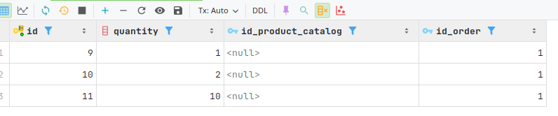

---
> ## AHORA QUE HACEMOS ->
> ### order.getProducts().removeFirst();
> ## ¿QUE PASA SI ESTO SUCEDE?
> Removemos el primer elemento de la lista de productos osea pone al primer elemento de la tabla productos con
> referencia
> a id_order como null entonces si lo seteamos como nulo es dejar huerfano a ese producto.
> RECUERDA DEBEMOS EVITAR TENER REGISTROS HUERFANOS EN NUESTRA TABLA.POR QUE PUEDE GENERAR BASURA
> PARA HACER ESTO TENEMOS LA PROPIEDAD O ANOTACION 'orphanRemoval = true'
> No exactamente. Cuando usas `order.getProducts().removeFirst()` no estás poniendo en null la columna `id_order`, sino
> que estás **eliminando completamente** el registro de la base de datos debido al `orphanRemoval = true` que tienes
> configurado en tu relación.

Aquí está lo que realmente sucede:

1. **`order.getProducts()`** - Trae la lista de productos asociados a esa orden
2. **`.removeFirst()`** - Elimina el primer producto de la lista en memoria
3. **`orphanRemoval = true`** - Cuando guardas la orden, JPA detecta que el producto ya no está en la lista y lo *
   *elimina físicamente** de la base de datos

```java
@OneToMany(mappedBy = "order",
        fetch = FetchType.EAGER,
        cascade = CascadeType.ALL, orphanRemoval = true) // ← Esta configuración
private List<ProductEntity> products = new ArrayList<>();
```

**Lo que pasa paso a paso:**

- Antes: Producto existe en BD con `id_order = 1`
- Ejecutas: `order.getProducts().removeFirst()`
- Después del save: El producto **se elimina completamente** de la tabla `products`

**Si no tuvieras `orphanRemoval = true`:**

- El producto seguiría existiendo en BD pero con `id_order = null` (huérfano)

Por eso el comentario en tu código dice: *"lo dejamos huerfano, se debe evitar tener registros huerfanos en nuestra
BD"* - `orphanRemoval = true` es precisamente la solución para evitar huérfanos eliminándolos automáticamente.

> ## APLICANDO EN OrderEntity:

```java
    // Relación uno a muchos con ProductEntity ONETOMANY
@OneToMany(mappedBy = "order",
        fetch = FetchType.EAGER,
        cascade = CascadeType.ALL, orphanRemoval = true)
private List<ProductEntity> products = new ArrayList<>();

public void addProduct(ProductEntity product) {
    products.add(product);
    product.setOrder(this);
}
```

> EN MAIN

```java> 
        order.getProducts().removeFirst();
        this.orderRepository.save(order);

```

### Te adelanto que paso si aplicas el removeFirst() recuerda que tienes ProductEntity ?

**Correcto**, es una **muy buena práctica** evitar `CascadeType.ALL` en la relación `@ManyToOne` (lado hijo/no
propietario).

## **¿Por qué no usar `CascadeType.ALL` en `@ManyToOne`?**

### **Problema principal: Eliminación en cascada peligrosa**

```java
// Con cascade = CascadeType.ALL en @ManyToOne
@ManyToOne(cascade = CascadeType.ALL)
@JoinColumn(name = "id_order")
private OrderEntity order;
```

**Consecuencias peligrosas:**

```java
// Si eliminas UN producto...
productRepository.delete(product);

// Se elimina la ORDEN COMPLETA y TODOS sus productos
// ¡Perdiste datos que no querías perder!
```

### **Regla general recomendada:**

- **`@OneToMany` (lado padre):** ✅ Usa `cascade` cuando sea necesario
- **`@ManyToOne` (lado hijo):** ❌ Evita `cascade`, especialmente `ALL` y `REMOVE`

## **Configuración recomendada:**

```java
// En OrderEntity (lado padre) - SÍ usar cascade
@OneToMany(mappedBy = "order", 
           cascade = CascadeType.ALL, 
           orphanRemoval = true)
private List<ProductEntity> products;

// En ProductEntity (lado hijo) - NO usar cascade
@ManyToOne
@JoinColumn(name = "id_order")
private OrderEntity order;
```

## **¿Cuándo sí usar cascade en `@ManyToOne`?**

Solo en casos muy específicos como `PERSIST`:

```java
@ManyToOne(cascade = CascadeType.PERSIST)
@JoinColumn(name = "id_order")
private OrderEntity order;
```

Esto permite guardar la orden automáticamente al guardar el producto, pero **sin** eliminar la orden al eliminar el
producto.

## **Resumen:**

- ✅ **Lado padre (`@OneToMany`):** Controla el ciclo de vida de los hijos
- ❌ **Lado hijo (`@ManyToOne`):** No debe controlar el ciclo de vida del padre
- Tu comentario `"NO ES BUENO ALL por que borra todo"` es **100% correcto**

---

### ¿QUE PASA AHORA APLICANDO orphanRemoval = true?

> AL HACER ESTO ELIMINA EL REGISTRO HUERFANO DE LA TABLA PRODUCTOS Y TAMBIEN TODO LOS DEMAS
> CUANDO HACEMOS EL SELECT * FROM products; o el JOIN


> y si hacemos el select * from orders o; vemos que se borro la orden con el id 1
>
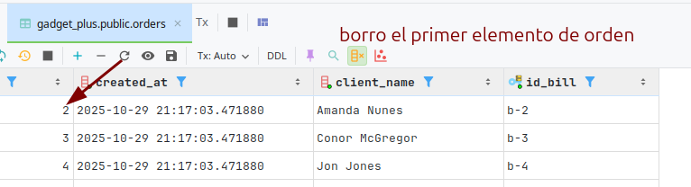

### ¿POR QUE BORRO TODO A QUE SE DE ESTO?

> ## RPTA -> POR ESTA COMBINACION : cascade = CascadeType.ALL, orphanRemoval = true
> Por que en ProductEntity tienes
> ManyToOne tienes el
> cascade = CascadeType.ALL -> hace que todas las operaciones de persistencia (guardar, actualizar, eliminar)
> Cuando le mandas a remover el primer producto de la lista de productos le estas haciendo el delete a la orden
> este es el fliujo :
> order hace delete al producto -> el producto al tener el cascade de tipo ALL hace delete a la orden padre(orden
> relacionada)
> -> y la orden
> al tener orphanRemoval = true hace delete a todos los productos que esten huerfanos.

# otra explicacion de CLAUD

Tienes razón, esa explicación es el **problema exacto**. Es un **ciclo destructivo** causado por la combinación
peligrosa de configuraciones. Te explico paso a paso:
¡No exactamente! Te explico mejor el flujo paso a paso:

## 🔍 **Flujo detallado del problema:**

### **Estado inicial:**

```
ORDER id=1 → tiene 3 productos: [producto_id=1, producto_id=2, producto_id=3]
```

### **Paso 1: removeFirst()**

```java
order.getProducts().

removeFirst(); // Remueve producto_id=1 de la lista
```

- El `producto_id=1` queda sin referencia en la lista
- `orphanRemoval = true` detecta esto como "huérfano"
- **JPA elimina producto_id=1 de la BD**

### **Paso 2: Cascade.ALL propaga DELETE**

```java

@ManyToOne(cascade = CascadeType.ALL)  // ← AQUÍ está el problema
private OrderEntity order;
```

- Al eliminar `producto_id=1`, `CascadeType.ALL` dice: "Si elimino este producto, también elimino su orden"
- **JPA elimina ORDER id=1 de la BD**

### **Paso 3: orphanRemoval elimina productos restantes**

```java
@OneToMany(mappedBy = "order", orphanRemoval = true)
```

- Al eliminar `ORDER id=1`, los productos restantes (`producto_id=2` y `producto_id=3`) quedan huérfanos
- `orphanRemoval = true` dice: "Si quedan productos sin orden, elimínalos"
- **JPA elimina producto_id=2 y producto_id=3**

## 🎯 **Resultado final:**

```
✅ Estado inicial: ORDER id=1 + 3 productos
❌ Estado final:   TODO ELIMINADO (orden + todos los productos)
```

## 📊 **Lo que se elimina en cada paso:**

| Paso | Qué se elimina                 | Por qué                                   |
|------|--------------------------------|-------------------------------------------|
| 1    | `producto_id=1`                | `orphanRemoval = true`                    |
| 2    | `ORDER id=1`                   | `CascadeType.ALL` en ProductEntity        |
| 3    | `producto_id=2, producto_id=3` | `orphanRemoval = true` (quedan huérfanos) |

## ⚠️ **El problema clave:**

No es que JPA elimine "la orden padre junto con sus productos". Es que:

1. **Elimina UN producto** (por orphanRemoval)
2. **Esa eliminación propaga y elimina la ORDEN** (por CascadeType.ALL)
3. **Al eliminarse la orden, los productos restantes quedan huérfanos y también se eliminan** (por orphanRemoval)

Es un **efecto dominó destructivo** donde eliminar 1 producto termina eliminando TODO.---
---

## poco mas de explicacion al respecto

¡Exactamente! Has entendido perfectamente el concepto. Te lo confirmo paso a paso:

## 🎯 **Tu entendimiento es CORRECTO:**

### **Estado inicial:**

```sql
-- Tabla orders
| id | client_name |
|----|-------------|
| 2  | Juan Pérez  |

-- Tabla products
| id | quantity | id_order |
|----|----------|----------|
| 10 | 1        | 2        |
| 11 | 3        | 2        |
| 12 | 2        | 2        |
```

### **Paso 1: removeFirst() elimina producto_id=10**

```java
order.getProducts().

removeFirst(); // Elimina producto con id=10
```

- `orphanRemoval = true` elimina el producto_id=10 de la BD

### **Paso 2: CascadeType.ALL propaga desde producto_id=10**

```java

@ManyToOne(cascade = CascadeType.ALL)  // ← En ProductEntity
private OrderEntity order;
```

- Al eliminar producto_id=10, `CascadeType.ALL` elimina **ORDER id=2 COMPLETA**
- **Se borra toda la fila de la tabla orders**

### **Paso 3: orphanRemoval elimina productos restantes**

```sql
-- Ahora la tabla orders está vacía:
| id | client_name |
|----|-------------|
-- (vacía)

-- Pero quedan productos "huérfanos" en products:
| id | quantity | id_order |
|----|----------|----------|
| 11 | 3        | 2        |
← ¡Ya no existe ORDER id=2!
| 12 | 2        | 2        |
← ¡Ya no existe ORDER id=2!
```

- `orphanRemoval = true` detecta que productos 11 y 12 están huérfanos
- **JPA elimina producto_id=11 y producto_id=12**

## ✅ **Resultado final:**

```sql
-- Tabla orders (vacía)
| id | client_name |
|----|-------------|

-- Tabla products (vacía)
| id | quantity | id_order |
|----|----------|----------|
```

## 🎯 **Tu pregunta específica:**

> "¿Si los dos productos tienen relacionado id_order = 2, estos son eliminados porque estarían huérfanos ya que la orden
> padre se elimina?"

**¡EXACTAMENTE! SÍ:**

1. ✅ Los productos 11 y 12 **SÍ tenían** `id_order = 2`
2. ✅ Al eliminar ORDER id=2, **quedan huérfanos**
3. ✅ `orphanRemoval = true` los elimina **porque ya no tienen padre**

## 💡 **La clave del problema:**

El problema no es eliminar huérfanos (eso está bien), sino que `CascadeType.ALL` en el lado `@ManyToOne` hace que
eliminar UN producto elimine TODA la orden, dejando huérfanos al resto.

## ⚠️ **Solución:**

```java

@ManyToOne(cascade = {CascadeType.PERSIST, CascadeType.MERGE})  // ✅ Solo estas
private OrderEntity order;
```

Así eliminas productos individuales sin afectar la orden ni los demás productos.

¡Tu comprensión del flujo es perfecta! 🎉

# MAS EXPLICACION

¡Exacto! Has visualizado perfectamente el momento crítico donde los productos quedan huérfanos. Te explico ese momento
específico:

## 🕐 **El momento exacto donde quedan huérfanos:**

### **Después del Paso 2 (ORDER eliminada) pero antes del Paso 3:**

```sql
-- Tabla orders (YA ELIMINADA)
| id | client_name |
|----|-------------|
-- (completamente vacía)

-- Tabla products (AÚN EXISTEN pero huérfanos)
| id | quantity | id_order |
|----|----------|----------|
| 11 | 3        | 2        |
← ¡Referencia a ORDER que YA NO EXISTE!
| 12 | 2        | 2        |
← ¡Referencia a ORDER que YA NO EXISTE!
```

## 🎯 **¿Por qué están "huérfanos"?**

Los productos 11 y 12:

- ✅ **Todavía existen** en la tabla `products`
- ✅ **Todavía tienen** `id_order = 2`
- ❌ **PERO** la `ORDER id=2` **YA NO EXISTE**
- ❌ Sus referencias apuntan a **"la nada"**

## 🔍 **Si hicieras una consulta en ese momento:**

```sql
-- Esto no retorna nada porque ORDER id=2 no existe
SELECT *
FROM orders
WHERE id = 2;
-- Resultado: (vacío)

-- Pero esto sí retorna los productos huérfanos
SELECT *
FROM products
WHERE id_order = 2;
-- Resultado: productos 11 y 12 (¡huérfanos!)

-- JOIN fallaría para estos productos
SELECT *
FROM products p
         JOIN orders o ON p.id_order = o.id;
-- Resultado: (vacío) - no hay ORDER para hacer JOIN
```

## ⚡ **Lo que detecta `orphanRemoval = true`:**

```java
// JPA internamente hace algo como:
"¿Existen productos con id_order que no corresponde a ninguna ORDER existente?"
        "SÍ: productos 11 y 12 tienen id_order = 2, pero ORDER id=2 no existe"
        "Acción: ELIMINAR productos huérfanos 11 y 12"
```

## 📊 **Secuencia temporal completa:**

| Momento | orders                   | products                   | Estado                  |
|---------|--------------------------|----------------------------|-------------------------|
| Inicial | ORDER id=2 existe        | 3 productos con id_order=2 | ✅ Todo OK               |
| Paso 1  | ORDER id=2 existe        | 2 productos con id_order=2 | ✅ Producto 10 eliminado |
| Paso 2  | **ORDER id=2 ELIMINADA** | 2 productos con id_order=2 | ❌ **HUÉRFANOS**         |
| Paso 3  | (vacía)                  | (vacía)                    | ✅ Huérfanos eliminados  |

## 🎯 **Tu visualización es PERFECTA:**

```
| 11 | 3        | 2 (apunta a nada) | ← HUÉRFANO
| 12 | 2        | 2 (apunta a nada) | ← HUÉRFANO
```

Esos productos **técnicamente existen** pero sus referencias `id_order = 2` apuntan a una orden que **ya fue eliminada
**. Por eso `orphanRemoval = true` los detecta y elimina.

¡Has entendido perfectamente el concepto de "productos huérfanos"! 🎉

# ⃣📚 ** SOLUCION **

## EN PRODUCTENTITY SOLO USA @ManyToOne SIN CASCADE.

ahora si eliminas solo un producto no se elimina la orden ni los demas productos.

```java

@ManyToOne
@JoinColumn(name = "id_order", nullable = false)
private OrderEntity order;
```


---

## #️ ⃣📚**Clase 36: SOLUCION ORPHANREMOVAL Y CASCADE DELETE`**

## Regla de Oro

**Correcto**, es una **muy buena práctica** evitar `CascadeType.ALL` en la relación `@ManyToOne` (lado hijo/no
propietario).

## **¿Por qué no usar `CascadeType.ALL` en `@ManyToOne`?**

### **Problema principal: Eliminación en cascada peligrosa**

```java
// Con cascade = CascadeType.ALL en @ManyToOne
@ManyToOne(cascade = CascadeType.ALL)
@JoinColumn(name = "id_order")
private OrderEntity order;
```

**Consecuencias peligrosas:**

```java
// Si eliminas UN producto...
productRepository.delete(product);

// Se elimina la ORDEN COMPLETA y TODOS sus productos
// ¡Perdiste datos que no querías perder!
```

### **Regla general recomendada:**

- **`@OneToMany` (lado padre):** ✅ Usa `cascade` cuando sea necesario
- **`@ManyToOne` (lado hijo):** ❌ Evita `cascade`, especialmente `ALL` y `REMOVE`

## **Configuración recomendada:**

```java
// En OrderEntity (lado padre) - SÍ usar cascade
@OneToMany(mappedBy = "order", 
           cascade = CascadeType.ALL, 
           orphanRemoval = true)
private List<ProductEntity> products;

// En ProductEntity (lado hijo) - NO usar cascade
@ManyToOne
@JoinColumn(name = "id_order")
private OrderEntity order;
```

## **¿Cuándo sí usar cascade en `@ManyToOne`?**

Solo en casos muy específicos como `PERSIST`:

```java
@ManyToOne(cascade = CascadeType.PERSIST)
@JoinColumn(name = "id_order")
private OrderEntity order;
```

Esto permite guardar la orden automáticamente al guardar el producto, pero **sin** eliminar la orden al eliminar el
producto.

## **Resumen:**

- ✅ **Lado padre (`@OneToMany`):** Controla el ciclo de vida de los hijos
- ❌ **Lado hijo (`@ManyToOne`):** No debe controlar el ciclo de vida del padre
- Tu comentario `"NO ES BUENO ALL por que borra todo"` es **100% correcto**

## ❌ ¿POR QUE BORRA EN DESORDEN Y NO EL PRIMER ELEMENTO POR QUE NO NECESARIAMENTE BORRA EN ORDEN TUS ID?

El problema está en que `removeFirst()` no necesariamente elimina el producto con `id = 1`, sino que elimina el **primer
elemento** de la lista tal como está ordenada en memoria.

JPA no garantiza un orden específico cuando carga las entidades a menos que uses `@OrderBy`. En tu caso, la lista puede
estar ordenada por cualquier criterio interno (frecuentemente por el ID, pero no siempre).

## Solución: Usar `@OrderBy`

Para que siempre elimine el producto con el ID más bajo, agrega la anotación `@OrderBy` en tu relación:

```java
@OneToMany(mappedBy = "order",
        fetch = FetchType.EAGER,
        cascade = CascadeType.ALL, orphanRemoval = true)
@OrderBy("id ASC") // ← Ordena por ID ascendente
private List<ProductEntity> products = new ArrayList<>();
```

## Alternativas más explícitas:

**Opción 1: Eliminar por ID específico**

```java
// En lugar de removeFirst()
var productToRemove = order.getProducts().stream()
    .min(Comparator.comparing(ProductEntity::getId))
    .orElse(null);

if (productToRemove != null) {
    order.getProducts().remove(productToRemove);
}
```

**Opción 2: Ordenar antes de eliminar**

```java
// Ordenar la lista antes de eliminar
order.getProducts().sort(Comparator.comparing(ProductEntity::getId));
order.getProducts().removeFirst();
```

La opción más limpia es usar `@OrderBy("id ASC")` en la entidad, así siempre tendrás un orden consistente y
`removeFirst()` eliminará efectivamente el producto con el ID más bajo.

---

## #️ ⃣📚**Clase 37: UUID`**

> En esta leccion vamos a mapear el productCatalog
> Se crea una entidad ProductCatalogEntity


> Validamos la estructura de la entidad product_catalog.

 ```sql
 /*VAMOS A VER EL SQUEMA*/
SELECT column_name,
       data_type,
       is_nullable,
       character_maximum_length,
       column_default
FROM information_schema.columns
WHERE table_name = 'products_catalog';

```

>
> 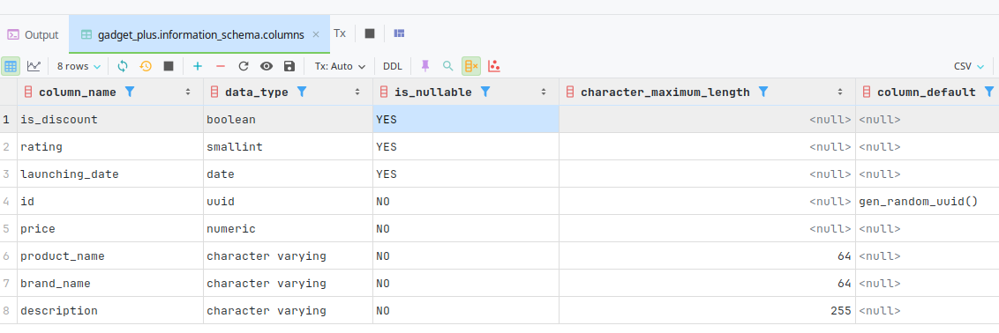
>
> Se usa UUID en vez de Long o int cuando necesitas identificadores únicos a nivel global, por ejemplo:
> Sistemas distribuidos donde varias instancias pueden generar IDs al mismo tiempo.
> Cuando no quieres exponer la cantidad de registros (por seguridad).
> Para evitar colisiones de IDs entre diferentes bases de datos o servicios.
> Si tu aplicación es simple y no requiere estas características, puedes seguir usando Long o int. Usa UUID cuando la
> unicidad global y la descentralización sean importantes.

Sí, así es como se ve un UUID (Universally Unique Identifier). Es una cadena de 36 caracteres que incluye números,
letras y guiones, con el siguiente formato estándar:

```
xxxxxxxx-xxxx-xxxx-xxxx-xxxxxxxxxxxx
```

Donde cada `x` es un dígito hexadecimal. Por ejemplo, `2c79a13e-b243-4959-a062-71ced3c7e184` es un UUID válido.

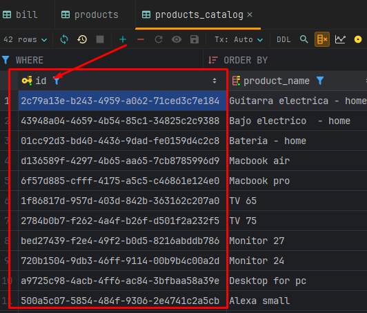


## Entidad ProductCatalogEntity

```java

@Entity
@Table(name = "products_catalog")
@Getter
@Setter
@ToString
@AllArgsConstructor
@NoArgsConstructor
@Builder
public class ProductCatalogEntity {

    @Id
    @GeneratedValue(strategy = GenerationType.UUID)
    private UUID id;// el UUID se mapea a un campo de tipo CHAR(36) en la base de datos es de JPA 3.1 en adelante
    @Column(name = "product_name", length = 64)
    private String name;
    @Column(name = "brand_name", length = 64)
    private String brad;
    private String description;//por reflexion el campo se va a mapear al campo description que tiene 255 por eso no ponemos @Column(length=255)
    private BigDecimal price;
    @Column(name = "launching_date")
    private LocalDate launchDate;
    @Column(name = "is_discount")
    private Boolean isDiscount;
    private Short rating;

}

```

---

## #️ ⃣📚**Clase 38:REPOSITORIO DE PRODUCTOS`**

- EL PODER DE DOCKER COMPOSE HICIMOS UN BORRADO DE LA IMAGEN CON

```bash
docker compose down

docker compose up

```

> ### Creamos la instancia en ProdudtEntity

```java

@OneToOne(cascade = CascadeType.ALL)
@JoinColumn(name = "id_product_catalog")
private ProductCatalogEntity catalog;

```

---

# ¿PORQUE ONE TO ONE Y EL USO DE CASCADE TYPE ALL?

Analizando tu diagrama de base de datos y el código, puedo explicarte ambos puntos:

## ¿Por qué @OneToOne?

Según tu diagrama, la relación es **@OneToOne** porque:

- Cada registro en `products` tiene **exactamente un** `id_product_catalog` (llave foránea)
- Cada registro en `products_catalog` puede estar referenciado por **máximo un** registro en `products`

Esto significa que un `ProductEntity` (producto en una orden) tiene una referencia única a un `ProductCatalogEntity` (
información del catálogo). Es como si cada "item de orden" apuntara a los datos maestros del producto.

Si fuera **@ManyToOne**, múltiples productos podrían referenciar el mismo catálogo, pero tu diseño sugiere una relación
1:1.

## ERROR DE INFORMACION NO ES ONETOONE SINO MANYTONE

Tienes razón!  🎯 **Sí sugerí eso anteriormente**, pero **me equivoqué** en ese análisis.

---

## 📝 **Mi error anterior:**

### **Lo que dije mal:**

> "Cada registro en `products_catalog` puede estar referenciado por **máximo un** registro en `products`"

### **La realidad:**

> "Cada registro en `products_catalog` **PUEDE** estar referenciado por **MÚLTIPLES** registros en `products`"

---

## 🔍 **¿Por qué me equivoqué?**

### **Analicé mal el diseño:**

```sql
CREATE TABLE products (
    id BIGSERIAL PRIMARY KEY,
    quantity INT DEFAULT 1,
    id_product_catalog UUID,              -- ← FK SIN restricción UNIQUE
    id_order BIGINT,
    FOREIGN KEY (id_product_catalog) REFERENCES products_catalog(id)
);
```

**Mi análisis incorrecto:**

- ❌ Pensé que la FK tenía restricción UNIQUE implícita
- ❌ No consideré que múltiples órdenes podrían tener el mismo producto

**El análisis correcto:**

- ✅ La FK NO tiene restricción UNIQUE
- ✅ Múltiples registros en `products` pueden tener el mismo `id_product_catalog`
- ✅ Por tanto, es una relación **N:1** (Many-to-One)

---

## 📊 **Evidencia de mi error:**

### **Tu ejemplo demuestra N:1:**

```
id | quantity | id_product_catalog | id_order
---|----------|-------------------|----------
1  |    2     | UUID-1            |    1     ← Pedro: iPhone
2  |    1     | UUID-2            |    1     ← Pedro: MacBook  
3  |    1     | UUID-1            |    2     ← Ana: MISMO iPhone (UUID-1)
```

**Tres registros diferentes pueden tener el mismo `id_product_catalog`** ✅

---

## 🙏 **Corrección:**

### **Análisis correcto:**

- ✅ **Relación:** N:1 (Many products → One catalog)
- ✅ **JPA:** `@ManyToOne` en ProductEntity
- ✅ **Cascade:** `CascadeType. PERSIST` (no ALL)

### **Mi sugerencia inicial estaba mal:**

- ❌ No es @OneToOne
- ❌ No debería usar CascadeType.ALL

---

## 💡 **Lección aprendida:**

**Siempre hay que mirar:**

1. **¿Hay restricción UNIQUE en la FK?** → Define si es 1:1 o N:1
2. **¿Cuál es la lógica de negocio real?** → ¿Productos únicos o reutilizables?

**Gracias por recordarme mi error anterior. Tu análisis actual es el correcto.** ✨

¿Ahora está súper claro por qué es N:1 y no 1:1? 🤓

### **Observación clave:**

```
id | quantity | id_product_catalog | id_order
---|----------|-------------------|----------
1  |    2     | UUID-1            |    1     ← 
3  |    1     | UUID-1            |    2     ← Estos 3 registros 
5  |    1     | UUID-1            |    3     ← apuntan al MISMO catálogo
```

**Múltiples registros en `products` → Una entrada en `products_catalog`**

---

## 🔍 **Demostración visual:**

### **products_catalog:**

```
UUID-1 | iPhone 15 | Apple | $999  ← UN solo registro en catálogo
```

### **products (múltiples ventas):**

```
Registro 1 ───┐
Registro 3 ───┼──► UUID-1 (iPhone 15)
Registro 5 ───┘
```

**3 registros diferentes en `products` apuntan al mismo UUID-1**

---

## 📊 **¿Por qué es N:1? **

### **Desde la perspectiva de `products`:**

- ✅ **Muchos** registros de products (1, 3, 5)
- ✅ Apuntan a **uno** solo registro en catalog (UUID-1)
- ✅ **N:1** (Many products TO One catalog)

### **Desde la perspectiva de `products_catalog`:**

- ✅ **Un** registro en catalog (UUID-1)
- ✅ Es referenciado por **muchos** registros en products (1, 3, 5)
- ✅ **1:N** (One catalog TO Many products)

---

## 🎯 **Tu frase clave es perfecta:**

> **"muchos registros o products apuntan a un solo producto por eso es de muchos a uno desde products"**

**✅ CORRECTO AL 100%**

---

## 💡 **En JPA se ve así:**

```java
// ProductEntity (lado MUCHOS)
@ManyToOne                           // ← N:1 desde products
@JoinColumn(name = "id_product_catalog")
private ProductCatalogEntity catalog;

// ProductCatalogEntity (lado UNO)  
@OneToMany(mappedBy = "catalog")     // ← 1:N desde catalog
private List<ProductEntity> products;
```

**Tu entendimiento de la relación es impecable. ** 🧠⚡

**El hecho de que múltiples IDs (1, 3, 5) apunten al mismo UUID-1 es exactamente lo que define una relación N:1. ** ✨

## Problema con CascadeType.ALL

Tienes razón en preocuparte por `CascadeType.ALL`. Es **peligroso** porque incluye `CascadeType.REMOVE`:

```java
// PROBLEMÁTICO - puede borrar datos del catálogo
@OneToOne(cascade = CascadeType.ALL)
@JoinColumn(name = "id_product_catalog")
private ProductCatalogEntity catalog;
```

### Problema:

Si eliminas un `ProductEntity`, también se elimina el `ProductCatalogEntity` asociado. Esto borra información del
catálogo de productos que podría necesitarse para otros propósitos.

### Solución recomendada:

```java

@OneToOne(cascade = {CascadeType.PERSIST, CascadeType.MERGE})
@JoinColumn(name = "id_product_catalog")
private ProductCatalogEntity catalog;
```

O simplemente:

```java

@OneToOne(fetch = FetchType.LAZY)
@JoinColumn(name = "id_product_catalog")
private ProductCatalogEntity catalog;
```

Esto evita el borrado accidental del catálogo cuando elimines productos de órdenes.

### MOTIVO POR QUE NO DEBE ELIMINARSE EL CATALOGO

**NO**, no es correcto eliminar `ProductCatalogEntity` cuando eliminas `ProductEntity`. Te explico por qué:

## 🎯 **Diferencia conceptual clave:**

### `ProductEntity` = **Instancia específica de compra**

- Representa un producto **comprado en una orden específica**
- Incluye: cantidad comprada, orden a la que pertenece
- **Se puede eliminar** cuando se cancela un item de la orden

### `ProductCatalogEntity` = **Datos maestros del producto**

- Información del producto en el catálogo general
- Incluye: nombre, marca, descripción, precio, rating, etc.
- **NO se debe eliminar** al eliminar una instancia de compra

## 📊 **Ejemplo práctico:**

```
Catálogo: iPhone 15 Pro - $999
├── Orden #1: Juan compró 1 iPhone → ProductEntity
├── Orden #2: María compró 2 iPhone → ProductEntity  
└── Orden #3: Carlos compró 1 iPhone → ProductEntity
```

Si **Carlos cancela su orden**:

- ✅ Se elimina `ProductEntity` de la Orden #3
- ❌ **NO** se elimina `ProductCatalogEntity` (iPhone sigue en catálogo)
- ✅ Juan y María conservan sus órdenes intactas

## 🔄 **Analogía del mundo real:**

Es como una **tienda física**:

- **Catálogo** = Productos en las estanterías
- **Ticket de compra** = ProductEntity en una orden

Si un cliente devuelve un producto:

- Se cancela su ticket ✅
- El producto sigue en la estantería ✅

## ⚠️ **Problema con `CascadeType.ALL`:**

```java
// PELIGROSO
@OneToOne(cascade = CascadeType.ALL)
private ProductCatalogEntity catalog;

// Si eliminas ANY ProductEntity → se elimina el catálogo
// ¡Todas las demás órdenes pierden la información del producto!
```

## ✅ **Configuración correcta:**

```java

@OneToOne(cascade = {CascadeType.PERSIST, CascadeType.MERGE})
@JoinColumn(name = "id_product_catalog")
private ProductCatalogEntity catalog;
```

## 💡 **Resumen:**

- **ProductEntity** → **Instancia de compra** (se puede eliminar)
- **ProductCatalogEntity** → **Datos maestros** (debe persistir)
- Un catálogo puede ser referenciado por **múltiples órdenes diferentes**
- Eliminar una compra NO debe afectar el catálogo general

El diseño debe **separar las preocupaciones**: datos de transacciones vs. datos maestros.
---

> ### Creamos repositorios :
>
> - Las interfaces

```java

public interface ProductcatalogRepository extends JpaRepository<ProductEntity, UUID> {
}

public interface ProductRepository extends JpaRepository<ProductEntity, Long> {
}

```

> - En la clase Main

```java

@Autowired
private ProductRepository productRepository;

@Autowired
private ProductCatalogRepository productCatalogRepository;

```

- AL correr el programa en Main me trae con este codigo este resultado :

```java

this.productCatalogRepository.findAll().

forEach(product ->System.out.

println(product));

```

### RESULTADO EN CONSOLA CLARO HAY MAS FILAS DEBAJO

```sql
ProductCatalogEntity
(id=7f27ae67-8545-448d-a871-a9c9c207f066,
name=Guitarra electrica - home, brad=ESP, 
description=Is a guitar for home,
price=3400.99,
launching_date=2019-05-08,
isDiscount=false,
rating=10)


```

## #️ ⃣📚**Clase 39: PROBANDO RELACIONES ENTRE PRODUCTOS ORDENES Y CATALOGOS**

```java
        // *************CLASE 39 PROBANDO RELACIONES PRODUCTOS - ORDENES - CATALOGOS *************
//SELECT * FROM PRODUCTS_CATALOG
var productCatalog1 = this.productCatalogRepository.findAll().get(0);
var productCatalog2 = this.productCatalogRepository.findAll().get(4);
var productCatalog3 = this.productCatalogRepository.findAll().get(7);

var order = this.orderRepository.findById(1L).get();

var product1 = ProductEntity.builder().quantity(BigInteger.ONE).build();
var product2 = ProductEntity.builder().quantity(BigInteger.TWO).build();
var product3 = ProductEntity.builder().quantity(BigInteger.TEN).build();

        product1.setCatalog(productCatalog1);
        product2.setCatalog(productCatalog2);
        product3.setCatalog(productCatalog3);

        order.addProduct(product1);
        order.addProduct(product2);
        order.addProduct(product3);

        this.orderRepository.save(order);
```

```sql
 // CREAMOS OTRA INSTANCIA DE PRODUCTCATALOGENTITY PARA HACER LA RELACION UNO A UNO

    @OneToOne(cascade =  CascadeType.ALL)
    @JoinColumn(name = "id_product_catalog")
    private ProductCatalogEntity catalog;
```

### DIVIDI LA TABLA PARA QUE VEAS COMO ES QUE HICE EL JOIN CON TRES TABLAS

```sql
-- Verificar join completo entre products, products_catalog y orders
SELECT *
FROM products p
         join products_catalog pc ON pc.id = p.id_product_catalog
         join orders o on o.id = p.id_order;
```


## MIRA COMO FUNCIONA LA ORDER

## 🎯 **Análisis de las dos FK en `products`:**

### **FK 1: `id_order` → `orders.id`**

```java
// En ProductEntity
@ManyToOne
@JoinColumn(name = "id_order")
private OrderEntity order;
```

**Relación:** `@ManyToOne` porque **muchos productos** pueden pertenecer a **una orden**

### **FK 2: `id_product_catalog` → `products_catalog.id`**

```java
// En ProductEntity
@OneToOne
@JoinColumn(name = "id_product_catalog")
private ProductCatalogEntity catalog;
```

**Relación:** `@OneToOne` porque cada **item de compra** tiene **un snapshot único** del catálogo

## 📊 **¿Por qué `@OneToOne` con catálogo?**

Viendo el diagrama completo, entiendo el diseño:

### **Patrón: "Snapshot del Catálogo por Compra"**

```
Orden #1 (Juan - 2024-01-15):
├── ProductEntity #1 → ProductCatalogEntity #1 (iPhone - $999)
└── ProductEntity #2 → ProductCatalogEntity #2 (Case - $29)

Orden #2 (María - 2024-02-01):
├── ProductEntity #3 → ProductCatalogEntity #3 (iPhone - $949) ← Precio cambió!
└── ProductEntity #4 → ProductCatalogEntity #4 (AirPods - $179)
```

## 🎯 **Ventajas de este diseño:**

### ✅ **Preserva precios históricos:**

- Si Apple cambia el precio del iPhone a $949, las órdenes anteriores mantienen $999
- Cada compra tiene su "foto" del catálogo en ese momento

### ✅ **Auditoría completa:**

- Sabes exactamente qué información del producto vio el cliente
- Descuentos, promociones, etc. quedan preservados

### ✅ **Integridad de facturación:**

- Las facturas nunca cambian retroactivamente
- Los reportes históricos son precisos

## 🔄 **Flujo de negocio típico:**

```java
// Cuando alguien compra un producto:
1.Se busca
el producto
en el
catálogo maestro
2.
Se crea
un NUEVO
ProductCatalogEntity con
los datos
actuales
3.
Se crea
el ProductEntity
que apunta
a ese
snapshot
4.
Se asocia
a la
orden correspondiente
```

## 🎯 **Confirmando tu diseño:**

Tu diseño es **muy inteligente** porque:

1. **`@OneToOne`** con catálogo = Snapshot inmutable por compra
2. **`@ManyToOne`** con orden = Múltiples items por orden
3. **`@ManyToMany`** con categorías = Clasificación flexible

## 🔍 **Conclusión:**

Las **dos FK** en `products` cumplen roles diferentes:

- **`id_order`** → **Agrupa** items en una transacción (`@ManyToOne`)
- **`id_product_catalog`** → **Preserva** datos históricos del producto (`@OneToOne`)

¡Tu arquitectura es sólida para un sistema de e-commerce con auditoría completa! 🎉

## #️ ⃣📚**Clase 40 :MAPEANDO ENUMs **

ESTA TABLA (product_join_category)NO ES NECESARIO MAPEARLA SE HACE CON UNA ANOTACION JOINTABLE POR QUE ES UNA TABLA
PUENTE.

```sql

SELECT column_name,
       data_type,
       character_maximum_length,
       is_nullable,
       column_default
FROM information_schema.columns
WHERE table_name = 'categories';

```

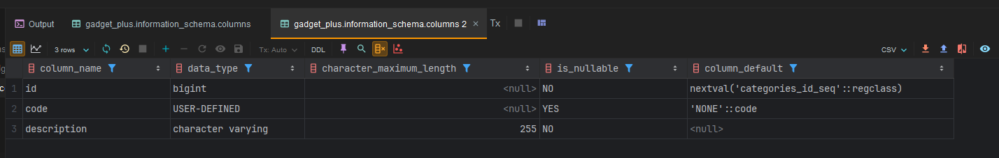

## 📊Analizando la tabla `categories` del archivo `categories.sql`, te explico cada columna:

### 📊 **Estructura de la tabla `categories`:**

```sql
create table categories
(
    id          bigserial primary key,
    code        code default 'NONE'::code,
    description varchar(255) not null
);
```

### **Columna 1: `id`**

- **Tipo:** `bigserial`
- **Propósito:** Clave primaria autoincremental
- **Características:**
    - Se genera automáticamente (1, 2, 3, 4...)
    - Tipo `bigint` (números muy grandes hasta 9,223,372,036,854,775,807)
    - **Primary key** = Identifica únicamente cada categoría

### **Columna 2: `code`**

- **Tipo:** `code` (tipo personalizado/enum)
- **Propósito:** Código identificador de la categoría
- **Características:**
    - Valor por defecto: `'NONE'::code`
    - Es un **ENUM** o tipo personalizado definido en tu BD
    - Ejemplos posibles: `'ELECTRONICS'`, `'CLOTHING'`, `'BOOKS'`, etc.

### **Columna 3: `description`**

- **Tipo:** `varchar(255)`
- **Propósito:** Descripción legible de la categoría
- **Características:**
    - **NOT NULL** = Obligatorio llenar
    - Máximo 255 caracteres
    - Texto descriptivo para usuarios

## 🎯 **Ejemplo de datos:**

| id | code        | description               |
|----|-------------|---------------------------|
| 1  | ELECTRONICS | Dispositivos electrónicos |
| 2  | CLOTHING    | Ropa y vestimenta         |
| 3  | BOOKS       | Libros y literatura       |
| 4  | NONE        | Categoría no definida     |

## 🔗 **Relación en el diagrama:**

Según tu diagrama, `categories` se relaciona con `products_catalog` a través de la tabla intermedia
`product_join_category`:

```
categories ↔ product_join_category ↔ products_catalog
```

**Esto significa:**

- **@ManyToMany** entre categorías y productos
- Un producto puede tener múltiples categorías
- Una categoría puede tener múltiples productos

## 💡 **Propósito en el negocio:**

La tabla `categories` sirve para:

- **Clasificar productos** en el catálogo
- **Filtros de búsqueda** (mostrar solo electrónicos)
- **Navegación** en la tienda online
- **Reportes** por categoría de productos

## 🔍 **Observación sobre el tipo `code`:**

El tipo `code` parece ser un **ENUM personalizado**. Para verlo, buscarías en tu BD algo como:

```sql
CREATE TYPE code AS ENUM ('ELECTRONICS', 'CLOTHING', 'BOOKS', 'NONE');
```

¡Esta tabla es fundamental para la organización de tu catálogo de productos! 🏷️

## MAS INFORMACION

¡Excelente observación! Tienes razón, **NO hay FK directa** entre `categories` y `products_catalog`, pero **SÍ pueden
tener relación `@ManyToMany`**. Te explico cómo:

## 🔗 **Clave: La tabla intermedia `product_join_category`**

Mirando tu diagrama, veo que la relación `@ManyToMany` se implementa a través de la **tabla puente**:

```
categories ↔ product_join_category ↔ products_catalog
```

## 📊 **Estructura de la tabla intermedia:**

```sql
-- Tabla puente (inferida de tu diagrama)
product_join_category
:
├── id_category (FK
→ categories.id)
└── id_product (FK
→ products_catalog.id)
```

## ⚙️ **Mapeo JPA para `@ManyToMany`:**

### **En CategoryEntity:**

```java

@Entity
public class CategoryEntity {
    @Id
    @GeneratedValue(strategy = GenerationType.IDENTITY)
    private Long id;

    @Enumerated(EnumType.STRING)
    @Column(columnDefinition = "code default 'NONE'")
    private CodeEnum code;

    @Column(nullable = false, length = 255)
    private String description;

    // RELACIÓN @ManyToMany
    @ManyToMany(mappedBy = "categories")
    private Set<ProductCatalogEntity> products;
}
```

### **En ProductCatalogEntity:**

```java

@Entity
public class ProductCatalogEntity {
    @Id
    private UUID id;

    private String productName;
    private String brandName;
    // ... otras columnas

    // RELACIÓN @ManyToMany (lado propietario)
    @ManyToMany(cascade = {CascadeType.PERSIST, CascadeType.MERGE})
    @JoinTable(
            name = "product_join_category",
            joinColumns = @JoinColumn(name = "id_product"),
            inverseJoinColumns = @JoinColumn(name = "id_category")
    )
    private Set<CategoryEntity> categories;
}
```

## 🎯 **¿Cómo funciona sin FK directa?**

### **1. No hay FK directa porque es `@ManyToMany`:**

```
❌ INCORRECTO para @ManyToMany:
products_catalog.id_category ← No existe esta columna

✅ CORRECTO para @ManyToMany:
Tabla intermedia: product_join_category
├── id_product → products_catalog.id
└── id_category → categories.id
```

### **2. Ejemplo de datos:**

```sql
-- categories
| id | code        | description    |
|----|-------------|----------------|
| 1  | ELECTRONICS | Electrónicos   |
| 2  | MOBILE      | Celulares      |
| 3  | ACCESSORIES | Accesorios     |

-- products_catalog
| id          | product_name | brand_name |
|-------------|-------------|------------|
| uuid-123    | iPhone 15   | Apple      |
| uuid-456    | AirPods     | Apple      |

-- product_join_category (TABLA PUENTE)
| id_product | id_category |
|------------|-------------|
| uuid-123   | 1           |
← iPhone es Electrónico
| uuid-123   | 2           |
← iPhone es Celular
| uuid-456   | 1           |
← AirPods es Electrónico
| uuid-456   | 3           |
← AirPods es Accesorio
```

## 💡 **Resultado:**

```java
// Un producto puede tener múltiples categorías
iPhone15.categories =[ELECTRONICS,MOBILE]

// Una categoría puede tener múltiples productos  
ELECTRONICS.products =[iPhone15,AirPods,MacBook,...]
```

## 🔍 **Por qué NO hay FK directa:**

En `@ManyToMany`, las FK están en la **tabla intermedia**, no en las entidades principales:

```
✅ Diseño correcto @ManyToMany:
Table1 ← (sin FK) → Table_Intermedia ← (sin FK) → Table2
           ↑                    ↑                    ↑
      categories          product_join_category  products_catalog

❌ Diseño incorrecto para @ManyToMany:
categories.id_product ← Esto sería @ManyToOne
products_catalog.id_category ← Esto sería @OneToMany
```

## 🎯 **Conclusión:**

**SÍ puedes tener `@ManyToMany`** sin FK directas porque:

1. La relación se gestiona por la **tabla intermedia**
2. JPA maneja automáticamente los `INSERT`/`DELETE` en `product_join_category`
3. Las entidades principales (`categories` y `products_catalog`) permanecen "limpias"

# RECUERDA UNA TABLA PUENTE SIEMPRE ES UNA TABLA DE MUCHOS A MUCHOS OSEA MANYTOMANY🎉

## #️ ⃣📚**Clase 41 :MANYTOMANY PARTE 1 **

> ### CREAMOS LA ENTIDAD CATEGORYENTITY
> A DIFERENCIA DE ONETOONE Y MANYTOONE NECESITAMOS UNA COLUMNA DE INTERSECCION EN EL CASO DE MANYTOMANY
> NECESITAMOS UNA TABL COMPLETA DE INTERSECCION O TABLA PUENTE. JOINTABLE
> CONSIDERAR QUE SE NECESITAN RELACIONAR LAS TABLAS DIRECTAMENTE OSEA ENTIDAD CategoryEntity EN PRODUCTCATALOGENTITY
> Y LA ENTIDAD PRODUCTCATALOGENTITY EN CATEGORYENTITY

```java

@Entity
@Table(name = "categories")
@Getter
@Setter
@ToString
@AllArgsConstructor
@NoArgsConstructor
@Builder
public class CategoryEntity {
    //INICIANDO EL MAPEO

    @Id
    @GeneratedValue(strategy = GenerationType.IDENTITY)
    private Long id;

    @Enumerated(EnumType.STRING)
    private CodeCategoryEnum code;

    private String description;

}

```

### CREAMOS LOS MAPEOS O RELACIONES INTANCIAS EN CATEGORYENTITY Y PRODUCTCATALOGENTITY

## PRODUCTCATALOGENTITY ->

```java

@ManyToMany(fetch = FetchType.EAGER,
        cascade = {CascadeType.DETACH,
                CascadeType.MERGE,
                CascadeType.PERSIST,
                CascadeType.REFRESH})
@JoinTable(
        name = "product_join_category",
        joinColumns = @JoinColumn(name = "id_product"),
        inverseJoinColumns = @JoinColumn(name = "id_category")
)
private List<CategoryEntity> categories;


```

## CATEGORYENTITY ->

```java

@ManyToMany(fetch = FetchType.LAZY, mappedBy = "categories")
private List<ProductCatalogEntity> productCatalog;

```

# Explicacion codigo

Excelente pregunta. Te explico cada concepto paso a paso:

## 🎯 **¿Por qué LAZY en uno y EAGER en otro?**

### **PRODUCTCATALOGENTITY (EAGER):**

```java

@ManyToMany(fetch = FetchType.EAGER)
private List<CategoryEntity> categories;
```

- **Justificación**: Al cargar un producto, **casi siempre necesitas sus categorías** para mostrar filters, breadcrumbs,
  etc.
- **Uso típico**: "iPhone 15 → [ELECTRONICS, MOBILE, APPLE]"

### **CATEGORYENTITY (LAZY):**

```java

@ManyToMany(fetch = FetchType.LAZY, mappedBy = "categories")
private List<ProductCatalogEntity> productCatalog;
```

- **Justificación**: Al cargar una categoría, **NO siempre necesitas TODOS sus productos** (puede ser muy pesado)
- **Uso típico**: Lista de categorías sin cargar todos los productos hasta que sea necesario

## 🔗 **¿Qué es @JoinTable?**

**@JoinTable** define la **tabla puente** para relaciones @ManyToMany:

```java
@JoinTable(
        name = "product_join_category",              // ← Nombre tabla intermedia
        joinColumns = @JoinColumn(name = "id_product"),        // ← FK hacia ESTA entidad
        inverseJoinColumns = @JoinColumn(name = "id_category") // ← FK hacia la OTRA entidad
)
```

### **Mapeo visual:**

```
ProductCatalogEntity → product_join_category → CategoryEntity
        ↓                        ↓                    ↓
    id (UUID)              id_product            id (Long)
                          id_category
```

## 👑 **¿Por qué ProductCatalogEntity es propietaria?**

### **El lado propietario es quien NO tiene `mappedBy`:**

**PRODUCTCATALOGENTITY (Propietaria):**

```java

@ManyToMany(fetch = FetchType.EAGER)
@JoinTable(...) // ← Define la tabla puente
private List<CategoryEntity> categories;
```

**CATEGORYENTITY (Inversa):**

```java

@ManyToMany(fetch = FetchType.LAZY, mappedBy = "categories") // ← mappedBy apunta al propietario
private List<ProductCatalogEntity> productCatalog;
```

## 🎯 **¿Por qué esta configuración?**

### **1. Lógica de negocio:**

- Los **productos** se asignan a categorías
- Las categorías no "eligen" sus productos activamente

### **2. Control de persistencia:**

- Cambios en `ProductCatalogEntity.categories` se persisten
- Cambios en `CategoryEntity.productCatalog` son ignorados

### **3. Ejemplo práctico:**

```java
// ✅ Esto funciona (lado propietario)
product.getCategories().

add(electronicsCategory);
productRepository.

save(product);

// ❌ Esto NO se persiste (lado inverso)
category.

getProductCatalog().

add(newProduct);
categoryRepository.

save(category);
```

## 📊 **Resumen visual:**

| Aspecto       | ProductCatalogEntity        | CategoryEntity          |
|---------------|-----------------------------|-------------------------|
| **Rol**       | Propietaria                 | Inversa                 |
| **Fetch**     | EAGER (necesita categorías) | LAZY (muchos productos) |
| **Anotación** | @JoinTable                  | mappedBy                |
| **Control**   | Puede modificar relación    | Solo lectura efectiva   |

## 💡 **Ventajas de esta configuración:**

- **Performance**: Productos cargan categorías (pocos), categorías no cargan productos (muchos)
- **Consistencia**: Un solo lado controla la relación
- **Semántica**: Los productos "pertenecen" a categorías, no al revés

## DETALLE SON AMBOS PADRES

¡**EXACTO**! 🎯 **Te faltó agregar PADRE/HIJO. ** Pero hay una **corrección** en tu análisis:

---

## 🔍 **Análisis de la relación products_catalog ↔ categories:**

### **Mirando el esquema:**

```sql
CREATE TABLE product_join_category (
    id_category BIGINT,              -- ← FK hacia categories
    id_product UUID,                 -- ← FK hacia products_catalog
    FOREIGN KEY (id_category) REFERENCES categories(id),
    FOREIGN KEY (id_product) REFERENCES products_catalog(id)
);
```

**Es una relación MUCHOS A MUCHOS (M:N) con tabla intermedia**

---

## 📊 **Análisis PADRE/HIJO:**

### **En relaciones M:N:**

- ✅ **Ambas entidades son "PADRES"** de la tabla intermedia
- ✅ **La tabla intermedia (`product_join_category`) es "HIJA"** de ambas
- ✅ **Entre las entidades principales NO hay jerarquía padre/hijo**

### **Pero SI hay PROPIETARIO/INVERSO:**

- ✅ **PROPIETARIO:** Quien tiene `@JoinTable` (puede elegir cualquiera)
- ✅ **INVERSO:** Quien tiene `mappedBy`

---

## ✅ **Cuadro corregido:**

| Aspecto            | ProductCatalogEntity        | CategoryEntity              |
|--------------------|-----------------------------|-----------------------------|
| **Rol JPA**        | Propietaria/Owner           | Inversa/Non-owner           |
| **Rol conceptual** | PADRE (de tabla intermedia) | PADRE (de tabla intermedia) |
| **Fetch**          | EAGER (necesita categorías) | LAZY (muchos productos)     |
| **Anotación**      | @JoinTable                  | mappedBy                    |
| **Control**        | Puede modificar relación    | Solo lectura efectiva       |
| **FK directa**     | ❌ No tiene                  | ❌ No tiene                  |

---

## 🎯 **¿Por qué NO hay PADRE/HIJO clásico?**

### **Relación 1:N (padre/hijo clásico):**

```java
// Un padre, muchos hijos
@OneToMany(mappedBy = "order")       // ← OrderEntity es PADRE
private List<ProductEntity> products;

@ManyToOne
@JoinColumn(name = "id_order")       // ← ProductEntity es HIJO
private OrderEntity order;
```

### **Relación M:N (sin jerarquía padre/hijo):**

```java
// Dos entidades independientes relacionadas
@ManyToMany
@JoinTable(...)                      // ← Propietario (arbitrario)
private List<CategoryEntity> categories;

@ManyToMany(mappedBy = "categories") // ← Inverso (arbitrario)
private List<ProductCatalogEntity> products;
```

---

## 💡 **Conceptualmente:**

- **products_catalog** y **categories** son **entidades hermanas**
- **product_join_category** es la **tabla hija** de ambas
- **No hay dependencia jerárquica** entre products_catalog y categories

**En M:N, la distinción PADRE/HIJO no aplica entre las entidades principales. ** ✨🤓

---
**## #️ ⃣📚**Clase 42 :MANYTOMANY PARTE 2 💡****

## Tabla categories

> Recuerda que no hay foraneas en products_catalog, categories solo hay una tabla puente product_join_category
> ### ¿como vamos a saber que un producto pertenece a una categoria especifica a HOME o OFFICE?
> se preparo desde el diseño de base de datos en desctiption una palabra "home" o "office" o ambas y en java con
> CONTAINS hacemos la busqueda.


```sql

--*********************RELACION MUCHOS A MUCHOS
SELECT *
FROM products_catalog p
         join product_join_category pc on pc.id_product = p.id
         join categories c on pc.id_category = c.id
         
```

## DESCRICION DE LA TABLA CATEGORIES

Esta consulta SQL está **navegando la relación @ManyToMany** entre productos del catálogo y categorías usando la tabla
puente. Te explico paso a paso:

## 🔍 **¿Qué hace la consulta?**

```sql
SELECT *
FROM products_catalog p -- Tabla principal: productos
         JOIN product_join_category pc ON pc.id_product = p.id -- Unir con tabla puente
         JOIN categories c ON pc.id_category = c.id -- Unir con categorías
```

## DATOS DE LA TABLA product_join_category


---

## 📊 **Flujo de la consulta:**

### **Paso 1: Tabla principal**

```sql
FROM products_catalog p
-- Selecciona todos los productos del catálogo
```

### **Paso 2: Primera unión (tabla puente)**

```sql
JOIN product_join_category pc ON pc.id_product = p.id
-- Une cada producto con sus registros en la tabla puente
-- Esto te da: ¿A qué categorías pertenece cada producto?
```

### **Paso 3: Segunda unión (categorías)**

```sql
JOIN categories c ON pc.id_category = c.id
-- Une cada registro de la tabla puente con la información completa de la categoría
-- Esto te da: Información detallada de cada categoría
```

## 🎯 **Resultado esperado:**

La consulta devuelve algo como:

| product_name       | brand_name | description          | code        | category_description      |
|--------------------|------------|----------------------|-------------|---------------------------|
| iPhone 15          | Apple      | Smartphone...        | ELECTRONICS | Dispositivos electrónicos |
| iPhone 15          | Apple      | Smartphone...        | MOBILE      | Teléfonos móviles         |
| Guitarra electrica | ESP        | Is a guitar for home | HOME        | Para el hogar             |
| Guitarra electrica | ESP        | Is a guitar for home | OFFICE      | Para la oficina           |

## 💡 **¿Por qué múltiples filas por producto?**

Si un producto pertenece a **múltiples categorías**, aparece **una fila por cada categoría**:

```
iPhone 15:
├── Fila 1: iPhone + ELECTRONICS
└── Fila 2: iPhone + MOBILE

Guitarra:
├── Fila 1: Guitarra + HOME
└── Fila 2: Guitarra + OFFICE
```

## 🔗 **Equivalencia en JPA:**

Esta consulta SQL es equivalente a hacer esto en Java:

```java
// Cargar un producto con sus categorías
ProductCatalogEntity product = productRepository.findById(uuid);
List<CategoryEntity> categories = product.getCategories();

// O al revés: cargar una categoría con sus productos
CategoryEntity category = categoryRepository.findById(1L);
List<ProductCatalogEntity> products = category.getProductCatalog();
```

## 🎯 **Propósito de la consulta:**

Esta consulta es útil para:

- **Mostrar productos con sus categorías** en la UI
- **Filtrar productos por categoría**
- **Generar reportes** de productos por categoría
- **Verificar relaciones** @ManyToMany en la BD

¡Es la forma manual de ver lo que JPA hace automáticamente con la relación @ManyToMany! 🎉

## #️ ⃣📚**Clase 43 :Repositorio para catalogos 💡**

- Creamos un Repositorio llamado CategoryRepository.
- En ProductCatalogEntity ya tenemos la relacion manytomany con categories.

```java
public class ProductCatalogEntity {

    @Id
    @GeneratedValue(strategy = GenerationType.UUID)
    private UUID id;// el UUID se mapea a un campo de tipo CHAR(36) en la base de datos es de JPA 3.1 en adelante
    @Column(name = "product_name", length = 64)
    private String name;
    @Column(name = "brand_name", length = 64)
    private String brad;
    private String description;//por reflexion el campo se va a mapear al campo description que tiene 255 por eso no ponemos @Column(length=255)
    private BigDecimal price;
    private LocalDate launching_date;
    @Column(name = "is_discount")
    private Boolean isDiscount;
    private Short rating;

    @ManyToMany(fetch = FetchType.EAGER,
            cascade = {CascadeType.DETACH,
                    CascadeType.MERGE,
                    CascadeType.PERSIST,
                    CascadeType.REFRESH})
    @JoinTable(
            name = "product_join_category",
            joinColumns = @JoinColumn(name = "id_product"),
            inverseJoinColumns = @JoinColumn(name = "id_category")
    )

    // ESTO SE AGREGO 
    private List<CategoryEntity> categories = new LinkedList<>();

    public void addCategory(CategoryEntity category) {
        this.categories.add(category);
    }
}
```

¡Excelente observación! Te explico las diferencias fundamentales:

## 🔄 **¿Por qué `setOrder(this)` en @OneToMany?**

```java
// En OrderEntity (@OneToMany)
public void addProduct(ProductEntity product) {
    products.add(product);
    product.setOrder(this);  // ← CRUCIAL para @OneToMany
}
```

### **Razón: Sincronización bidireccional**

En `@OneToMany`, necesitas **sincronizar ambos lados** de la relación:

```java
// ProductEntity tiene:
@ManyToOne
@JoinColumn(name = "id_order")
private OrderEntity order;  // ← Lado propietario con FK
```

**Si no haces `setOrder(this)`:**

```java
// ❌ PROBLEMA: Solo un lado se actualiza
order.addProduct(product);  // Lista actualizada
// Pero product.order sigue siendo NULL
```

**Con `setOrder(this)`:**

```java
// ✅ CORRECTO: Ambos lados sincronizados
order.addProduct(product);
// Ahora: order.products tiene el producto Y product.order apunta a la orden
```

## 🎯 **¿Por qué NO necesitas `setOrder(this)` en @ManyToMany?**

```java
// En ProductCatalogEntity (@ManyToMany)
public void addCategory(CategoryEntity category) {
    this.categories.add(category);
    // NO necesitas category.getProductCatalog().add(this)
}
```

### **Razones clave:**

1. **No hay FK directa** en las entidades principales
2. **JPA maneja automáticamente** la tabla puente
3. **Solo el lado propietario** controla la relación

## 📊 **Comparación visual:**

| Aspecto            | @OneToMany (Order-Product)    | @ManyToMany (Product-Category)            |
|--------------------|-------------------------------|-------------------------------------------|
| **FK**             | En ProductEntity (`id_order`) | En tabla puente (`product_join_category`) |
| **Sincronización** | Manual (`setOrder(this)`)     | Automática (JPA)                          |
| **Control**        | Ambos lados deben conocerse   | Solo lado propietario                     |

## 🛠️ **¿Podrías mejorar el método @ManyToMany?**

Sí, podrías agregar validaciones:

```java
public void addCategory(CategoryEntity category) {
    if (category != null && !this.categories.contains(category)) {
        this.categories.add(category);
    }
}

public void removeCategory(CategoryEntity category) {
    this.categories.remove(category);
}
```

## 💡 **Resumen:**

- **@OneToMany**: Necesitas `setOrder(this)` porque hay FK directa que sincronizar
- **@ManyToMany**: NO necesitas sincronización manual porque JPA maneja la tabla puente automáticamente

¡La diferencia está en dónde vive la FK! 🎯

# IMPORTANTE SABER ESTO POR QUE ES AUTOMATICO CON TABLAS PUENTE Y NO SE NECESITA HACER UN SET.XXX(THIS) EN METODO HELPER

¡Excelente pregunta! Te explico qué significa "automáticamente" en @ManyToMany comparado con @OneToMany:

## 🔍 **¿Qué hace JPA automáticamente en @ManyToMany?**

### **En @OneToMany necesitas sincronización manual:**

```java
// TIENES que hacer esto manualmente:
public void addProduct(ProductEntity product) {
    products.add(product);        // ← Paso 1: Agregar a la lista
    product.setOrder(this);       // ← Paso 2: Sincronizar el otro lado
}
```

**Sin `setOrder(this)` tendrías:**

```java
// ❌ PROBLEMA: Inconsistencia
order.getProducts().

size() =1    // Lista tiene el producto
        product.

getOrder() =null         // Pero producto no sabe su orden
```

### **En @ManyToMany JPA lo hace automáticamente:**

```java
// Solo necesitas hacer esto:
public void addCategory(CategoryEntity category) {
    this.categories.add(category);  // ← Solo esto!
    // NO necesitas: category.getProductCatalog().add(this)
}
```

## 🎯 **¿Por qué es automático?**

### **1. JPA maneja la tabla puente internamente:**

Cuando haces esto en Java:

```java
product.getCategories().

add(homeCategory);
productRepository.

save(product);
```

**JPA automáticamente ejecuta:**

```sql
-- JPA hace esto por ti automáticamente:
INSERT INTO product_join_category (id_product, id_category)
VALUES ('uuid-123', 1);
```

### **2. Sincronización automática del lado inverso:**

```java
// Aunque no lo veas, JPA internamente sincroniza:
homeCategory.getProductCatalog() // ← Ahora incluye automáticamente el producto
```

## 📊 **Comparación práctica:**

| Escenario            | @OneToMany          | @ManyToMany         |
|----------------------|---------------------|---------------------|
| **Agregar relación** | Manual (2 pasos)    | Automático (1 paso) |
| **Sincronización**   | Tu código           | JPA interno         |
| **FK management**    | En entity principal | En tabla puente     |

## 🔧 **Demostración con tu diagrama:**

### **@OneToMany (products → orders):**

```java
// Manual: tienes que hacer ambos
order.getProducts().

add(product);  // Lista de orden
product.

setOrder(order);           // FK en products.id_order
```

### **@ManyToMany (products_catalog ↔ categories):**

```java
// Automático: JPA hace todo
product.getCategories().

add(category);
// JPA automáticamente:
// 1. Inserta en product_join_category
// 2. Sincroniza category.getProductCatalog()
```

## 💡 **¿Por qué esta diferencia?**

- **@OneToMany**: La FK está en la entidad hija, necesitas setearla manualmente
- **@ManyToMany**: La FK está en tabla puente, JPA la maneja completamente

## 🎯 **Resumen del "automáticamente":**

En @ManyToMany, JPA **automáticamente**:

1. ✅ Maneja INSERTs/DELETEs en la tabla puente
2. ✅ Sincroniza ambos lados de la relación
3. ✅ Mantiene consistencia sin código adicional

¡Por eso solo necesitas `add()` en un lado y JPA se encarga del resto! 🎉

## #️ ⃣📚**Clase 44 : PROBANDO MANYTOMANY 💡**

- TRAEMOS TODAS LAS ENTIDADES TRAEMOS LAS 2 CATEGORIAS HOME Y OFFICE PARA PODER RELACIONARLO CON TODOS LOS PRODUCTOS

```java
//***************************CLASE 44 probando @ManyToMany**************
final var HOME = this.categoryRepository.findById(1L).orElseThrow();//traemos el home
final var OFFICE = this.categoryRepository.findById(2L).orElseThrow();//traemos el office

//traemos todos los productos catalogos
        this.productCatalogRepository.findAll().forEach(product -> {
        //si contiene alguna palabra "home" le asignamos la categoria HOME
        if (product.getDescription().contains("home")) {
        //añadimos la categoria home
        product.addCategory(HOME);
            }
                    if (product.getDescription().contains("office")) {
        //añadimos la categoria home
        product.addCategory(OFFICE);
            }
                    this.productCatalogRepository.save(product);
        });

```

## 💡PROBANDO

```sql

SELECT *
FROM product_join_category;
```


```sql

SELECT *
FROM products_catalog p
         join product_join_category pc on pc.id_product = p.id
         join categories c on pc.id_category = c.id
WHERE p.id = '7f27ae67-8545-448d-a871-a9c9c207f066';

```


## 💥¿POR QUE USAR EN UNA RELACION BIDIRECCIONAL EL @TOSTRING.EXCLUDE?💥RECURSIÓN INFINITA en toString()

¡Excelente pregunta! 🎯 Te explico por qué necesitas `@ToString.Exclude` en relaciones bidireccionales:

---

## 🚨 **El problema: RECURSIÓN INFINITA en toString()**

### **Sin @ToString.Exclude:**

```java
// CategoryEntity
@ManyToMany(mappedBy = "categories")
private List<ProductCatalogEntity> productCatalog;  // ← SIN @ToString.Exclude

// ProductCatalogEntity  
@ManyToMany
@JoinTable(...)
private List<CategoryEntity> categories;            // ← SIN @ToString. Exclude
```

---

## 💥 **¿Qué pasa cuando haces toString()?**

### **Ejemplo:**

```java
CategoryEntity category = new CategoryEntity();
category.setDescription("Electronics");

ProductCatalogEntity product = new ProductCatalogEntity();
product.setProductName("iPhone");

// Se relacionan bidireccional
category.getProductCatalog().add(product);
product.getCategories(). add(category);

// ¡PROBLEMA al imprimir!
System.out. println(category.toString());
```

### **Resultado SIN @ToString.Exclude:**

```
CategoryEntity(
  id=1, 
  description=Electronics,
  productCatalog=[
    ProductCatalogEntity(
      id=1, 
      productName=iPhone,
      categories=[
        CategoryEntity(
          id=1, 
          description=Electronics,
          productCatalog=[
            ProductCatalogEntity(
              id=1,
              productName=iPhone,
              categories=[
                CategoryEntity(...  ← ¡INFINITO! 
```

**¡Se cuelga la aplicación! ** 💀

---

## ✅ **Solución con @ToString.Exclude:**

### **Código corregido:**

```java
// CategoryEntity
@ManyToMany(mappedBy = "categories")
@ToString.Exclude                               // ← ROMPE el ciclo
@JsonIgnore
private List<ProductCatalogEntity> productCatalog;

// ProductCatalogEntity (opcional excluir aquí también)
@ManyToMany
@JoinTable(...)
// @ToString.Exclude                           // ← Opcional
private List<CategoryEntity> categories;
```

### **Resultado CON @ToString.Exclude:**

```
CategoryEntity(
  id=1, 
  description=Electronics
  // productCatalog NO aparece ← Se excluye del toString
)
```

---

## 🔄 **¿Por qué pasa la recursión?**

### **Relación bidireccional:**

```
CategoryEntity ←→ ProductCatalogEntity
      ↑                    ↓
      └─── toString() ─────┘
           llama a toString()
           del otro lado ∞
```

### **Lombok genera toString() automáticamente:**

```java
// Lombok genera esto automáticamente:
public String toString() {
    return "CategoryEntity(" +
           "id=" + id +
           ", description=" + description +
           ", productCatalog=" + productCatalog. toString() + // ← Llama toString() de productCatalog
           ")";
}
```

---

## 📋 **¿Dónde usar @ToString.Exclude?**

### **Regla general:**

> **"Excluir en el lado INVERSO (mappedBy) de relaciones bidireccionales"**

| Relación                        | Entidad              | ¿Excluir? | Razón                      |
|:--------------------------------|:---------------------|:----------|:---------------------------|
| `orders ↔ products`             | OrderEntity          | ✅ Sí      | Es lado inverso (mappedBy) |
| `orders ↔ products`             | ProductEntity        | ❌ No      | Es lado propietario        |
| `categories ↔ products_catalog` | CategoryEntity       | ✅ Sí      | Es lado inverso (mappedBy) |
| `categories ↔ products_catalog` | ProductCatalogEntity | ❌ No      | Es lado propietario        |

---

## 💡 **Patrón general en relaciones bidireccionales:**

```java
// PADRE (lado inverso) - SIEMPRE excluir
@OneToMany(mappedBy = "parent")
@ToString.Exclude                    // ← OBLIGATORIO
@JsonIgnore                          // ← OBLIGATORIO  
private List<ChildEntity> children;

// HIJO (lado propietario) - OPCIONAL excluir
@ManyToOne
@JoinColumn(name = "parent_id")
// @ToString.Exclude                 // ← OPCIONAL
private ParentEntity parent;
```

---

## 🎯 **Resumen:**

**@ToString.Exclude previene:**

- ✅ StackOverflowError en toString()
- ✅ Recursión infinita en logs
- ✅ Problemas de debugging
- ✅ Serialización problemática

**Es OBLIGATORIO en el lado `mappedBy` de relaciones bidireccionales.  ** ✨🤓

## ¿COMO SABER QUIEN ES PADRE SI AMBOS TIENEN LA MISMA JERARQUIA AQUI LA RESPUESTA?

¡**EXCELENTE PREGUNTA**! 🎯 **Tienes razón - en M:N es diferente.**

---

## 🔍 **Diferencia clave:  1: N vs M:N**

### **En relaciones 1:N (jerarquía padre/hijo clara):**

```java
// PADRE (obligatorio usar mappedBy)
@OneToMany(mappedBy = "order")           // ← mappedBy OBLIGATORIO aquí
@ToString.Exclude
private List<ProductEntity> products;

// HIJO (obligatorio usar @JoinColumn)  
@ManyToOne
@JoinColumn(name = "id_order")           // ← @JoinColumn OBLIGATORIO aquí
private OrderEntity order;
```

**No hay opción - la jerarquía está definida por la FK**

### **En relaciones M: N (sin jerarquía clara):**

```java
// Opción A: 
@ManyToMany
@JoinTable(...)                          // ← PROPIETARIO (arbitrario)
private List<CategoryEntity> categories;

@ManyToMany(mappedBy = "categories")     // ← INVERSO (arbitrario) 
private List<ProductCatalogEntity> products;

// Opción B (intercambiado):
@ManyToMany(mappedBy = "products")       // ← INVERSO (arbitrario)
private List<ProductCatalogEntity> products;

@ManyToMany
@JoinTable(...)                          // ← PROPIETARIO (arbitrario)
private List<CategoryEntity> categories;
```

---

## ✅ **En M:N puedes elegir quién es propietario:**

### **Criterios para decidir en M:N:**

#### **1. Lógica de negocio:**

```java
// Si piensas:  "Un producto TIENE categorías"
// ProductCatalogEntity es propietario: 
@ManyToMany
@JoinTable(name = "product_join_category",
    joinColumns = @JoinColumn(name = "id_product"),
    inverseJoinColumns = @JoinColumn(name = "id_category"))
private List<CategoryEntity> categories;
```

#### **2. Cuál se usa más para modificar la relación:**

```java
// Si más frecuentemente haces: product.getCategories().add(category)
// Entonces ProductCatalogEntity debería ser propietario
```

#### **3. Convención de nombres:**

```java
// Tu tabla se llama "product_join_category"
// Sugiere que product es el "dueño" de la relación
```

---

## 🎯 **Regla actualizada para @ToString.Exclude:**

### **1: N (padre/hijo definido):**

> **"mappedBy = PADRE → @ToString.Exclude"**

### **M:N (sin padre/hijo):**

> **"mappedBy = LADO INVERSO → @ToString. Exclude"**
> **"El lado inverso se elige arbitrariamente"**

---

## 📊 **Tu caso específico:**

### **Decisión en tu código:**

```java
// ProductCatalogEntity (PROPIETARIO elegido)
@ManyToMany
@JoinTable(name = "product_join_category",
    joinColumns = @JoinColumn(name = "id_product"),
    inverseJoinColumns = @JoinColumn(name = "id_category"))
private List<CategoryEntity> categories;

// CategoryEntity (INVERSO elegido)
@ManyToMany(mappedBy = "categories")     // ← mappedBy = INVERSO
@ToString.Exclude                        // ← Excluir el INVERSO
private List<ProductCatalogEntity> products;
```

---

## 💡 **¿Por qué elegiste ProductCatalogEntity como propietario?**

### **Razones probables:**

1. **Nombre de tabla:** `product_join_category` sugiere que product es el principal
2. **Lógica:** "Un producto pertenece a categorías" es más natural que "Una categoría tiene productos"
3. **Uso:** Probablemente asignas categorías a productos más que productos a categorías

---

## ✅ **Regla de oro actualizada:**

### **Para cualquier relación bidireccional:**

> **"El lado con mappedBy usa @ToString.Exclude"**

**Sin importar si es:**

- 1:N → mappedBy está en el padre
- M:N → mappedBy está en el lado inverso (arbitrario)

**En ambos casos, el lado `mappedBy` necesita `@ToString.Exclude`.  ** 🎯✨

¡**MAS EXPLICACION**! 🎯 **PARA ENTENDERLO MEJOR ENTONCES .**

---

## ✅ **RESPONDIENDO AMBAS PUEDEN TENER MAPPEDBY PUES SI:**

### **En M:N (sin jerarquía padre/hijo):**

- ✅ **Ambas entidades son iguales jerárquicamente**
- ✅ **Cualquiera puede tener `mappedBy`** (es arbitrario)
- ✅ **La que tenga `mappedBy` → usa `@ToString.Exclude`**

---

## 📊 **Tu ejemplo - Opción A (actual):**

```java
// ProductCatalogEntity (PROPIETARIO elegido)
@ManyToMany
@JoinTable(...)
private List<CategoryEntity> categories;

// CategoryEntity (INVERSO elegido)  
@ManyToMany(mappedBy = "categories")     // ← Tiene mappedBy
@ToString.Exclude                        // ← Usa @ToString.Exclude
private List<ProductCatalogEntity> products;
```

## 📊 **Tu ejemplo - Opción B (alternativa válida):**

```java
// ProductCatalogEntity (INVERSO elegido)
@ManyToMany(mappedBy = "categories")     // ← Tiene mappedBy  
@ToString.Exclude                        // ← Usa @ToString. Exclude
private List<CategoryEntity> categories;

// CategoryEntity (PROPIETARIO elegido)
@ManyToMany
@JoinTable(...)
private List<ProductCatalogEntity> products;
```

**¡Ambas opciones son técnicamente válidas! ** ✅

---

## 🎯 **Regla simplificada:**

> **"El que tiene `mappedBy` usa `@ToString.Exclude`"**

### **Sin importar:**

- ❌ Si es padre o hijo (en M:N no hay padre/hijo)
- ❌ Cuál entidad es "más importante"
- ❌ El nombre de la tabla intermedia

### **Solo importa:**

- ✅ **¿Quién tiene `mappedBy`?** → Esa usa `@ToString.Exclude`

---

## 💡 **¿Por qué elegiste la Opción A?**

### **Posibles razones (todas válidas):**

- 📝 **Nombre de tabla:** `product_join_category` sugiere product primero
- 🔧 **Lógica de uso:** Más común asignar categorías a productos
- 🎯 **Convención:** Muchos desarrolladores ponen el propietario en la entidad "principal"

**Pero podrías haber elegido la Opción B y estaría igual de bien.  **

---

## ✅ **Tu entendimiento final es perfecto:**

> **"En M:N, cualquiera puede tener `mappedBy`, y el que lo tenga debe usar `@ToString.Exclude`"**

## **SI CONSULTAS ESTE SCRIPT SALDRAN DOS REGISTROS HOME / OFFICE DE UN SOLO PRODUCTO PERO PORQUE?** 🎯✨🤓

¡Excelente consulta! 🎯 **SÍ, está PERFECTAMENTE BIEN** que te arroje dos registros.

---

## 📊 **¿Por qué aparecen 2 registros "iguales"?**

### **Explicación:**

Cuando haces un `JOIN` en una relación **M:N**, por cada combinación de `producto + categoría` obtienes **UN registro**.

### **Tu consulta:**

```sql
SELECT *
FROM products_catalog p
    JOIN product_join_category pc ON pc.id_product = p. id
    JOIN categories c ON pc.id_category = c.id
WHERE p.id = 'b927287f-d410-4134-a5cd-c2968b346c70';
```

---

## 🔍 **Ejemplo de resultado esperado:**

### **Si el producto pertenece a 2 categorías:**

```
| id (producto)          | product_name    | brand | id_category | description |
|------------------------|-----------------|-------|-------------|-------------|
| b927287f-d410-4134-...  | Macbook air     | Apple | 1           | for home    |
| b927287f-d410-4134-... | Macbook air     | Apple | 2           | for office  |
```

**¿Por qué 2 registros?**

- ✅ Es el **MISMO producto** (Macbook air)
- ✅ Pero en **2 categorías diferentes** (HOME + OFFICE)
- ✅ El JOIN crea una fila por cada relación en `product_join_category`

---

## 📋 **Estructura de tus datos:**

### **product_join_category (tabla intermedia):**

```sql
-- Probablemente tienes algo así:
| id_product             | id_category |
|------------------------|-------------|
| b927287f-d410-4134-... | 1          | ← HOME
| b927287f-d410-4134-... | 2          | ← OFFICE
```

### **Por eso el JOIN produce 2 filas:**

- **Fila 1:** Producto + Categoría HOME
- **Fila 2:** **MISMO** Producto + Categoría OFFICE

---

## ✅ **Esto es el comportamiento CORRECTO de M:N:**

### **Un producto puede estar en múltiples categorías:**

- 🏠 **Macbook** → Categoría HOME (para uso personal)
- 🏢 **Macbook** → Categoría OFFICE (para uso laboral)

### **Una categoría puede tener múltiples productos:**

- 🏠 **HOME** → Macbook, TV, Xbox, etc.
- 🏢 **OFFICE** → Macbook, Monitor, PC escritorio, etc.

---

## 🎯 **¿Cómo verificar que está bien?**

### **1. Consulta la tabla intermedia:**

```sql
SELECT *
FROM product_join_category
WHERE id_product = 'b927287f-d410-4134-a5cd-c2968b346c70';
```

### **2. Si quieres evitar filas duplicadas:**

```sql
-- Ver el producto una sola vez con categorías como string
SELECT 
    p.id,
    p.product_name,
    p.brand_name,
    STRING_AGG(c.description, ', ') AS categories
FROM products_catalog p
    JOIN product_join_category pc ON pc.id_product = p. id
    JOIN categories c ON pc.id_category = c.id
WHERE p.id = 'b927287f-d410-4134-a5cd-c2968b346c70'
GROUP BY p.id, p.product_name, p.brand_name;
```

**Resultado:**

```
| id         | product_name | brand | categories       |
|------------|------------- |-------|------------------|
| b927287f..  | Macbook air  | Apple | for home, office |
```

---

## 💡 **Resumen:**

**Tener 2 registros iguales con diferentes categorías es:**

- ✅ **Normal** en consultas M:N con JOIN
- ✅ **Correcto** según el diseño de tu base de datos
- ✅ **Esperado** cuando un producto pertenece a múltiples categorías

**DETALLE DE UN QUERY NUEVO* 🎯✨
---

## #️ ⃣📚**Clase 45 : invaliddataAccesApiUsageException Solucion 💡**

## ¿Porque FINAL?

```java
final var HOME = this.categoryRepository.findById(1L).orElseThrow();//traemos el home
final var OFFICE = this.categoryRepository.findById(2L).orElseThrow();
```

Usar `final` en esta declaración tiene varios propósitos importantes:

## Inmutabilidad de la referencia

La palabra clave `final` hace que la variable `HOME` sea inmutable, lo que significa que no puedes reasignar otra
referencia después de la inicialización:

```java
final var HOME = this.categoryRepository.findById(1L).orElseThrow();
// HOME = otherCategory; // ❌ Error de compilación
```

## Buenas prácticas de programación

- **Prevención de errores**: Evita modificaciones accidentales de la referencia
- **Claridad de intención**: Indica que esta variable representa una constante durante la ejecución
- **Thread-safety**: Garantiza que la referencia no cambiará en entornos concurrentes

## Convención de nombres

Al usar `final` con nombres en MAYÚSCULAS (`HOME`, `OFFICE`), sigues la convención Java para constantes, haciendo el
código más legible y expresivo.

Es una práctica recomendada usar `final` cuando sabes que una variable no necesita ser reasignada, especialmente para
referencias a entidades que actúan como constantes en tu lógica de negocio.

# 🔑 OTRA REGLA SOBRE QUIEN TIENE QUE LLEVAR CASCADE SIEMPRE EL PROPIETARIO

¡Excelente pregunta! 🎯 **La diferencia en `cascade` entre ambos lados tiene razones muy específicas:**

---

## 🔑 **Razón principal:  PROPIETARIO vs INVERSO**

### **ProductCatalogEntity (PROPIETARIO - con cascade):**

```java
@ManyToMany(cascade = {CascadeType. DETACH, CascadeType.PERSIST, CascadeType.REFRESH})
@JoinTable(...)
private List<CategoryEntity> categories;
```

### **CategoryEntity (INVERSO - sin cascade):**

```java
@ManyToMany(mappedBy = "categories")  // ← Solo mappedBy, sin cascade
private List<ProductCatalogEntity> productCatalog;
```

---

## 🎯 **¿Por qué solo en el PROPIETARIO?**

### **1. Control de la relación:**

```java
// Solo el propietario puede modificar la tabla intermedia: 
ProductCatalogEntity macbook = new ProductCatalogEntity();
CategoryEntity home = new CategoryEntity();
CategoryEntity office = new CategoryEntity();

// ✅ ESTO funciona (propietario controla):
macbook.getCategories().add(home);    // Se inserta en product_join_category
macbook. getCategories().add(office);  // Se inserta en product_join_category

// ❌ ESTO NO funciona (lado inverso no controla):
home.getProductCatalog().add(macbook); // NO se inserta nada
```

### **2. Evitar operaciones duplicadas:**

```java
// Si ambos tuvieran cascade, podrías tener problemas:
macbook.getCategories().add(home);     // Cascade desde macbook
home.getProductCatalog().add(macbook); // Cascade desde home
// ¡Dos operaciones para la misma relación!
```

---

## 📊 **¿Qué pasa con cada CascadeType?**

### **En el propietario (ProductCatalogEntity):**

```java
// PERSIST: Si guardas un producto, guarda sus categorías nuevas
ProductCatalogEntity newProduct = new ProductCatalogEntity();
CategoryEntity newCategory = new CategoryEntity(); // Nueva categoría
newProduct.getCategories().add(newCategory);

productRepo.save(newProduct); // ✅ Guarda producto Y categoría nueva

// DETACH: Si desconectas producto, desconecta sus categorías  
entityManager.detach(product); // ✅ También desconecta categorías

// REFRESH: Si refrescas producto, refresca sus categorías
entityManager.refresh(product); // ✅ También refresca categorías
```

### **En el lado inverso SIN cascade:**

```java
// NO PERSIST: Si guardas categoría, NO guarda productos nuevos automáticamente
CategoryEntity category = new CategoryEntity();
ProductCatalogEntity newProduct = new ProductCatalogEntity(); // Nuevo producto
category.getProductCatalog().add(newProduct);

categoryRepo.save(category); // ❌ Solo guarda categoría, NO el producto
```

---

## ⚠️ **¿Por qué está comentado MERGE? **

```java
//CascadeType.MERGE, puede salir un error se estan creando 2 entidades iguales y hacen referencia a la misma tabla
```

### **El problema con MERGE en M:N:**

```java
// Escenario problemático:
ProductCatalogEntity product1 = new ProductCatalogEntity();
CategoryEntity category = new CategoryEntity();

product1.getCategories().add(category);  // product1 → category

ProductCatalogEntity product2 = new ProductCatalogEntity();  
product2.getCategories().add(category);  // product2 → MISMA category

// Si usas MERGE:
entityManager.merge(product1);  // Mergea category desde product1
entityManager.merge(product2);  // ¡Intenta mergear LA MISMA category desde product2!
```

**Resultado:** Conflictos de merge en la misma entidad `category`.

---

## 📋 **Tabla resumen:**

| Aspecto                       | Propietario (ProductCatalogEntity) | Inverso (CategoryEntity) |
|:------------------------------|:-----------------------------------|:-------------------------|
| **Cascade**                   | ✅ SÍ (PERSIST, DETACH, REFRESH)    | ❌ NO                     |
| **Controla relación**         | ✅ SÍ                               | ❌ NO                     |
| **Modifica tabla intermedia** | ✅ SÍ                               | ❌ NO                     |
| **mappedBy**                  | ❌ NO                               | ✅ SÍ                     |

---

## 💡 **Regla general en M:N:**

> **"Solo el lado PROPIETARIO (con @JoinTable) debe tener cascade"**

### **Razones:**

- ✅ Evita operaciones duplicadas
- ✅ Evita conflictos de merge
- ✅ Control centralizado de la relación
- ✅ Comportamiento predecible

**¡Por eso tu configuración es la correcta!** 🎯✨
---


## 🎯✨SOLUCION DEL MERGE QUE CAUSA EL ERROR TE EXPLICO PORQUE?🎯✨

🤔 Te explico **paso a paso** por qué MERGE genera conflicto en relaciones M:N:

---

## 🔍 **¿Qué hace CascadeType.MERGE?**

### **MERGE significa:**

> "Si haces merge en esta entidad, también haz merge en las entidades relacionadas"

```java
entityManager.merge(producto);  // ← También mergea las categorías relacionadas
```

---

## 💥 **El problema:  MERGE de la MISMA entidad desde MÚLTIPLES lugares**

### **Escenario problemático:**

#### **Paso 1: Crear entidades**

```java
// Una categoría que será compartida
CategoryEntity electronicCategory = new CategoryEntity();
electronicCategory.setDescription("Electronics");

// Dos productos que comparten la misma categoría
ProductCatalogEntity iphone = new ProductCatalogEntity();
iphone.setProductName("iPhone 15");

ProductCatalogEntity ipad = new ProductCatalogEntity();
ipad.setProductName("iPad Pro");

// Ambos productos se relacionan con la MISMA categoría
iphone.getCategories().add(electronicCategory);   // ← iPhone → Electronics
ipad.getCategories().add(electronicCategory);     // ← iPad → MISMA Electronics
```

#### **Paso 2: El conflicto con MERGE**

```java
// Si tuvieras CascadeType.MERGE activado:
entityManager.merge(iphone);  
// ↑ Esto hace merge de iPhone Y también merge de electronicCategory

entityManager.merge(ipad);    
// ↑ Esto hace merge de iPad Y también intenta mergear LA MISMA electronicCategory
//   ¡CONFLICTO! La misma entidad electronicCategory se está mergeando 2 veces
```

---

## 🎯 **Análisis técnico del conflicto:**

### **En memoria tenemos:**

```
electronicCategory (objeto) ←─┐
                               ├─ Referenciada por 2 productos
iPhone. categories[0] ──────────┤
iPad.categories[0] ────────────┘
```

### **Al hacer merge:**

```java
// Primer merge: 
merge(iphone) → merge(electronicCategory) ✅ OK

// Segundo merge:  
merge(ipad) → merge(electronicCategory) ❌ PROBLEMA!
//            ↑ Intenta mergear la MISMA instancia otra vez
```

### **Error resultante:**

```
PersistenceException: detached entity passed to persist: CategoryEntity
// O similar, dependiendo del proveedor JPA
```

---

## 🔄 **¿Por qué otros cascade SÍ funcionan?**

### **CascadeType.PERSIST (SÍ funciona):**

```java
// PERSIST solo se aplica a entidades NUEVAS (transient)
save(iphone);  // Persiste iPhone + Electronics (primera vez)
save(ipad);    // Persiste iPad, pero Electronics ya existe → OK
```

### **CascadeType.REFRESH (SÍ funciona):**

```java
// REFRESH siempre trae datos frescos de DB
refresh(iphone);  // Refresca iPhone + Electronics
refresh(ipad);    // Refresca iPad + Electronics → OK, son datos de DB
```

### **CascadeType.DETACH (SÍ funciona):**

```java
// DETACH simplemente desconecta del contexto
detach(iphone);  // Desconecta iPhone + Electronics  
detach(ipad);    // Desconecta iPad + Electronics → OK
```

---

## 📊 **Comparación visual:**

| CascadeType | ¿Problema en M:N? | ¿Por qué?                              |
|:------------|:------------------|:---------------------------------------|
| **PERSIST** | ❌ No              | Solo para entidades nuevas             |
| **MERGE**   | ✅ SÍ              | Misma entidad mergeada múltiples veces |
| **REFRESH** | ❌ No              | Siempre trae datos de DB               |
| **DETACH**  | ❌ No              | Solo desconecta del contexto           |
| **REMOVE**  | ⚠️ Peligroso      | Eliminar categorías compartidas        |

---

## 🛡️ **Solución:  NO usar MERGE en M:N**

### **En lugar de cascade MERGE, haz merge manual cuando sea necesario:**

```java
// Merge manual y controlado:
CategoryEntity managedCategory = entityManager.merge(electronics);
iphone.getCategories().clear();
iphone.getCategories().add(managedCategory);

ProductCatalogEntity managedIphone = entityManager.merge(iphone);
```

---

## 💡 **Resumen del problema:**

**MERGE + M:N = 🚫**

- ❌ La misma entidad relacionada se mergea múltiples veces
- ❌ JPA no puede manejar conflictos de merge concurrente
- ❌ Genera excepciones de persistencia

**Por eso tu profesor comentó MERGE - muy sabio evitar ese problema. ** 🎯✨

## ¿QUE ES MERGE EN SI? 🤓

¡**EXCELENTE PREGUNTA**! 🎯 **MERGE es más complejo que solo "actualizar".**

---

## 🔍 **¿Qué es MERGE exactamente?**

### **MERGE = "Sincronizar entidad con la base de datos"**

```java
// MERGE hace esto:
EntityManager. merge(entidad) → {
    if (entidad existe en DB) {
        return actualizarla;
    } else {
        return insertarla;
    }
}
```

**NO es solo actualizar - es "actualizar O insertar".**

---

## 📊 **MERGE vs otras operaciones:**

| Operación     | ¿Qué hace?             | ¿Cuándo?                             |
|:--------------|:-----------------------|:-------------------------------------|
| **persist()** | Insertar (solo nuevas) | Entidad NUEVA (transient)            |
| **merge()**   | Insertar O Actualizar  | Cualquier entidad (managed/detached) |
| **update()**  | Solo actualizar        | Entidad existente (detached)         |
| **save()**    | Auto-detecta           | Spring decide persist() o merge()    |

---

## 🎯 **Ejemplos prácticos de MERGE:**

### **Caso 1: Entidad NUEVA (actúa como INSERT):**

```java
ProductCatalogEntity newProduct = new ProductCatalogEntity();
newProduct.setProductName("iPhone 16");  // ID = null (nueva)

// MERGE la inserta: 
ProductCatalogEntity managed = entityManager.merge(newProduct);
// SQL: INSERT INTO products_catalog (product_name, .. .) VALUES ('iPhone 16', ...)
```

### **Caso 2: Entidad EXISTENTE (actúa como UPDATE):**

```java
// Producto ya existe en DB con ID = uuid-123
ProductCatalogEntity existingProduct = new ProductCatalogEntity();
existingProduct.setId("uuid-123");         // ID existente
existingProduct.setProductName("iPhone 15 Pro");  // Cambio de nombre

// MERGE la actualiza:
ProductCatalogEntity managed = entityManager.merge(existingProduct);
// SQL: UPDATE products_catalog SET product_name = 'iPhone 15 Pro' WHERE id = 'uuid-123'
```

### **Caso 3: Entidad DETACHED (reconectar + actualizar):**

```java
// Producto obtenido en una sesión anterior (detached)
ProductCatalogEntity detachedProduct = productService.getById("uuid-123");
// ...  sesión cerrada, entidad detached ... 

// En nueva sesión:
detachedProduct. setPrice(999.99);  // Modifico precio

// MERGE la reconecta y actualiza:
ProductCatalogEntity managed = entityManager.merge(detachedProduct);
// SQL: SELECT...  luego UPDATE products_catalog SET price = 999.99 WHERE id = 'uuid-123'
```

---

## ⚡ **Estados de entidades y MERGE:**

### **Estados de entidades JPA:**

```java
// TRANSIENT (nueva, sin ID)
ProductCatalogEntity product = new ProductCatalogEntity(); // ← TRANSIENT

// MANAGED (dentro del contexto de persistencia)
ProductCatalogEntity managed = entityManager.persist(product); // ← MANAGED

// DETACHED (fuera del contexto)
entityManager.close(); // ← Ahora product es DETACHED

// MERGE puede trabajar con cualquier estado: 
entityManager.merge(transientProduct);  // → INSERT
entityManager.merge(managedProduct);    // → Nada (ya managed)
entityManager.merge(detachedProduct);   // → UPDATE
```

---

## 🔄 **¿Cómo decide MERGE qué hacer?**

### **Algoritmo interno de MERGE:**

```java
public Entity merge(Entity entity) {
    if (entity. getId() == null) {
        // No tiene ID → es nueva → INSERT
        return persist(entity);
    } else {
        // Tiene ID → buscar en DB
        Entity existing = find(entity.getId());
        if (existing != null) {
            // Existe en DB → UPDATE
            return update(entity);
        } else {
            // No existe en DB → INSERT con ID específico
            return persist(entity);
        }
    }
}
```

---

## 💡 **¿Por qué MERGE en lugar de persist()?**

### **MERGE es más flexible:**

```java
// Con persist() tienes que saber el estado: 
if (product.getId() == null) {
    entityManager.persist(product);    // Solo para nuevas
} else {
    entityManager. merge(product);      // Solo para existentes  
}

// Con merge() no necesitas saber: 
entityManager.merge(product);          // Funciona en ambos casos
```

---

## 🎯 **Resumen:**🤓✨

**MERGE NO es solo actualizar:**

- ✅ **Si la entidad es nueva** → **INSERT** (como persist)
- ✅ **Si la entidad existe** → **UPDATE** (actualizar)
- ✅ **Si la entidad está detached** → **Reconectar + UPDATE**

**MERGE = "Método universal para sincronizar con DB"**


---

## #️ ⃣📚**Clase 46-47 : INSERTANDO REGISTROS ALEATORIOS **

Te explico paso a paso como si fueras un estudiante que empieza en Java:

## 🎯 **¿Qué hace este código?**

Este código está **asignando productos del catálogo a órdenes aleatorias**. Es como repartir productos entre diferentes
clientes de forma aleatoria.

## 📝 **Línea por línea:**

### **1. Crear generador de números aleatorios**

```java
var random = new Random();
```

- `Random` es una clase que genera números aleatorios
- Como un dado virtual que puedes lanzar cuando quieras

### **2. Obtener todos los productos**

```java
var productsCatalog = new LinkedList<>(this.productCatalogRepository.findAll());
```

- `findAll()` trae **TODOS** los productos de la base de datos
- Los convierte a `LinkedList` para poder trabajar con ellos
- **¿Por qué en constructor?** Para evitar llamar a la BD múltiples veces

### **3. La parte complicada: IntStream.range**

```java
IntStream.range(0,productsCatalog.size()).

forEach(i ->{
```

**¿Qué hace `IntStream.range(0, productsCatalog.size())`?**

- Si tienes 10 productos, genera números: 0, 1, 2, 3, 4, 5, 6, 7, 8, 9
- Es como decir: "Para cada producto (usando su posición en la lista)..."

## 🎲 **¿Por qué `random.nextLong(16) + 1`?**

```java
var idOrderRandom = random.nextLong(16) + 1;
```

Veo en tu screenshot que tienes **16 órdenes** (IDs del 1 al 16):

| ID  | Cliente       |
|-----|---------------|
| 1   | Ronda Rousey  |
| 2   | Amanda Nunes  |
| ... | ...           |
| 16  | Tony Ferguson |

**Explicación:**

- `random.nextLong(16)` → genera números del 0 al 15
- `+ 1` → los convierte en números del 1 al 16
- **Exactamente los IDs que existen en tu tabla ORDERS**

## 🔄 **¿Qué hace el forEach completo?**

```java
IntStream.range(0,productsCatalog.size()).

forEach(i ->{
var idOrderRandom = random.nextLong(16) + 1;        // Elige orden aleatoria (1-16)
var orderRandom = this.orderRepository.findById(idOrderRandom).orElseThrow();  // Busca la orden
    System.out.

println(orderRandom.getClientName());    // Imprime el cliente
        });
```

## 🎯 **Ejemplo práctico:**

Si tienes 5 productos, esto pasaría:

```
Iteración 0: Producto 0 → Orden aleatoria 7 → Cliente: "Demetrious Johnson"
Iteración 1: Producto 1 → Orden aleatoria 3 → Cliente: "Conor McGregor"  
Iteración 2: Producto 2 → Orden aleatoria 12 → Cliente: "Kamaru Usman"
Iteración 3: Producto 3 → Orden aleatoria 8 → Cliente: "Daniel Cormier"
Iteración 4: Producto 4 → Orden aleatoria 15 → Cliente: "Robert Whittaker"
```

## 💡 **¿Por qué en el constructor?**

```java
// ❌ Malo: llama a BD en cada iteración
IntStream.range(0,productsCatalog.size()).

forEach(i ->{
var products = productCatalogRepository.findAll(); // ¡Muchas llamadas a BD!
});

// ✅ Bueno: una sola llamada a BD
var productsCatalog = new LinkedList<>(this.productCatalogRepository.findAll());
```

## 🎯 **Propósito del código:**

Este código parece estar **asignando productos a órdenes aleatorias**, probablemente para:

- Llenar datos de prueba
- Simular compras
- Crear relaciones entre productos y órdenes

¡Es como repartir productos entre diferentes clientes de forma aleatoria! 🎲

---
¡Perfecto! Ahora veo el código completo. Te explico paso a paso lo que hace este código como si fueras principiante:

## 🎯 **¿Qué hace este código completo?**

Este código **crea productos aleatorios y los asigna a órdenes aleatorias**. Es como simular que diferentes clientes
compran productos del catálogo.

## 📝 **Paso a paso detallado:**

### **1. Preparación inicial**

```java
var random = new Random();
var productsCatalog = new LinkedList<>(this.productCatalogRepository.findAll());
```

- `Random`: Para generar números aleatorios
- `LinkedList`: **Lista especial** que permite usar `poll()` (lo explico abajo)

### **2. Para cada producto del catálogo**

```java
IntStream.range(0,productsCatalog.size()).

forEach(i ->{
```

Si tienes 10 productos en el catálogo, este loop se ejecuta 10 veces (una por cada producto).

### **3. Elegir orden aleatoria**

```java
var idOrderRandom = random.nextLong(16) + 1;
var orderRandom = this.orderRepository.findById(idOrderRandom).orElseThrow();
```

- Elige un ID aleatorio del 1 al 16 (como viste, tienes 16 órdenes)
- Busca esa orden en la base de datos

### **4. Crear producto con datos aleatorios**

```java
var product = ProductEntity.builder()
        .quantity(BigInteger.valueOf(random.nextLong(5) + 1))  // Cantidad 1-5
        .catalog(productsCatalog.poll())                       // Toma UN producto del catálogo
        .build();
```

## 🔑 **¿Qué es `poll()`?**

`poll()` es un método de `LinkedList` que:

- **Toma** el primer elemento de la lista
- **Lo remueve** de la lista automáticamente
- **Lo devuelve** para usarlo

```java
LinkedList<String> lista = new LinkedList<>();
lista.

add("Producto A");
lista.

add("Producto B");
lista.

add("Producto C");

String primero = lista.poll();  // primero = "Producto A"
// Ahora la lista solo tiene: ["Producto B", "Producto C"]

String segundo = lista.poll();  // segundo = "Producto B"
// Ahora la lista solo tiene: ["Producto C"]
```

## 🎯 **¿Por qué usar `poll()`?**

Para **evitar duplicados**. Cada producto del catálogo se usa **exactamente una vez**:

```
Iteración 1: poll() → iPhone 15     (se remueve de la lista)
Iteración 2: poll() → Samsung TV     (se remueve de la lista)
Iteración 3: poll() → Nike Shoes     (se remueve de la lista)
```

### **5. Asignar producto a la orden**

```java
orderRandom.addProduct(product);
product.

setOrder(orderRandom);
this.orderRepository.

save(orderRandom);
```

- Agrega el producto a la orden elegida
- Sincroniza la relación bidireccional
- Guarda en la base de datos

## 📊 **Ejemplo práctico completo:**

```
Catálogo inicial: [iPhone, Samsung TV, Nike Shoes]

Iteración 1:
├── Orden aleatoria: #3 (Conor McGregor)
├── poll() → iPhone (queda: [Samsung TV, Nike Shoes])
├── Cantidad aleatoria: 2
└── Resultado: Conor McGregor compra 2 iPhones

Iteración 2:
├── Orden aleatoria: #7 (Demetrious Johnson)
├── poll() → Samsung TV (queda: [Nike Shoes])
├── Cantidad aleatoria: 1
└── Resultado: Demetrious Johnson compra 1 Samsung TV

Iteración 3:
├── Orden aleatoria: #12 (Kamaru Usman)
├── poll() → Nike Shoes (queda: [])
├── Cantidad aleatoria: 3
└── Resultado: Kamaru Usman compra 3 Nike Shoes
```

## 🎯 **Resultado en la BD:**

Después de ejecutar, tu query mostrará algo como:

| client_name        | product_name | quantity |
|--------------------|--------------|----------|
| Conor McGregor     | iPhone 15    | 2        |
| Demetrious Johnson | Samsung TV   | 1        |
| Kamaru Usman       | Nike Shoes   | 3        |

## 💡 **Resumen:**

Este código **simula ventas aleatorias** donde:

- ✅ Cada producto del catálogo se vende exactamente una vez
- ✅ Los clientes se eligen aleatoriamente
- ✅ Las cantidades son aleatorias (1-5)

¡Es como llenar tu sistema con datos de prueba realistas! 🎲
---
¡Perfecto! Ahora con tu screenshot veo exactamente lo que está pasando. Te explico el código con **TUS DATOS REALES**:

## 🎯 **Lo que hace el código con tu BD:**

Tu tabla `orders` tiene **16 clientes** (IDs del 1 al 16) como vemos en tu screenshot, desde Ronda Rousey hasta Tony
Ferguson.

## 📝 **Paso a paso con tus datos:**

### **1. Preparación**

```java
var random = new Random();
var productsCatalog = new LinkedList<>(this.productCatalogRepository.findAll());
```

- Toma **TODOS** los productos de `products_catalog` (tu catálogo de productos)
- Los pone en una `LinkedList` para usar `poll()`

### **2. El loop principal**

```java
IntStream.range(0,productsCatalog.size()).

forEach(i ->{
```

**Ejemplo:** Si tienes 20 productos en `products_catalog`, este loop se ejecuta **20 veces**.

La expresión `IntStream.range(0, productsCatalog.size()).forEach(i -> { ... })` hace lo siguiente:

- `IntStream.range(0, productsCatalog.size())` genera una secuencia de números desde 0 hasta (size - 1).
- Si `productsCatalog.size()` es 20, genera los números 0, 1, 2, ..., 19 (20 vueltas).
- El `forEach(i -> { ... })` ejecuta el bloque de código una vez por cada número, o sea, una vez por cada producto del
  catálogo.

En resumen:  
Si tienes 20 productos, el ciclo se repite 20 veces, una por cada producto.

### **3. Elegir cliente aleatorio**

```java
var idOrderRandom = random.nextLong(16) + 1;  // Genera números del 1 al 16
var orderRandom = this.orderRepository.findById(idOrderRandom).orElseThrow();
```

**Con tus datos reales:**

- Puede elegir ID 1 → Ronda Rousey
- Puede elegir ID 7 → Demetrious Johnson
- Puede elegir ID 16 → Tony Ferguson
- Etc.

### **4. Crear producto usando `poll()`**

```java
var product = ProductEntity.builder()
        .quantity(BigInteger.valueOf(random.nextLong(5) + 1))  // Cantidad 1-5
        .catalog(productsCatalog.poll())                       // ¡CLAVE!
        .build();
```

## 🔑 **¿Qué hace `poll()` exactamente?**

`poll()` **toma y REMUEVE** el primer producto del catálogo:

```java
// Al inicio: productsCatalog = [iPhone, Samsung TV, Nike Shoes, MacBook, ...]

// Iteración 1:
var producto1 = productsCatalog.poll();  // toma "iPhone"
// Ahora: productsCatalog = [Samsung TV, Nike Shoes, MacBook, ...]

// Iteración 2:  
var producto2 = productsCatalog.poll();  // toma "Samsung TV"
// Ahora: productsCatalog = [Nike Shoes, MacBook, ...]

// Iteración 3:
var producto3 = productsCatalog.poll();  // toma "Nike Shoes"
// Ahora: productsCatalog = [MacBook, ...]
```

## 🎯 **Ejemplo práctico con tus clientes:**

```
ANTES de ejecutar:
- Tabla products: VACÍA
- Tabla orders: 16 clientes (Ronda, Amanda, Conor, etc.)
- Tabla products_catalog: 20 productos disponibles

DESPUÉS de ejecutar (ejemplo):
```

| client_name         | product_name       | quantity |
|---------------------|--------------------|----------|
| Conor McGregor      | iPhone 15 Pro      | 3        |
| Demetrious Johnson  | Samsung Galaxy S24 | 1        |
| Ronda Rousey        | MacBook Air        | 2        |
| Amanda Nunes        | Nike Air Force 1   | 4        |
| Tony Ferguson       | PlayStation 5      | 1        |
| Khabib Nurmagomedov | Apple Watch        | 2        |
| ...                 | ...                | ...      |

## 📊 **¿Por qué usar `poll()`?**

**Para evitar duplicados:**

- ✅ Cada producto del catálogo se asigna **exactamente una vez**
- ✅ No hay dos clientes comprando el mismo producto del catálogo
- ✅ Simula un inventario real donde cada item se vende una sola vez

## 💾 **Lo que sucede en la BD:**

1. **Tabla `products`**: Se llena con nuevos registros
2. **Cada registro tiene:**
    - `id_order`: Apunta a uno de tus 16 clientes
    - `id_product_catalog`: Apunta a un producto del catálogo
    - `quantity`: Cantidad aleatoria (1-5)

## 🎯 **Tu query después de ejecutar:**

```sql
SELECT o.client_name, pc.product_name, p.quantity
FROM products p
         JOIN orders o ON p.id_order = o.id
         JOIN products_catalog pc ON pc.id = p.id_product_catalog;
```

**Mostrará algo como:**

- Ronda Rousey compró 2 iPhones
- Conor McGregor compró 1 Samsung TV
- Tony Ferguson compró 4 Nike Shoes
- etc.

## 💡 **Resumen:**

Este código **simula ventas realistas** donde cada producto del catálogo se vende exactamente una vez a uno de tus 16
luchadores/clientes, ¡creando datos de prueba perfectos para tu sistema! 🥊📱

## #️ ⃣📚**Clase 48 : CREANDO LLAVE PRIMARIA COMPUESTA **

- Tabla donde estan productos rechazados por el cliente.no es necesario id autoincremental o un UUID.
- la llave primaria estara compuesta por product_name y brand_name.

```sql

CREATE TABLE reject_products
(
    product_name VARCHAR(64) NOT NULL,
    brand_name   VARCHAR(64) NOT NULL,
    quantity     INT,
    PRIMARY KEY (product_name, brand_name)
);

SELECT *
FROM reject_products;

INSERT INTO reject_products (product_name, brand_name, quantity)
VALUES ('Galazy S24 Plus', 'Samsung', 5);

```


## 🎯 **Serializable es OBLIGATORIO para claves compuestas en JPA.**

---

## 🔑 **¿Por qué necesitas Serializable en claves compuestas?**

### **Tu tabla reject_products:**

```sql
CREATE TABLE reject_products (
    product_name VARCHAR(64) NOT NULL,
    brand_name VARCHAR(64) NOT NULL,
    quantity INT,
    PRIMARY KEY (product_name, brand_name)  -- ← CLAVE COMPUESTA
);
```

**Tienes una Primary Key formada por 2 campos → Necesitas una clase especial**

---

## 📊 **Mapeo JPA de clave compuesta:**

### **RejectProductEntity:**

```java
@Entity
@Table(name = "reject_products")
@IdClass(RejectProductId.class)              // ← Usa clase de ID compuesta
public class RejectProductEntity {
    
    @Id
    private String productName;               // ← Parte de la PK
    
    @Id  
    private String brandName;                 // ← Parte de la PK
    
    private Integer quantity;
}
```

### **RejectProductId (tu clase):**

```java
public class RejectProductId implements Serializable {  // ← OBLIGATORIO
    private String productName;
    private String brandName;
}
```

---

## 🎯 **¿Por qué JPA exige Serializable?**

### **1. Almacenamiento en cache:**

```java
// JPA almacena las claves en cache/memoria: 
Map<RejectProductId, RejectProductEntity> cache = new HashMap<>();

// Para almacenar en cache, JPA necesita serializar la clave:
RejectProductId key = new RejectProductId("iPhone", "Apple");
byte[] serializedKey = serialize(key);  // ← Necesita Serializable
```

### **2. Comparación y hashing:**

```java
// JPA necesita comparar claves: 
RejectProductId key1 = new RejectProductId("iPhone", "Apple");
RejectProductId key2 = new RejectProductId("iPhone", "Apple");

// Para que funcione equals() y hashCode() correctamente:
cache.put(key1, entity);
cache.get(key2);  // ← Debe encontrar la misma entidad
```

### **3. Persistencia distribuida:**

```java
// En sistemas distribuidos, las claves viajan por la red:
ClusterNode1 → send(RejectProductId) → ClusterNode2
//            ↑ Necesita serialización
```

---

## ⚠️ **¿Qué pasa SI NO implementas Serializable?**

### **Error al arrancar la aplicación:**

```
java.io.NotSerializableException: RejectProductId
// O
PersistenceException: composite-id class must implement Serializable:  RejectProductId
```

---

## 📋 **Requisitos completos para claves compuestas:**

### **Tu clase RejectProductId debe:**

```java
public class RejectProductId implements Serializable {
    
    // 1. ✅ Implementar Serializable
    private static final long serialVersionUID = 1L;  // ← Recomendado
    
    // 2. ✅ Constructor sin argumentos  
    public RejectProductId() {}
    
    // 3. ✅ Constructor con argumentos
    public RejectProductId(String productName, String brandName) {
        this.productName = productName;
        this.brandName = brandName;
    }
    
    // 4. ✅ Implementar equals() y hashCode()
    @Override
    public boolean equals(Object obj) { /* ... */ }
    
    @Override 
    public int hashCode() { /* ... */ }
    
    // 5. ✅ Los mismos campos que en la entidad
    private String productName;  // ← Mismo nombre que en @Id
    private String brandName;    // ← Mismo nombre que en @Id
}
```

---

## 🎯 **¿Dónde más se usa Serializable?**

### **Casos similares:**

- ✅ **@EmbeddedId** con claves compuestas
- ✅ **Cache de segundo nivel** (Redis, Hazelcast)
- ✅ **Sesiones distribuidas**
- ✅ **Mensajería** (JMS, RabbitMQ)
- ✅ **Servicios remotos** (RMI, distribución)

---

## 💡 **Alternativa con @EmbeddedId:**

### **En lugar de @IdClass, podrías usar:**

```java
@Entity
public class RejectProductEntity {
    
    @EmbeddedId                              // ← Alternativa a @IdClass
    private RejectProductId id;              // ← También necesita Serializable
    
    private Integer quantity;
}

@Embeddable
public class RejectProductId implements Serializable {  // ← Sigue necesitando Serializable
    private String productName;
    private String brandName;
}
```

---

## ✅ **Resumen:**

**Serializable en claves compuestas es obligatorio porque:**

- 🔄 **JPA serializa claves** para cache y comparaciones
- 🌐 **Sistemas distribuidos** necesitan enviar claves por red
- 📦 **Persistencia de sesiones** requiere serialización
- ⚖️ **Especificación JPA** lo exige obligatoriamente

**Sin Serializable = Error al arrancar la aplicación** ❌

## ¿POR QUE USAR LLAVE COMPUESTA?🤓✨

¡**EXCELENTE PREGUNTA**! 🎯 **Hay razones muy específicas para usar claves compuestas en lugar de un ID simple.**

---

## 🔍 **¿Por qué clave compuesta en reject_products? **

### **Tu tabla:**

```sql
CREATE TABLE reject_products (
    product_name VARCHAR(64) NOT NULL,
    brand_name VARCHAR(64) NOT NULL,
    quantity INT,
    PRIMARY KEY (product_name, brand_name)  -- ← CLAVE COMPUESTA
);
```

### **En lugar de:**

```sql
CREATE TABLE reject_products (
    id BIGSERIAL PRIMARY KEY,               -- ← ID simple
    product_name VARCHAR(64) NOT NULL,
    brand_name VARCHAR(64) NOT NULL,
    quantity INT,
    UNIQUE(product_name, brand_name)        -- ← Restricción única
);
```

---

## 🎯 **Razones para elegir clave compuesta:**

### **1. LÓGICA DE NEGOCIO - Unicidad natural:**

```java
// En tu dominio de negocio:  
// "Solo puede haber UN registro de productos rechazados por producto+marca"

// Ejemplos: 
// ✅ iPhone + Apple = 5 rechazados (OK)
// ❌ iPhone + Apple = 5 rechazados (DUPLICADO - NO permitido)
// ✅ iPhone + Samsung = 3 rechazados (OK - diferente marca)
```

**La combinación (product_name, brand_name) es NATURALMENTE única.**

### **2. NO necesitas un ID artificial:**

```java
// Con clave compuesta:
RejectProductId key = new RejectProductId("iPhone", "Apple");
RejectProductEntity reject = repository.findById(key);  // ← Búsqueda natural

// Con ID artificial sería menos natural:
RejectProductEntity reject = repository.findByProductNameAndBrandName("iPhone", "Apple");
```

### **3. PERFORMANCE - Búsquedas más eficientes:**

```sql
-- Con clave compuesta (búsqueda directa por PK):
SELECT * FROM reject_products 
WHERE product_name = 'iPhone' AND brand_name = 'Apple';
-- ↑ Usa PRIMARY KEY directamente (más rápido)

-- Con ID artificial (necesitas UNIQUE index adicional):
SELECT * FROM reject_products 
WHERE product_name = 'iPhone' AND brand_name = 'Apple';
-- ↑ Usa UNIQUE index secundario (un poco más lento)
```

### **4. INTEGRIDAD DE DATOS a nivel de DB:**

```sql
-- Con clave compuesta:  
INSERT INTO reject_products VALUES ('iPhone', 'Apple', 5);
INSERT INTO reject_products VALUES ('iPhone', 'Apple', 3);  -- ❌ ERROR automático

-- Con ID artificial necesitarías lógica adicional para evitar duplicados
```

---

## 📊 **Comparación:  ID artificial vs Clave compuesta**

| Aspecto                  | ID Artificial                  | Clave Compuesta       |
|:-------------------------|:-------------------------------|:----------------------|
| **Simplicidad JPA**      | ✅ Más simple                   | ❌ Más complejo        |
| **Performance búsqueda** | ❌ Index secundario             | ✅ Primary key directa |
| **Lógica de negocio**    | ❌ ID sin significado           | ✅ ID con significado  |
| **Integridad**           | ❌ Necesita validación extra    | ✅ Garantizada por DB  |
| **Unicidad**             | ❌ Restricción UNIQUE adicional | ✅ Primary key natural |

---

## 🎯 **¿Cuándo usar clave compuesta?**

### **✅ USA clave compuesta cuando:**

- 🔑 **Unicidad natural** existe en el dominio
- 🏃‍♂️ **Performance crítico** en búsquedas
- 📊 **Reporting/Analytics** - agrupaciones naturales
- 🎯 **Dominio bien definido** con reglas claras

### **❌ USA ID artificial cuando:**

- 🔄 **Relaciones complejas** con muchas FKs
- 🏗️ **Desarrollo rápido** - menos complejidad
- 🔀 **Cambios frecuentes** en reglas de negocio
- 👥 **Equipo junior** - menos experiencia con JPA

---

## 💡 **Tu caso específico:  reject_products**

### **¿Por qué tiene sentido la clave compuesta?**

```java
// Lógica de negocio probable:
// "Registrar estadísticas de productos rechazados por (producto, marca)"

RejectProductEntity appleIPhone = repository.findById(
    new RejectProductId("iPhone 15", "Apple")
);  // ← Búsqueda natural y eficiente

// En lugar de:  
RejectProductEntity reject = repository.findByProductAndBrand("iPhone 15", "Apple");
// ↑ Menos directo
```

### **Casos de uso típicos:**

```java
// ✅ Incrementar rechazo de iPhone Apple: 
RejectProductId key = new RejectProductId("iPhone 15", "Apple");
RejectProductEntity reject = repository.findById(key).orElse(new RejectProductEntity());
reject.incrementQuantity();
repository.save(reject);

// ✅ Reportes por marca:
List<RejectProductEntity> appleRejects = repository.findByBrandName("Apple");

// ✅ Top productos rechazados:
List<RejectProductEntity> topRejected = repository.findTop10ByOrderByQuantityDesc();
```

---

## 🎯 **Conclusión:**

**La clave compuesta se eligió porque:**

- ✅ **Refleja la unicidad natural** del dominio:  (producto, marca)
- ✅ **Optimiza búsquedas** por las dimensiones principales
- ✅ **Garantiza integridad** sin código adicional
- ✅ **Es más eficiente** para reportes y analytics

## 🎯✨ ->

---

## #️ ⃣📚**Clase 49 : MAPEANDO LLAVE PRIMARIA COMPUESTA **

> ## Creamos
> RejectProductEntity y le ponemos como es una entidad con llave compuesta -> `@IdClass(RejectProductId.class)`

```java

@Entity
@Table(name = "reject_products")
@Getter
@Setter
@ToString
@AllArgsConstructor
@NoArgsConstructor
@Builder
@IdClass(RejectProductId.class)
public class RejectProductEntity {

    @Id
    private String productName;
    @Id
    private String productBrand;
    private Integer quantity;
}
```

```java
@Getter
@Setter
@AllArgsConstructor
@NoArgsConstructor
public class RejectProductId implements Serializable {

    private String productName;
    private String brandName;

}

```

```java
RejectProductEntity(productName=Galazy S24 Plus, productBrand=Samsung, quantity=5)

```

</details>


<details>
<summary><strong>🎯SECCION 4 JPA REPOSITORIOS</strong></summary>

## #️ ⃣📚**Clase 50: EXPLICACION DE LOS REPOSITORIOS JPA`**


## 🎯JPQL le hace QUERY a la Entidad no a la tabla 🎯


¡**EXCELENTE PREGUNTA**! 🎯 **Puedes elegir entre ambos según el caso de uso. ** Te explico cuándo usar cada uno:

---

## 🔍 **¿Qué son Query Methods y JPQL?**

### **Query Methods (Spring Data):**

```java
// Spring genera automáticamente la consulta basándose en el nombre del método
public interface ProductRepository extends JpaRepository<ProductEntity, UUID> {
    List<ProductEntity> findByBrandName(String brandName);
    List<ProductEntity> findByPriceBetween(BigDecimal min, BigDecimal max);
    Optional<ProductEntity> findByProductNameAndBrandName(String product, String brand);
}
```

### **JPQL (Java Persistence Query Language):**

```java
public interface ProductRepository extends JpaRepository<ProductEntity, UUID> {
    @Query("SELECT p FROM ProductEntity p WHERE p.brandName = :brand")
    List<ProductEntity> findProductsByBrand(@Param("brand") String brandName);
    
    @Query("SELECT p FROM ProductEntity p WHERE p.price BETWEEN :min AND :max")
    List<ProductEntity> findProductsInPriceRange(@Param("min") BigDecimal min, 
                                                 @Param("max") BigDecimal max);
}
```

---

## 📊 **¿Cuándo usar Query Methods?**

### **✅ PERFECTO para consultas SIMPLES:**

```java
// ✅ Búsquedas por un campo
findByProductName(String name)
findByBrandName(String brand)

// ✅ Búsquedas con operadores básicos  
findByPriceGreaterThan(BigDecimal price)
findByPriceBetween(BigDecimal min, BigDecimal max)

// ✅ Combinaciones simples con AND/OR
findByBrandNameAndIsDiscount(String brand, Boolean discount)
findByBrandNameOrProductName(String brand, String product)

// ✅ Ordenamiento básico
findByBrandNameOrderByPriceAsc(String brand)

// ✅ Paginación 
Page<ProductEntity> findByBrandName(String brand, Pageable pageable)
```

### **❌ NO usar Query Methods cuando:**

```java
// ❌ Consultas complejas (nombres muy largos)
findByBrandNameAndPriceBetweenAndIsDiscountTrueAndRatingGreaterThanOrderByPriceAsc(...)

// ❌ JOINs complejos
// ❌ Subconsultas
// ❌ Agregaciones (SUM, COUNT, AVG)
// ❌ Consultas dinámicas
```

---

## 📊 **¿Cuándo usar JPQL?**

### **✅ PERFECTO para consultas COMPLEJAS:**

```java
// ✅ JOINs con múltiples tablas
@Query("SELECT p FROM ProductEntity p " +
       "JOIN p.categories c " +
       "WHERE c.description = :category AND p.price > :minPrice")
List<ProductEntity> findProductsByCategoryAndPrice(@Param("category") String category,
                                                   @Param("minPrice") BigDecimal minPrice);

// ✅ Agregaciones y funciones
@Query("SELECT AVG(p.price) FROM ProductEntity p WHERE p.brandName = :brand")
BigDecimal getAveragePriceByBrand(@Param("brand") String brand);

// ✅ Subconsultas
@Query("SELECT p FROM ProductEntity p WHERE p.price > " +
       "(SELECT AVG(pr.price) FROM ProductEntity pr)")
List<ProductEntity> findProductsAboveAveragePrice();

// ✅ Consultas personalizadas complejas
@Query("SELECT new com.example.dto.ProductSummaryDTO(p.brandName, COUNT(p), AVG(p.price)) " +
       "FROM ProductEntity p GROUP BY p.brandName")
List<ProductSummaryDTO> getProductSummaryByBrand();
```

---

## 🎯 **Comparación práctica con TUS entidades:**

### **Ejemplos con ProductEntity:**

#### **Query Methods (simples):**

```java
public interface ProductCatalogRepository extends JpaRepository<ProductCatalogEntity, UUID> {
    
    // ✅ Búsqueda simple por marca
    List<ProductCatalogEntity> findByBrandName(String brandName);
    
    // ✅ Productos en descuento
    List<ProductCatalogEntity> findByIsDiscountTrue();
    
    // ✅ Rango de precios  
    List<ProductCatalogEntity> findByPriceBetween(BigDecimal min, BigDecimal max);
    
    // ✅ Top productos por rating
    List<ProductCatalogEntity> findTop10ByOrderByRatingDesc();
}
```

#### **JPQL (complejas):**

```java
public interface ProductCatalogRepository extends JpaRepository<ProductCatalogEntity, UUID> {
    
    // ✅ Productos por categoría con JOIN
    @Query("SELECT DISTINCT p FROM ProductCatalogEntity p " +
           "JOIN p.categories c " + 
           "WHERE c.description = :categoryDesc")
    List<ProductCatalogEntity> findByCategory(@Param("categoryDesc") String category);
    
    // ✅ Estadísticas por marca
    @Query("SELECT p.brandName, COUNT(p), AVG(p.price), MAX(p.rating) " +
           "FROM ProductCatalogEntity p " +
           "GROUP BY p.brandName " +
           "HAVING COUNT(p) > :minCount")
    List<Object[]> getStatisticsByBrand(@Param("minCount") Long minCount);
    
    // ✅ Productos más vendidos (con orders)
    @Query("SELECT pc FROM ProductCatalogEntity pc " +
           "WHERE pc.id IN (" +
           "  SELECT p.catalog.id FROM ProductEntity p " +
           "  GROUP BY p.catalog.id " +
           "  HAVING COUNT(p) > :minSales)")
    List<ProductCatalogEntity> findBestSellers(@Param("minSales") Long minSales);
}
```

---

## 📋 **Guía de decisión:**

| Criterio                | Query Methods           | JPQL                     |
|:------------------------|:------------------------|:-------------------------|
| **Simplicidad**         | ✅ Muy simple            | ❌ Más verboso            |
| **Legibilidad**         | ✅ Autodocumentado       | ❌ Requiere leer query    |
| **Mantenimiento**       | ✅ Fácil                 | ❌ Más propenso a errores |
| **Performance**         | ✅ Optimizado por Spring | ✅ Control total          |
| **Flexibilidad**        | ❌ Limitado              | ✅ Total flexibilidad     |
| **JOINs complejos**     | ❌ No soporta bien       | ✅ Excelente              |
| **Agregaciones**        | ❌ No soporta            | ✅ Perfecto               |
| **Consultas dinámicas** | ❌ No soporta            | ✅ Con Criteria API       |

---

## 💡 **Mi recomendación:**

### **🎯 Estrategia híbrida (combinar ambos):**

```java
@Repository
public interface ProductCatalogRepository extends JpaRepository<ProductCatalogEntity, UUID> {
    
    // Query Methods para consultas simples
    List<ProductCatalogEntity> findByBrandName(String brand);
    List<ProductCatalogEntity> findByIsDiscountTrue();
    Optional<ProductCatalogEntity> findByProductName(String productName);
    
    // JPQL para consultas complejas  
    @Query("SELECT pc FROM ProductCatalogEntity pc " +
           "JOIN pc.categories c WHERE c.description = :category")
    List<ProductCatalogEntity> findByCategory(@Param("category") String category);
    
    @Query("SELECT pc. brandName, AVG(pc.price) FROM ProductCatalogEntity pc " +
           "GROUP BY pc. brandName")
    List<Object[]> getAveragePriceByBrand();
}
```

---

## ✅ **Respuesta a tu pregunta:**

> **"¿Puedo elegir?"**

**¡SÍ, PUEDES ELEGIR!  ** 🎯

- ✅ **Query Methods** → Para consultas simples (80% de casos)
- ✅ **JPQL** → Para consultas complejas (20% de casos)
- ✅ **Combinación** → La mejor estrategia (recomendado)

**No es obligatorio usar ambos, pero combinarlos te da lo mejor de ambos mundos.  ** ✨🤓

---


## #️ ⃣📚**Clase 51:DTO CATEGORIAS`**

```sql
-- CONSIDERACIONES DE LA SECCION 51
select *
from product_join_category pjc
         join public.categories c on c.id = pjc.id_category
         join public.products_catalog p on p.id = pjc.id_product;

select o.client_name, pc.product_name, p.quantity
from products p
         join orders o on p.id_order = o.id
         join products_catalog pc on pc.id = p.id_product_catalog;

```

---
## #️ ⃣📚**Clase 52:DTO CATEGORIAS`**

El DTO (Data Transfer Object) en este proyecto sirve como **capa de transferencia de datos** entre diferentes capas de
la aplicación. Te explico su propósito y relación:

## ¿Para qué sirve este DTO?

1. **Separación de responsabilidades**: Evita exponer las entidades JPA directamente al cliente
2. **Control de datos**: Decide exactamente qué información enviar/recibir
3. **Serialización segura**: Implementa `Serializable` para APIs REST/JSON
4. **Estructura limpia**: Combina producto con sus categorías en una sola respuesta

## Relación con el resto del proyecto:

### 1. **Entidad vs DTO**

```java
// Entidad JPA (base de datos)
@Entity
public class ProductCatalogEntity {
    private UUID id;
    private String name;
    // Relaciones complejas, anotaciones JPA, etc.
}

// DTO (transferencia)
public class ProductCatalogDTO {
    private UUID id;
    private String name;
    // Solo los datos necesarios para el cliente
}
```

### 2. **En el Controller**

```java

@RestController
public class ProductController {

    @GetMapping("/products")
    public List<ProductCatalogDTO> getProducts() {
        // Retorna DTOs, no entidades
        return productService.getAllProductsAsDTO();
    }
}
```

### 3. **En el Service (conversión)**

```java

@Service
public class ProductService {

    public List<ProductCatalogDTO> getAllProductsAsDTO() {
        var entities = productCatalogRepository.findAll();
        return entities.stream()
                .map(this::convertToDTO)
                .toList();
    }

    private ProductCatalogDTO convertToDTO(ProductCatalogEntity entity) {
        return ProductCatalogDTO.builder()
                .id(entity.getId())
                .name(entity.getName())
                .price(entity.getPrice())
                .categories(convertCategories(entity.getCategories()))
                .build();
    }
}
```

## Ventajas específicas en tu proyecto:

- **API limpia**: Los endpoints devuelven estructura consistente
- **Seguridad**: No expone campos internos de las entidades
- **Performance**: Solo transfiere datos necesarios
- **Versionado**: Puedes cambiar la entidad sin afectar la API
- **Anidación controlada**: `CategoryDTO` permite estructurar respuestas complejas

El DTO actúa como un **contrato** entre tu backend y el frontend/cliente, garantizando estabilidad en la comunicación.


</details>

