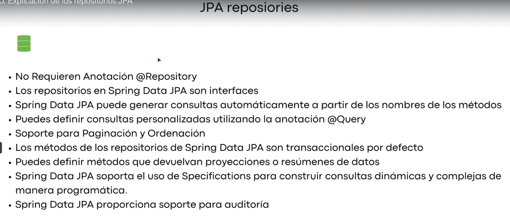
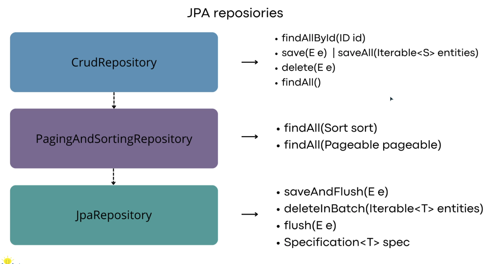
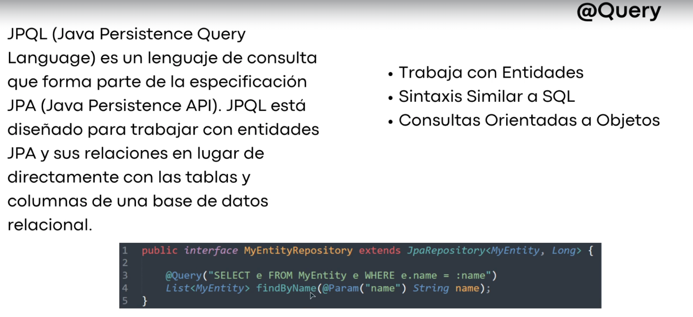
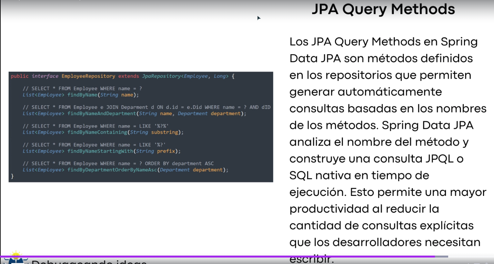
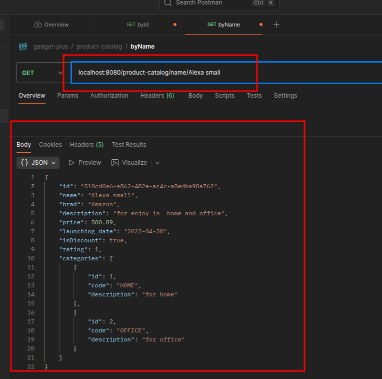
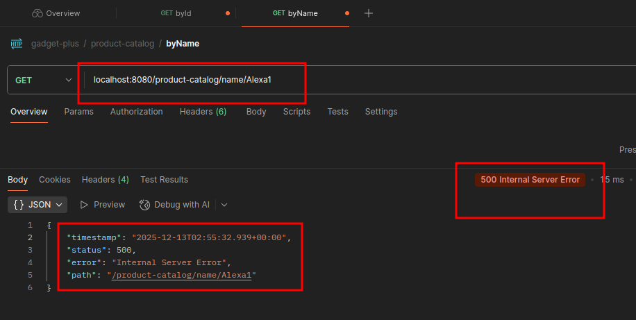

<details>
<summary><strong>🎯SECCION 4 JPA REPOSITORIOS</strong></summary>

## #️ ⃣📚**Clase 50: EXPLICACION DE LOS REPOSITORIOS JPA`**





## 🎯JPQL le hace QUERY a la Entidad no a la tabla 🎯





¡**EXCELENTE PREGUNTA**! 🎯 **Puedes elegir entre ambos según el caso de uso. ** Te explico cuándo usar cada uno:

---

## 🔍 **¿Qué son Query Methods y JPQL?**

### **Query Methods (Spring Data):**

```java
// Spring genera automáticamente la consulta basándose en el nombre del método
public interface ProductRepository extends JpaRepository<ProductEntity, UUID> {
    List<ProductEntity> findByBrandName(String brandName);
    List<ProductEntity> findByPriceBetween(BigDecimal min, BigDecimal max);
    Optional<ProductEntity> findByProductNameAndBrandName(String product, String brand);
}
```

### **JPQL (Java Persistence Query Language):**

```java
public interface ProductRepository extends JpaRepository<ProductEntity, UUID> {
    @Query("SELECT p FROM ProductEntity p WHERE p.brandName = :brand")
    List<ProductEntity> findProductsByBrand(@Param("brand") String brandName);
    
    @Query("SELECT p FROM ProductEntity p WHERE p.price BETWEEN :min AND :max")
    List<ProductEntity> findProductsInPriceRange(@Param("min") BigDecimal min, 
                                                 @Param("max") BigDecimal max);
}
```

---

## 📊 **¿Cuándo usar Query Methods?**

### **✅ PERFECTO para consultas SIMPLES:**

```java
// ✅ Búsquedas por un campo
findByProductName(String name)
findByBrandName(String brand)

// ✅ Búsquedas con operadores básicos  
findByPriceGreaterThan(BigDecimal price)
findByPriceBetween(BigDecimal min, BigDecimal max)

// ✅ Combinaciones simples con AND/OR
findByBrandNameAndIsDiscount(String brand, Boolean discount)
findByBrandNameOrProductName(String brand, String product)

// ✅ Ordenamiento básico
findByBrandNameOrderByPriceAsc(String brand)

// ✅ Paginación 
Page<ProductEntity> findByBrandName(String brand, Pageable pageable)
```

### **❌ NO usar Query Methods cuando:**

```java
// ❌ Consultas complejas (nombres muy largos)
findByBrandNameAndPriceBetweenAndIsDiscountTrueAndRatingGreaterThanOrderByPriceAsc(...)

// ❌ JOINs complejos
// ❌ Subconsultas
// ❌ Agregaciones (SUM, COUNT, AVG)
// ❌ Consultas dinámicas
```

---

## 📊 **¿Cuándo usar JPQL?**

### **✅ PERFECTO para consultas COMPLEJAS:**

```java
// ✅ JOINs con múltiples tablas
@Query("SELECT p FROM ProductEntity p " +
       "JOIN p.categories c " +
       "WHERE c.description = :category AND p.price > :minPrice")
List<ProductEntity> findProductsByCategoryAndPrice(@Param("category") String category,
                                                   @Param("minPrice") BigDecimal minPrice);

// ✅ Agregaciones y funciones
@Query("SELECT AVG(p.price) FROM ProductEntity p WHERE p.brandName = :brand")
BigDecimal getAveragePriceByBrand(@Param("brand") String brand);

// ✅ Subconsultas
@Query("SELECT p FROM ProductEntity p WHERE p.price > " +
       "(SELECT AVG(pr.price) FROM ProductEntity pr)")
List<ProductEntity> findProductsAboveAveragePrice();

// ✅ Consultas personalizadas complejas
@Query("SELECT new com.example.dto.ProductSummaryDTO(p.brandName, COUNT(p), AVG(p.price)) " +
       "FROM ProductEntity p GROUP BY p.brandName")
List<ProductSummaryDTO> getProductSummaryByBrand();
```

---

## 🎯 **Comparación práctica con TUS entidades:**

### **Ejemplos con ProductEntity:**

#### **Query Methods (simples):**

```java
public interface ProductCatalogRepository extends JpaRepository<ProductCatalogEntity, UUID> {
    
    // ✅ Búsqueda simple por marca
    List<ProductCatalogEntity> findByBrandName(String brandName);
    
    // ✅ Productos en descuento
    List<ProductCatalogEntity> findByIsDiscountTrue();
    
    // ✅ Rango de precios  
    List<ProductCatalogEntity> findByPriceBetween(BigDecimal min, BigDecimal max);
    
    // ✅ Top productos por rating
    List<ProductCatalogEntity> findTop10ByOrderByRatingDesc();
}
```

#### **JPQL (complejas):**

```java
public interface ProductCatalogRepository extends JpaRepository<ProductCatalogEntity, UUID> {
    
    // ✅ Productos por categoría con JOIN
    @Query("SELECT DISTINCT p FROM ProductCatalogEntity p " +
           "JOIN p.categories c " + 
           "WHERE c.description = :categoryDesc")
    List<ProductCatalogEntity> findByCategory(@Param("categoryDesc") String category);
    
    // ✅ Estadísticas por marca
    @Query("SELECT p.brandName, COUNT(p), AVG(p.price), MAX(p.rating) " +
           "FROM ProductCatalogEntity p " +
           "GROUP BY p.brandName " +
           "HAVING COUNT(p) > :minCount")
    List<Object[]> getStatisticsByBrand(@Param("minCount") Long minCount);
    
    // ✅ Productos más vendidos (con orders)
    @Query("SELECT pc FROM ProductCatalogEntity pc " +
           "WHERE pc.id IN (" +
           "  SELECT p.catalog.id FROM ProductEntity p " +
           "  GROUP BY p.catalog.id " +
           "  HAVING COUNT(p) > :minSales)")
    List<ProductCatalogEntity> findBestSellers(@Param("minSales") Long minSales);
}
```

---

## 📋 **Guía de decisión:**

| Criterio                | Query Methods           | JPQL                     |
|:------------------------|:------------------------|:-------------------------|
| **Simplicidad**         | ✅ Muy simple            | ❌ Más verboso            |
| **Legibilidad**         | ✅ Autodocumentado       | ❌ Requiere leer query    |
| **Mantenimiento**       | ✅ Fácil                 | ❌ Más propenso a errores |
| **Performance**         | ✅ Optimizado por Spring | ✅ Control total          |
| **Flexibilidad**        | ❌ Limitado              | ✅ Total flexibilidad     |
| **JOINs complejos**     | ❌ No soporta bien       | ✅ Excelente              |
| **Agregaciones**        | ❌ No soporta            | ✅ Perfecto               |
| **Consultas dinámicas** | ❌ No soporta            | ✅ Con Criteria API       |

---

## 💡 **Mi recomendación:**

### **🎯 Estrategia híbrida (combinar ambos):**

```java
@Repository
public interface ProductCatalogRepository extends JpaRepository<ProductCatalogEntity, UUID> {
    
    // Query Methods para consultas simples
    List<ProductCatalogEntity> findByBrandName(String brand);
    List<ProductCatalogEntity> findByIsDiscountTrue();
    Optional<ProductCatalogEntity> findByProductName(String productName);
    
    // JPQL para consultas complejas  
    @Query("SELECT pc FROM ProductCatalogEntity pc " +
           "JOIN pc.categories c WHERE c.description = :category")
    List<ProductCatalogEntity> findByCategory(@Param("category") String category);
    
    @Query("SELECT pc. brandName, AVG(pc.price) FROM ProductCatalogEntity pc " +
           "GROUP BY pc. brandName")
    List<Object[]> getAveragePriceByBrand();
}
```

---

## ✅ **Respuesta a tu pregunta:**

> **"¿Puedo elegir?"**

**¡SÍ, PUEDES ELEGIR!  ** 🎯

- ✅ **Query Methods** → Para consultas simples (80% de casos)
- ✅ **JPQL** → Para consultas complejas (20% de casos)
- ✅ **Combinación** → La mejor estrategia (recomendado)

**No es obligatorio usar ambos, pero combinarlos te da lo mejor de ambos mundos.  ** ✨🤓

---

## #️ ⃣📚**Clase 51:DTO CATEGORIAS`**

```sql
-- CONSIDERACIONES DE LA SECCION 51
select *
from product_join_category pjc
         join public.categories c on c.id = pjc.id_category
         join public.products_catalog p on p.id = pjc.id_product;

select o.client_name, pc.product_name, p.quantity
from products p
         join orders o on p.id_order = o.id
         join products_catalog pc on pc.id = p.id_product_catalog;

```

---

## #️ ⃣📚**Clase 52:DTO CATEGORIAS`**

El DTO (Data Transfer Object) en este proyecto sirve como **capa de transferencia de datos** entre diferentes capas de
la aplicación. Te explico su propósito y relación:

## ¿Para qué sirve este DTO?

1. **Separación de responsabilidades**: Evita exponer las entidades JPA directamente al cliente
2. **Control de datos**: Decide exactamente qué información enviar/recibir
3. **Serialización segura**: Implementa `Serializable` para APIs REST/JSON
4. **Estructura limpia**: Combina producto con sus categorías en una sola respuesta

## Relación con el resto del proyecto:

### 1. **Entidad vs DTO**

```java
// Entidad JPA (base de datos)
@Entity
public class ProductCatalogEntity {
    private UUID id;
    private String name;
    // Relaciones complejas, anotaciones JPA, etc.
}

// DTO (transferencia)
public class ProductCatalogDTO {
    private UUID id;
    private String name;
    // Solo los datos necesarios para el cliente
}
```

### 2. **En el Controller**

```java

@RestController
public class ProductController {

    @GetMapping("/products")
    public List<ProductCatalogDTO> getProducts() {
        // Retorna DTOs, no entidades
        return productService.getAllProductsAsDTO();
    }
}
```

### 3. **En el Service (conversión)**

```java

@Service
public class ProductService {

    public List<ProductCatalogDTO> getAllProductsAsDTO() {
        var entities = productCatalogRepository.findAll();
        return entities.stream()
                .map(this::convertToDTO)
                .toList();
    }

    private ProductCatalogDTO convertToDTO(ProductCatalogEntity entity) {
        return ProductCatalogDTO.builder()
                .id(entity.getId())
                .name(entity.getName())
                .price(entity.getPrice())
                .categories(convertCategories(entity.getCategories()))
                .build();
    }
}
```

## Ventajas específicas en tu proyecto:

- **API limpia**: Los endpoints devuelven estructura consistente
- **Seguridad**: No expone campos internos de las entidades
- **Performance**: Solo transfiere datos necesarios
- **Versionado**: Puedes cambiar la entidad sin afectar la API
- **Anidación controlada**: `CategoryDTO` permite estructurar respuestas complejas

El DTO actúa como un **contrato** entre tu backend y el frontend/cliente, garantizando estabilidad en la comunicación.

---

## #️ ⃣📚**Clase 53:SERVICIO PARA CATEGORIAS`**

Analizando el código del servicio, te explico lo que se ha hecho:

## ProductCatalogService (Interfaz)

Define el **contrato** para operaciones de consulta del catálogo de productos:

### Tipos de operaciones definidas:

1. **Búsquedas básicas**:
    - `findById(UUID)` - Por ID único
    - `findByName(String)` - Por nombre exacto

2. **Búsquedas con filtros**:
    - `findNameLike(String)` - Nombres similares (LIKE)
    - `findNameBetween(BigDecimal, BigDecimal)` - Por rango de precios
    - `findByCategoryName(BigInteger)` - Por categoría
    - `findByBrandAndRating(String, Short)` - Por marca y calificación

3. **Operaciones paginadas**:
    - `findAll(String, Boolean)` - Todos con ordenamiento
    - `findAllByBrand(String)` - Por marca con paginación

4. **Operaciones de agregación**:
    - `countByBrand(String)` - Contar productos por marca

## ProductCatalogServiceImpl (Implementación)

### Estado actual:

```java

@Service
@RequiredArgsConstructor  // Inyección por constructor
@Transactional(readOnly = true)  // Solo lectura por defecto
public class ProductCatalogServiceImpl implements ProductCatalogService {

    private final ProductCatalogRepository catalogRepository;

    // TODOS LOS MÉTODOS RETORNAN VALORES POR DEFECTO
    @Override
    public ProductCatalogEntity findById(UUID id) {
        return null;  // Sin implementar
    }

    // ... resto de métodos sin implementar
}
```

## Resumen del estado:

**✅ Lo que está hecho**:

- Estructura de servicio con Spring Boot
- Interfaz bien definida con diferentes tipos de consultas
- Inyección de dependencias configurada
- Transacciones de solo lectura

**❌ Lo que falta**:

- **Implementar todos los métodos** (actualmente retornan `null` o valores por defecto)
- **Usar el repository** para las consultas reales
- **Manejo de excepciones** para casos no encontrados
- **Conversión a DTOs** si es necesario

Este patrón es común en desarrollo: primero defines la interfaz y estructura, luego implementas la lógica real método
por método.

---

## #️ ⃣📚**Clase 54:POSTMAN`**

SE AGREGA DE RECURSOS JSON

---

## #️ ⃣📚**Clase 55:BUSCAR POR ID`**

USA ESTO : 0a7a432a-a5d8-46db-8248-ffda99b81898

# Análisis del Flujo de Obtención de Productos por ID

## 📋 Descripción General

Este código implementa un endpoint REST que permite obtener un producto del catálogo mediante su ID único (UUID).
El flujo sigue el patrón arquitectónico **Controller → Service → Repository** de Spring Boot.

## 🔄 Flujo de Ejecución Paso a Paso

### 1. **Controller Layer** - `ProductCatalogController`

```java

@RestController
@RequestMapping(path = "product-catalog")
@RequiredArgsConstructor
public class ProductCatalogController {

    private final ProductCatalogService productCatalogService;

    @GetMapping(path = "{id}")
    public ResponseEntity<ProductCatalogEntity> getById(@PathVariable String id) {
        return ResponseEntity.ok(this.productCatalogService.findById(UUID.fromString(id)));
    }
}
```

**¿Qué hace?**

- **`@RestController`**: Marca la clase como controlador REST
- **`@RequestMapping(path = "product-catalog")`**: Define la ruta base `/product-catalog`
- **`@GetMapping(path = "{id}")`**: Mapea peticiones GET a `/product-catalog/{id}`
- **`@PathVariable String id`**: Captura el ID de la URL como string
- **`UUID.fromString(id)`**: Convierte el string a formato UUID
- **`ResponseEntity.ok()`**: Retorna respuesta HTTP 200 con el producto encontrado

### 2. **Service Interface** - `ProductCatalogService`

```java
public interface ProductCatalogService {
    ProductCatalogEntity findById(UUID id);
}
```

**¿Qué define?**

- **Contrato del servicio**: Define qué operaciones están disponibles
- **Abstracción**: Separa la definición de la implementación
- **Parámetro UUID**: Recibe el ID ya convertido a formato UUID

### 3. **Service Implementation** - `ProductCatalogServiceImpl`

```java

@Slf4j
@Service
@RequiredArgsConstructor
@Transactional(readOnly = true)
public class ProductCatalogServiceImpl implements ProductCatalogService {

    private final ProductCatalogRepository catalogRepository;

    @Override
    public ProductCatalogEntity findById(UUID id) {
        return this.catalogRepository.findById(id).orElseThrow(() ->
                new NoSuchElementException("Producto no encontrado con ID: " + id));
    }
}
```

**¿Qué hace?**

- **`@Service`**: Marca la clase como servicio de Spring
- **`@Transactional(readOnly = true)`**: Optimiza las consultas como solo lectura
- **`@RequiredArgsConstructor`**: Inyección de dependencias por constructor
- **`catalogRepository.findById(id)`**: Busca en la base de datos usando JPA
- **`.orElseThrow()`**: Si no encuentra el producto, lanza excepción personalizada

## 🌐 Flujo de Petición HTTP

### Ejemplo de Uso:

```
GET /product-catalog/0a7a432a-a5d8-46db-8248-ffda99b81898
```

### Secuencia de Ejecución:

1. **Cliente** → Envía petición GET con UUID en la URL
2. **Controller** → Captura el UUID de la URL como string
3. **Controller** → Convierte string a UUID y llama al servicio
4. **Service** → Recibe UUID y delega al repository
5. **Repository** → Ejecuta consulta SQL en la base de datos
6. **Database** → Retorna el registro o null si no existe
7. **Service** → Si existe: retorna entidad, si no: lanza excepción
8. **Controller** → Retorna ResponseEntity con el producto
9. **Cliente** → Recibe respuesta HTTP 200 + JSON del producto

## 📊 Posibles Respuestas HTTP

| Escenario                  | Código HTTP                 | Respuesta                   |
|----------------------------|-----------------------------|-----------------------------|
| **Producto encontrado**    | `200 OK`                    | JSON con datos del producto |
| **Producto no encontrado** | `500 Internal Server Error` | `NoSuchElementException`    |
| **UUID inválido**          | `400 Bad Request`           | Error de formato UUID       |

## ⚠️ Consideraciones Actuales

### Problemas Potenciales:

- **Manejo de excepciones**: `NoSuchElementException` no se maneja explícitamente
- **Respuesta 500**: En lugar de 404 cuando no se encuentra el producto
- **Logs limitados**: Solo `@Slf4j` disponible pero sin uso explícito

### Mejoras Sugeridas:

```java

@GetMapping(path = "{id}")
public ResponseEntity<ProductCatalogEntity> getById(@PathVariable String id) {
    try {
        ProductCatalogEntity product = this.productCatalogService.findById(UUID.fromString(id));
        return ResponseEntity.ok(product);
    } catch (NoSuchElementException e) {
        return ResponseEntity.notFound().build(); // 404
    } catch (IllegalArgumentException e) {
        return ResponseEntity.badRequest().build(); // 400
    }
}
```

## 🏗️ Patrones de Diseño Utilizados

- **Dependency Injection**: Inyección de dependencias con `@RequiredArgsConstructor`
- **Repository Pattern**: Separación de lógica de acceso a datos
- **Service Layer**: Lógica de negocio encapsulada
- **REST API**: Endpoints RESTful con ResponseEntity
- **Interface Segregation**: Separación de contratos e implementaciones

## TOMAR EN CUENTA LA RECURSIVIDAD

¡Excelente pregunta! Te voy a mostrar exactamente qué pasaría:

## Sin @JsonIgnore - EL PROBLEMA DE RECURSIVIDAD INFINITA

### En `CategoryEntity`:

```java

@ManyToMany(fetch = FetchType.LAZY, mappedBy = "categories")
// @JsonIgnore  ← SIN ESTO
private List<ProductCatalogEntity> productCatalog;
```

### Lo que pasaría al serializar a JSON:

```json
{
  "id": "e43b4468...",
  "name": "Guitarra electrica",
  "categories": [
    {
      "id": 1,
      "code": "HOME",
      "description": "for home",
      "productCatalog": [
        // ← ¡Aquí empieza el problema!
        {
          "id": "e43b4468...",
          "name": "Guitarra electrica",
          "categories": [
            // ← Vuelve a las categorías
            {
              "id": 1,
              "code": "HOME",
              "description": "for home",
              "productCatalog": [
                // ← Y otra vez...
                {
                  "id": "e43b4468...",
                  "name": "Guitarra electrica",
                  "categories": [
                    // ← Y otra vez...
                    {
// ← INFINITO... 💥
```

## El error que obtendrías:

```
com.fasterxml.jackson.databind.JsonMappingException: 
Infinite recursion (StackOverflowError)
```

O:

```
org.springframework.http.converter.HttpMessageNotWritableException: 
Could not write JSON: Infinite recursion
```

## ¿Por qué sucede esto?

```
1. Jackson serializa ProductCatalogEntity
              ↓
2. Ve el campo "categories" → serializa CategoryEntity
              ↓
3. Ve el campo "productCatalog" → serializa ProductCatalogEntity
              ↓
4. Ve el campo "categories" → serializa CategoryEntity
              ↓
5. Ve el campo "productCatalog" → serializa ProductCatalogEntity
              ↓
   ... LOOP INFINITO hasta StackOverflow 💥
```

## Visualización del problema:

```
ProductCatalog ←→ Category ←→ ProductCatalog ←→ Category ←→ ...
     (contiene)        (contiene)        (contiene)
```

## Soluciones:

### 1. **@JsonIgnore** (Tu solución actual) ✓

```java

@JsonIgnore
private List<ProductCatalogEntity> productCatalog;
```

✓ Simple y efectiva
✗ Pierdes la referencia en ambas direcciones del JSON

### 2. **@JsonManagedReference y @JsonBackReference**

```java
// En ProductCatalogEntity
@JsonManagedReference
private List<CategoryEntity> categories;

// En CategoryEntity
@JsonBackReference
private List<ProductCatalogEntity> productCatalog;
```

✓ Mantiene la relación en una dirección
✗ Más complejo de entender

### 3. **@JsonIdentityInfo** (Referencia por ID)

```java

@JsonIdentityInfo(
        generator = ObjectIdGenerators.PropertyGenerator.class,
        property = "id"
)
@Entity
public class ProductCatalogEntity { ...
}

@JsonIdentityInfo(
        generator = ObjectIdGenerators.PropertyGenerator.class,
        property = "id"
)
@Entity
public class CategoryEntity { ...
}
```

Resultado:

```json
{
  "id": "e43b4468...",
  "name": "Guitarra electrica",
  "categories": [
    {
      "id": 1,
      "code": "HOME",
      "productCatalog": [
        "e43b4468..."
      ]
      // ← Solo el ID
    }
  ]
}
```

### 4. **Usar DTOs** (La mejor práctica) ✓✓✓

```java
public class ProductCatalogDTO {
    private UUID id;
    private String name;
    private List<CategoryDTO> categories;  // ← Solo lo necesario

    // CategoryDTO NO tiene referencia a productos
    public static class CategoryDTO {
        private CodeCategoryEnum code;
        private String description;
    }
}
```

✓ Control total
✓ Sin riesgo de recursividad
✓ Performance optimizado
✓ API limpia

## Demostración práctica:

### Con @JsonIgnore (tu código actual):

```json
{
  "categories": [
    {
      "id": 1,
      "code": "HOME",
      "description": "for home"
    }
  ]
}
```

✓ Funciona bien, no hay loop

### Sin @JsonIgnore:

```bash
curl http://localhost:8080/product-catalog/e43b4468...

# Respuesta:
HTTP/1.1 500 Internal Server Error
{
    "error": "Internal Server Error",
    "message": "Could not write JSON: Infinite recursion (StackOverflowError)"
}
```

## ¿Cuándo necesitas @JsonIgnore?

Siempre que tengas **relaciones bidireccionales**:

```java
// Lado A
@ManyToMany
private List<B> listB;

// Lado B
@ManyToMany(mappedBy = "listB")
@JsonIgnore  // ← NECESARIO aquí
private List<A> listA;
```

**Regla general**: En el lado que tiene `mappedBy` (el lado NO propietario de la relación), pon `@JsonIgnore`.

## Resumen:

| Situación           | Resultado                        |
|---------------------|----------------------------------|
| **Con @JsonIgnore** | ✓ Funciona, rompe el ciclo       |
| **Sin @JsonIgnore** | ✗ StackOverflowError, app crash  |
| **Con DTO**         | ✓✓ Mejor solución, control total |

¿Quieres que te muestre cómo refactorizar tu código para usar DTOs y evitar estos problemas desde el diseño?

---
¡Excelente pregunta! Voy a explicarte paso a paso cómo funciona todo esto:

## 1. ¿Cómo aparecen las categorías en el JSON?

La "magia" ocurre gracias a **JPA/Hibernate** y **Jackson** (el serializador JSON de Spring):

### En tu `ProductCatalogEntity`:

```java
@ManyToMany(fetch = FetchType.EAGER, ...)
@JoinTable(
        name = "product_join_category",
        joinColumns = @JoinColumn(name = "id_product"),
        inverseJoinColumns = @JoinColumn(name = "id_category")
)
private List<CategoryEntity> categories = new LinkedList<>();
```

**¿Qué hace esto?**

1. **`@ManyToMany`**: Define la relación muchos a muchos
2. **`fetch = FetchType.EAGER`**: Cuando cargues un producto, **automáticamente** carga sus categorías
3. **`@JoinTable`**: Le dice a JPA que use la tabla puente `product_join_category`
4. Cuando Spring serializa el objeto a JSON, **Jackson ve el campo `categories`** y lo convierte automáticamente a JSON

### Flujo completo:

```
1. Controller recibe petición GET /product-catalog/{id}
              ↓
2. Service llama a catalogRepository.findById(id)
              ↓
3. JPA/Hibernate ejecuta:
   - SELECT * FROM products_catalog WHERE id = ?
   - Como tienes EAGER, automáticamente hace:
   - SELECT c.* FROM categories c 
     JOIN product_join_category pjc ON c.id = pjc.id_category
     WHERE pjc.id_product = ?
              ↓
4. Hibernate mapea los resultados a:
   ProductCatalogEntity + List<CategoryEntity>
              ↓
5. Controller devuelve el objeto
              ↓
6. Jackson (Spring) serializa a JSON:
   - Ve el campo "categories"
   - Convierte cada CategoryEntity a JSON
   - Ignora "productCatalog" por @JsonIgnore
```

## 2. ¿Basta con las llaves foráneas?

**NO, necesitas las anotaciones JPA**:

```
Base de datos                    JPA/Hibernate
─────────────────────────────────────────────────────
Tabla: product_join_category     @JoinTable
Columnas: id_product            joinColumns
          id_category           inverseJoinColumns
                                ↓
                        Mapea automáticamente
                        la relación many-to-many
```

Sin las anotaciones, JPA no sabría cómo cargar las categorías.

## 3. ¿Para qué sirve el DTO?

El **DTO (Data Transfer Object)** tiene varios propósitos importantes:

### Problema sin DTO:

```java
// Devuelves la entidad directamente
return ResponseEntity.ok(productCatalogEntity);
```

**Problemas:**

1. ✗ Expones TODA la estructura de tu base de datos
2. ✗ Puede haber recursividad infinita si no tienes `@JsonIgnore`
3. ✗ Envías datos innecesarios (ej: campos internos)
4. ✗ No puedes personalizar la respuesta fácilmente

### Solución con DTO:

```java
// En tu Service o Controller
public ProductCatalogDTO findById(UUID id) {
    ProductCatalogEntity entity = catalogRepository.findById(id)
            .orElseThrow(() -> new NoSuchElementException("..."));

    // Conviertes Entity → DTO
    return ProductCatalogDTO.builder()
            .id(entity.getId())
            .name(entity.getName())
            .description(entity.getDescription())
            .price(entity.getPrice())
            .categories(entity.getCategories().stream()
                    .map(cat -> ProductCatalogDTO.CategoryDTO.builder()
                            .code(cat.getCode())
                            .description(cat.getDescription())
                            .build())
                    .toList())
            .build();
}
```

**Ventajas:**

1. ✓ Control total sobre qué datos envías
2. ✓ Puedes agregar/quitar campos sin tocar la BD
3. ✓ Mejor seguridad (no expones estructura interna)
4. ✓ Documentación más clara de tu API
5. ✓ No hay riesgo de recursividad

## 4. Comparación práctica:

### Usando Entity directamente:

```json
{
  "id": "e43b4468...",
  "name": "Guitarra electrica",
  "brad": "ESP",
  // ← ¡Expones el typo!
  "description": "...",
  "price": 3400.99,
  "launching_date": "2024-12-10",
  "isDiscount": false,
  "rating": 10,
  "categories": [
    {
      "id": 1,
      "code": "HOME",
      "description": "for home",
      "productCatalog": null
      // ← Gracias a @JsonIgnore
    }
  ]
}
```

### Usando DTO:

```json
{
  "id": "e43b4468...",
  "name": "Guitarra electrica",
  "description": "...",
  "price": 3400.99,
  "categories": [
    {
      "code": "HOME",
      "description": "for home"
    }
  ]
}
```

✓ Limpio, solo lo necesario

## 5. Cómo usar el DTO (ejemplo completo):

```java

@Service
public class ProductCatalogServiceImpl {

    private final ProductCatalogRepository catalogRepository;

    // Método que devuelve DTO
    public ProductCatalogDTO findByIdAsDTO(UUID id) {
        ProductCatalogEntity entity = catalogRepository.findById(id)
                .orElseThrow(() -> new NoSuchElementException("..."));

        return mapToDTO(entity);
    }

    // Método helper para convertir Entity → DTO
    private ProductCatalogDTO mapToDTO(ProductCatalogEntity entity) {
        return ProductCatalogDTO.builder()
                .id(entity.getId())
                .name(entity.getName())
                .description(entity.getDescription())
                .price(entity.getPrice())
                .categories(entity.getCategories().stream()
                        .map(this::mapCategoryToDTO)
                        .toList())
                .build();
    }

    private ProductCatalogDTO.CategoryDTO mapCategoryToDTO(CategoryEntity entity) {
        return ProductCatalogDTO.CategoryDTO.builder()
                .code(entity.getCode())
                .description(entity.getDescription())
                .build();
    }
}
```

```java

@RestController
@RequestMapping("product-catalog")
public class ProductCatalogController {

    private final ProductCatalogService service;

    @GetMapping("{id}")
    public ResponseEntity<ProductCatalogDTO> getById(@PathVariable String id) {
        return ResponseEntity.ok(service.findByIdAsDTO(UUID.fromString(id)));
    }
}
```

## Resumen:

1. **Las categorías aparecen** porque `@ManyToMany` con `EAGER` las carga automáticamente
2. **La tabla puente** es manejada por `@JoinTable`, no necesitas crear una entidad para ella
3. **El DTO** sirve para controlar exactamente qué datos envías al cliente
4. **Actualmente estás usando Entity directamente**, lo cual funciona pero no es la mejor práctica

# AUN NO USO DTO

¡**CORRECTO!** 👍

En tu proyecto **NO estás usando el DTO** en ninguna parte. Solo lo tienes **definido pero sin usar**.

## Evidencia:

### 1. Tu Controller devuelve la **Entity directamente**:

```java

@GetMapping(path = "{id}")
public ResponseEntity<ProductCatalogEntity> getById(@PathVariable String id) {
    return ResponseEntity.ok(this.productCatalogService.findById(UUID.fromString(id)));
    // ↑ Devuelve ProductCatalogEntity, NO ProductCatalogDTO
}
```

### 2. Tu Service devuelve la **Entity directamente**:

```java

@Override
public ProductCatalogEntity findById(UUID id) {
    return this.catalogRepository.findById(id).orElseThrow(...);
    // ↑ Retorna ProductCatalogEntity, NO ProductCatalogDTO
}
```

### 3. El DTO está ahí pero **nunca se usa**:

```java
public class ProductCatalogDTO implements Serializable {
    // ← Esta clase existe pero nadie la usa 😅
}
```

## ¿Cómo sé que no lo usas?

Porque el JSON que te devuelve la API tiene **TODOS** los campos de la Entity:

```json
{
  "id": "e43b4468-e383-4e4e-a51f-1486b2b93328",
  "name": "Guitarra electrica - home",
  "brad": "ESP",
  // ← Este campo está en Entity
  "description": "...",
  "price": 3400.99,
  "launching_date": "2024-12-10",
  // ← Este campo NO está en DTO
  "isDiscount": false,
  // ← Este campo NO está en DTO
  "rating": 10,
  // ← Este campo NO está en DTO
  "categories": [
    ...
  ]
}
```

Si estuvieras usando el DTO, el JSON sería:

```json
{
  "id": "e43b4468-e383-4e4e-a51f-1486b2b93328",
  "name": "Guitarra electrica - home",
  "description": "...",
  "price": 3400.99,
  "categories": [
    {
      "code": "HOME",
      "description": "for home"
    }
  ]
}
```

## ¿Por qué funciona sin DTO?

Porque Spring automáticamente serializa la **Entity** a JSON usando **Jackson**:

```
Controller devuelve Entity
        ↓
Spring ve que debe devolver JSON
        ↓
Jackson serializa ProductCatalogEntity
        ↓
JSON resultante con TODOS los campos
```

## Entonces, ¿para qué crearon el DTO?

Probablemente:

1. Lo crearon con la **intención de usarlo**
2. Pero nunca lo **implementaron**
3. O lo dejaron para **refactorizar después**

Es muy común en proyectos tener DTOs definidos pero no usados al principio 😅

## ¿Quieres implementarlo?

Te puedo ayudar a refactorizar tu código para que **SÍ use el DTO**. Sería algo así:

```java
// Service
public ProductCatalogDTO findByIdAsDTO(UUID id) {
    ProductCatalogEntity entity = catalogRepository.findById(id)
            .orElseThrow(() -> new NoSuchElementException("..."));

    return convertToDTO(entity); // ← Conviertes Entity a DTO
}

// Controller
@GetMapping("{id}")
public ResponseEntity<ProductCatalogDTO> getById(@PathVariable String id) {
    return ResponseEntity.ok(productCatalogService.findByIdAsDTO(UUID.fromString(id)));
    // ↑ Ahora devuelve DTO
}
```

---

## Ignora "productCatalog" por @JsonIgnore esto por que se ignora que pasaria si no estuviera @JsonIgnore?

¡Excelente pregunta! Te voy a mostrar exactamente qué pasaría:

## Sin @JsonIgnore - EL PROBLEMA DE RECURSIVIDAD INFINITA

### En `CategoryEntity`:

```java

@ManyToMany(fetch = FetchType.LAZY, mappedBy = "categories")
// @JsonIgnore  ← SIN ESTO
private List<ProductCatalogEntity> productCatalog;
```

### Lo que pasaría al serializar a JSON:

```json
{
  "id": "e43b4468...",
  "name": "Guitarra electrica",
  "categories": [
    {
      "id": 1,
      "code": "HOME",
      "description": "for home",
      "productCatalog": [
        // ← ¡Aquí empieza el problema!
        {
          "id": "e43b4468...",
          "name": "Guitarra electrica",
          "categories": [
            // ← Vuelve a las categorías
            {
              "id": 1,
              "code": "HOME",
              "description": "for home",
              "productCatalog": [
                // ← Y otra vez...
                {
                  "id": "e43b4468...",
                  "name": "Guitarra electrica",
                  "categories": [
                    // ← Y otra vez...
                    {
// ← INFINITO... 💥
```

## El error que obtendrías:

```
com.fasterxml.jackson.databind.JsonMappingException: 
Infinite recursion (StackOverflowError)
```

O:

```
org.springframework.http.converter.HttpMessageNotWritableException: 
Could not write JSON: Infinite recursion
```

## ¿Por qué sucede esto?

```
1. Jackson serializa ProductCatalogEntity
              ↓
2. Ve el campo "categories" → serializa CategoryEntity
              ↓
3. Ve el campo "productCatalog" → serializa ProductCatalogEntity
              ↓
4. Ve el campo "categories" → serializa CategoryEntity
              ↓
5. Ve el campo "productCatalog" → serializa ProductCatalogEntity
              ↓
   ... LOOP INFINITO hasta StackOverflow 💥
```

## Visualización del problema:

```
ProductCatalog ←→ Category ←→ ProductCatalog ←→ Category ←→ ...
     (contiene)        (contiene)        (contiene)
```

## Soluciones:

### 1. **@JsonIgnore** (Tu solución actual) ✓

```java

@JsonIgnore
private List<ProductCatalogEntity> productCatalog;
```

✓ Simple y efectiva
✗ Pierdes la referencia en ambas direcciones del JSON

### 2. **@JsonManagedReference y @JsonBackReference**

```java
// En ProductCatalogEntity
@JsonManagedReference
private List<CategoryEntity> categories;

// En CategoryEntity
@JsonBackReference
private List<ProductCatalogEntity> productCatalog;
```

✓ Mantiene la relación en una dirección
✗ Más complejo de entender

### 3. **@JsonIdentityInfo** (Referencia por ID)

```java

@JsonIdentityInfo(
        generator = ObjectIdGenerators.PropertyGenerator.class,
        property = "id"
)
@Entity
public class ProductCatalogEntity { ...
}

@JsonIdentityInfo(
        generator = ObjectIdGenerators.PropertyGenerator.class,
        property = "id"
)
@Entity
public class CategoryEntity { ...
}
```

Resultado:

```json
{
  "id": "e43b4468...",
  "name": "Guitarra electrica",
  "categories": [
    {
      "id": 1,
      "code": "HOME",
      "productCatalog": [
        "e43b4468..."
      ]
      // ← Solo el ID
    }
  ]
}
```

### 4. **Usar DTOs** (La mejor práctica) ✓✓✓

```java
public class ProductCatalogDTO {
    private UUID id;
    private String name;
    private List<CategoryDTO> categories;  // ← Solo lo necesario

    // CategoryDTO NO tiene referencia a productos
    public static class CategoryDTO {
        private CodeCategoryEnum code;
        private String description;
    }
}
```

✓ Control total
✓ Sin riesgo de recursividad
✓ Performance optimizado
✓ API limpia

## Demostración práctica:

### Con @JsonIgnore (tu código actual):

```json
{
  "categories": [
    {
      "id": 1,
      "code": "HOME",
      "description": "for home"
    }
  ]
}
```

✓ Funciona bien, no hay loop

### Sin @JsonIgnore:

```bash
curl http://localhost:8080/product-catalog/e43b4468...

# Respuesta:
HTTP/1.1 500 Internal Server Error
{
    "error": "Internal Server Error",
    "message": "Could not write JSON: Infinite recursion (StackOverflowError)"
}
```

## ¿Cuándo necesitas @JsonIgnore?

Siempre que tengas **relaciones bidireccionales**:

```java
// Lado A
@ManyToMany
private List<B> listB;

// Lado B
@ManyToMany(mappedBy = "listB")
@JsonIgnore  // ← NECESARIO aquí
private List<A> listA;
```

**Regla general**: En el lado que tiene `mappedBy` (el lado NO propietario de la relación), pon `@JsonIgnore`.

## Resumen:

| Situación           | Resultado                        |
|---------------------|----------------------------------|
| **Con @JsonIgnore** | ✓ Funciona, rompe el ciclo       |
| **Sin @JsonIgnore** | ✗ StackOverflowError, app crash  |
| **Con DTO**         | ✓✓ Mejor solución, control total |

# 👍 VEO QUE AUN NO SE ULIZADO EL DTO EN ESTE EJEMPLO EN MI PROYECTO VERDAD?

¡**CORRECTO!** 👍

En tu proyecto **NO estás usando el DTO** en ninguna parte. Solo lo tienes **definido pero sin usar**.

## Evidencia:

### 1. Tu Controller devuelve la **Entity directamente**:

```java

@GetMapping(path = "{id}")
public ResponseEntity<ProductCatalogEntity> getById(@PathVariable String id) {
    return ResponseEntity.ok(this.productCatalogService.findById(UUID.fromString(id)));
    // ↑ Devuelve ProductCatalogEntity, NO ProductCatalogDTO
}
```

### 2. Tu Service devuelve la **Entity directamente**:

```java

@Override
public ProductCatalogEntity findById(UUID id) {
    return this.catalogRepository.findById(id).orElseThrow(...);
    // ↑ Retorna ProductCatalogEntity, NO ProductCatalogDTO
}
```

### 3. El DTO está ahí pero **nunca se usa**:

```java
public class ProductCatalogDTO implements Serializable {
    // ← Esta clase existe pero nadie la usa 😅
}
```

## ¿Cómo sé que no lo usas?

Porque el JSON que te devuelve la API tiene **TODOS** los campos de la Entity:

```json
{
  "id": "e43b4468-e383-4e4e-a51f-1486b2b93328",
  "name": "Guitarra electrica - home",
  "brad": "ESP",
  // ← Este campo está en Entity
  "description": "...",
  "price": 3400.99,
  "launching_date": "2024-12-10",
  // ← Este campo NO está en DTO
  "isDiscount": false,
  // ← Este campo NO está en DTO
  "rating": 10,
  // ← Este campo NO está en DTO
  "categories": [
    ...
  ]
}
```

Si estuvieras usando el DTO, el JSON sería:

```json
{
  "id": "e43b4468-e383-4e4e-a51f-1486b2b93328",
  "name": "Guitarra electrica - home",
  "description": "...",
  "price": 3400.99,
  "categories": [
    {
      "code": "HOME",
      "description": "for home"
    }
  ]
}
```

## ¿Por qué funciona sin DTO?

Porque Spring automáticamente serializa la **Entity** a JSON usando **Jackson**:

```
Controller devuelve Entity
        ↓
Spring ve que debe devolver JSON
        ↓
Jackson serializa ProductCatalogEntity
        ↓
JSON resultante con TODOS los campos
```

## Entonces, ¿para qué crearon el DTO?

Probablemente:

1. Lo crearon con la **intención de usarlo**
2. Pero nunca lo **implementaron**
3. O lo dejaron para **refactorizar después**

Es muy común en proyectos tener DTOs definidos pero no usados al principio 😅

## ¿Quieres implementarlo?

Te puedo ayudar a refactorizar tu código para que **SÍ use el DTO**. Sería algo así:

```java
// Service
public ProductCatalogDTO findByIdAsDTO(UUID id) {
    ProductCatalogEntity entity = catalogRepository.findById(id)
            .orElseThrow(() -> new NoSuchElementException("..."));

    return convertToDTO(entity); // ← Conviertes Entity a DTO
}

// Controller
@GetMapping("{id}")
public ResponseEntity<ProductCatalogDTO> getById(@PathVariable String id) {
    return ResponseEntity.ok(productCatalogService.findByIdAsDTO(UUID.fromString(id)));
    // ↑ Ahora devuelve DTO
}
```

## #️ ⃣📚**Clase 56:BUSCAR POR NOMBRE`**

```sql
select *
  from products_catalog
  where product_name = 'Pc gamer';
```
- Por detras es como si estuvieramos haciendo el Query de arriba en sql pero en java usando QueryMehods de JPA
- y por que product_name en el sql y en jpa name? por que ya esta mapeada en la columna como "product_name"


```java
public interface ProductCatalogRepository extends JpaRepository<ProductCatalogEntity, UUID> {
    
    Optional<ProductCatalogEntity> findByName(String name); 
    
}
```
- En ProductCatalogServiceImpl ->

```java
    @Override
    public ProductCatalogEntity findByName(String name) {
        return this.catalogRepository.findByName(name).orElseThrow();
    }

```
- En ProductCatalogController ->

```java
    @GetMapping(path = "by-name/{name}")
    public ResponseEntity<ProductCatalogEntity> getByName(@PathVariable String name) {
        return ResponseEntity.ok(this.productCatalogService.findByName(name));
    }
```

- Hacemos la prueba en postman con :



- si ponemos un nombre que no esta pues tenemos la opcion que pusimos en ProductCatalogServiceImpl
- de lanzar una excepcion con orElseThrow()

> ### **Opcion 1-orElseThrow()**
> - Lanzara un error 500 Internal Server Error

```java
   @Override
    public ProductCatalogEntity findByName(String name) {
        return this.catalogRepository.findByName(name).orElseThrow();
    }

```
- Respuesta en postman ingresando un nombre que no existe:



> ### **Opcion 2-orElse(ProductCatalogEntity.builder().build())**
> - Lanzara un objeto vacio

```java
  @Override
    public ProductCatalogEntity findByName(String name) {
        return this.catalogRepository.findByName(name).orElse(ProductCatalogEntity.builder().build());//lanzara un objeto vacio
    }
```

- Respuesta en postman ingresando un nombre que no existe:


</details>