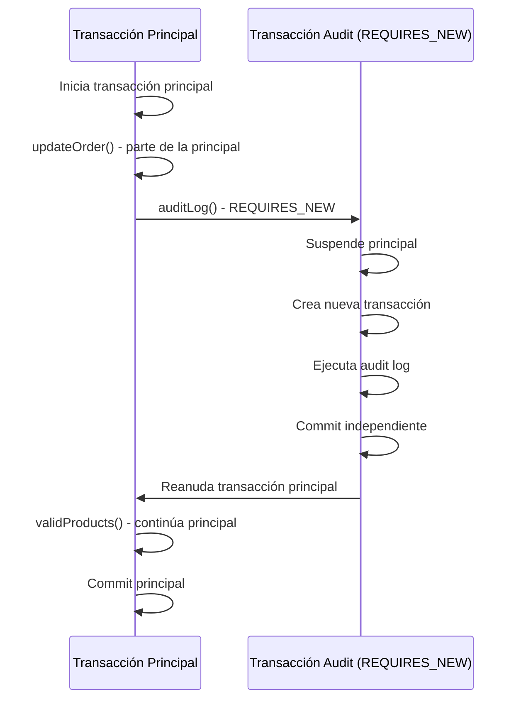

# 🎯 🎯 Transacciones 🎯 🎯


----

### ⃣📚**Clase 96:DEFINIENDO SERVICIOS****

```java
public interface TransactionService {
    void executeTransaction(Long id);

    void updateOrder(Long id);

    void updateBill(String id);

    void validProducts(Long id);
}
```
- Implementan en TransactionServiceImpl

---
### ⃣📚**Clase 97:Implementando Servicios****
# 📚 Análisis del Código - Transacciones en Spring Boot JPA

¡Perfecto para aprender! Te explico cada parte como si fueras principiante en JPA 🚀

---

## 🏗️ **Clase de Servicio - `TransactionServiceImpl`**

### **📋 Anotaciones de la clase**

```java
@Service
@RequiredArgsConstructor
public class TransactionServiceImpl implements TransactionService {
```

| Anotación | ¿Qué hace? | ¿Por qué se usa? |
|-----------|------------|------------------|
| `@Service` | Marca esta clase como un **servicio de Spring** | Spring la registra como un **Bean** y la puede inyectar en otros componentes |
| `@RequiredArgsConstructor` | **Lombok** crea automáticamente el constructor | Evita escribir el constructor manualmente para los campos `final` |

---

## 💉 **Inyección de Dependencias**

```java
private final OrderRepository orderRepository;
private final BillRepository billRepository;
```

### **🔍 ¿Qué significa esto?**

- **`final`**: Las variables no pueden cambiar una vez inicializadas
- **Lombok** crea este constructor automáticamente:

```java
// Esto es lo que Lombok genera internamente:
public TransactionServiceImpl(OrderRepository orderRepository, 
                             BillRepository billRepository) {
    this.orderRepository = orderRepository;
    this.billRepository = billRepository;
}
```

---

## 🔄 **Método Principal - `executeTransaction()`**

```java
@Override
public void executeTransaction(Long id) {
    this.updateOrder(id);
}
```

### **📝 ¿Qué hace?**

- Es el **punto de entrada** de la transacción
- Solo llama a `updateOrder(id)`
- **⚠️ PROBLEMA**: ¡No tiene `@Transactional`!

---

## 🛠️ **Método Core - `updateOrder()`**

```java
@Override
public void updateOrder(Long id) {
    final var order = orderRepository.findById(id).orElseThrow();
    order.setCreatedAt(LocalDateTime. now());
    orderRepository.save(order);
    this.validProducts(id);
    this.updateBill(order. getBill().getId());
}
```

### **🔍 Desglose paso a paso:**

#### **1️⃣ Buscar la orden**
```java
final var order = orderRepository.findById(id).orElseThrow();
```
- `findById(id)` devuelve un `Optional<Order>`
- `orElseThrow()` lanza excepción si no encuentra la orden
- **En JPA**:  Ejecuta `SELECT * FROM orders WHERE id = ? `

#### **2️⃣ Modificar la entidad**
```java
order.setCreatedAt(LocalDateTime.now());
```
- Cambia la fecha de creación (¿raro verdad?  🤔)
- La entidad está en estado **MANAGED** por el EntityManager

#### **3️⃣ Guardar cambios**
```java
orderRepository.save(order);
```
- **En JPA**: Ejecuta `UPDATE orders SET created_at = ?  WHERE id = ?`
- Como la entidad ya existía, hace `UPDATE` no `INSERT`

#### **4️⃣ Validar productos**
```java
this.validProducts(id);
```
- Llama a método de validación
- Si falla, lanza excepción

#### **5️⃣ Actualizar factura**
```java
this.updateBill(order.getBill().getId());
```
- Actualiza la factura relacionada
- Usa `order.getBill()` - **relación JPA**

---

## 📄 **Método de Actualización - `updateBill()`**

```java
@Override
public void updateBill(String id) {
    final var bill = billRepository. findById(id).orElseThrow();
    bill.setClientRfc("TRANS123");
    billRepository.save(bill);
}
```

### **🔍 ¿Qué hace?**
- Busca la factura por ID (tipo `String`)
- Cambia el RFC del cliente a valor fijo
- Guarda los cambios
- **En JPA**: `UPDATE bills SET client_rfc = 'TRANS123' WHERE id = ?`

---

## ✅ **Método de Validación - `validProducts()`**

```java
@Override
public void validProducts(Long id) {
    final var order = orderRepository. findById(id).orElseThrow();
    if (order.getProducts().isEmpty()) {
        throw new IllegalStateException("there are no products in the order");
    }
}
```

### **🔍 ¿Qué hace?**
- **Vuelve a buscar** la orden (¡ineficiente!)
- Verifica si tiene productos:  `order.getProducts()`
- Si está vacía, lanza `IllegalStateException`

---

## 🌐 **Controlador REST - `TransactionController`**

```java
@RestController
@RequestMapping(path = "transaction")
@RequiredArgsConstructor
public class TransactionController {

    private final TransactionService transactionService;

    @PostMapping
    public ResponseEntity<Map<String, String>> startTransaction(@RequestParam Long id) {
        this.transactionService.executeTransaction(id);
        return ResponseEntity.ok(Map.of("Transaction", "ok"));
    }
}
```

### **📝 Desglose:**

| Anotación | Función |
|-----------|---------|
| `@RestController` | Combina `@Controller` + `@ResponseBody` |
| `@RequestMapping(path = "transaction")` | Todas las rutas empiezan con `/transaction` |
| `@PostMapping` | Mapea POST a `/transaction` |
| `@RequestParam Long id` | Obtiene parámetro `id` del request |

### **📡 Endpoint resultante:**
```http
POST /transaction? id=123
```

---

## ⚠️ **PROBLEMAS IMPORTANTES del código**

### **🚨 1. Sin `@Transactional`**

```java
// ❌ MALO:  Sin transacción
public void executeTransaction(Long id) {
    this. updateOrder(id); // Si falla, cambios previos NO se revierten
}

// ✅ CORRECTO: Con transacción
@Transactional
public void executeTransaction(Long id) {
    this.updateOrder(id); // Si falla, TODO se revierte
}
```

### **🚨 2. Consultas duplicadas**

```java
// ❌ INEFICIENTE:  Busca la orden 2 veces
public void updateOrder(Long id) {
    final var order = orderRepository. findById(id).orElseThrow(); // 1ra vez
    // ... 
    this.validProducts(id); // Vuelve a buscar la misma orden
}
```

### **🚨 3. Sin manejo de errores**

```java
// ❌ Sin try-catch en el controlador
@PostMapping
public ResponseEntity<Map<String, String>> startTransaction(@RequestParam Long id) {
    this.transactionService. executeTransaction(id); // ¿Y si falla? 
    return ResponseEntity. ok(Map.of("Transaction", "ok"));
}
```

---

## ✅ **Versión CORREGIDA**

### **🔧 Servicio mejorado:**

```java
@Service
@RequiredArgsConstructor
@Transactional // ← ¡Importante!
public class TransactionServiceImpl implements TransactionService {

    private final OrderRepository orderRepository;
    private final BillRepository billRepository;

    @Override
    public void executeTransaction(Long id) {
        final var order = orderRepository.findById(id)
            .orElseThrow(() -> new EntityNotFoundException("Order not found"));
        
        // Validar ANTES de modificar
        validProducts(order);
        
        // Actualizar orden
        order.setCreatedAt(LocalDateTime.now());
        
        // Actualizar factura
        updateBill(order. getBill());
        
        // Spring JPA guarda automáticamente al final de la transacción
    }
    
    private void validProducts(OrderEntity order) { // ← Recibe la entidad
        if (order.getProducts().isEmpty()) {
            throw new IllegalStateException("Order has no products");
        }
    }
    
    private void updateBill(BillEntity bill) { // ← Recibe la entidad
        bill.setClientRfc("TRANS123");
    }
}
```

### **🌐 Controlador mejorado:**

```java
@RestController
@RequestMapping("/transaction")
@RequiredArgsConstructor
public class TransactionController {

    private final TransactionService transactionService;

    @PostMapping
    public ResponseEntity<? > startTransaction(@RequestParam Long id) {
        try {
            transactionService.executeTransaction(id);
            return ResponseEntity.ok(Map.of("status", "success"));
        } catch (EntityNotFoundException e) {
            return ResponseEntity. notFound().build();
        } catch (IllegalStateException e) {
            return ResponseEntity.badRequest()
                .body(Map.of("error", e.getMessage()));
        }
    }
}
```

---

## 📚 **Conceptos clave aprendidos:**

| Concepto | Explicación |
|----------|-------------|
| **`@Service`** | Marca una clase como servicio de Spring |
| **`@Transactional`** | Agrupa operaciones en una transacción |
| **EntityManager** | JPA maneja automáticamente el ciclo de vida |
| **Repository. save()** | INSERT si es nueva, UPDATE si existe |
| **Optional. orElseThrow()** | Manejo seguro de valores nulos |

---

## 🎯 **¿Qué sigue en tu aprendizaje? **

1. **Propagación de transacciones** (`REQUIRED`, `REQUIRES_NEW`)
2. **Rollback strategies**
3. **Lazy vs Eager loading**
4. **Query optimization**

¡Excelente código para aprender! 🚀 ¿Qué parte quieres que profundice más? 

### ⃣📚**Clase 97:Implementando Servicios****

```java
@Service
@RequiredArgsConstructor
@Transactional
public class TransactionServiceImpl implements TransactionService {


    private final OrderRepository orderRepository;
    private final BillRepository billRepository;

    @Override
    public void executeTransaction(Long id) {
        this.updateOrder(id);
    }

    @Override
    public void updateOrder(Long id) {
        final var order = orderRepository.findById(id).orElseThrow();
        order.setCreatedAt(LocalDateTime.now());
        orderRepository.save(order);
        this.validProducts(id);
        this.updateBill(order.getBill().getId());
    }

    //CREAMOS ESTOS METODOS PARA SER LLAMADOS DENTRO DE LA TRANSACCION DE UPDATEORDER
    @Override
    public void updateBill(String id) {
        final var bill = billRepository.findById(id).orElseThrow();
        bill.setClientRfc("trc34");
        billRepository.save(bill);
    }

    @PersistenceContext
    private EntityManager entityManager;

    @Override
    public void validProducts(Long id) {
        entityManager.clear();
        final var order = orderRepository.findById(id).orElseThrow();
        if (order.getProducts().isEmpty()) {
            throw new IllegalArgumentException("there are no products in the order");
        }
    }
```

- Aqui se quita el id order al id de producto 

---

### ⃣📚**Clase 98:Explicacion de Querys****

- Cambia el id order por que es aleatorio
- 
```sql
SELECT o.client_name, o.created_at, b.client_rfc
FROM orders o
    JOIN bill b ON o.id_bill = b.id
WHERE o.id = 3;

SELECT o.client_name, o.created_at, o.id AS id_order, p.id AS id_product, p.id_product_catalog id_catalog
FROM orders o JOIN products p ON o.id = p.id_order
WHERE o.id = 3;

UPDATE products set id_order = null WHERE id = 4;

UPDATE products set id_order = 3 WHERE id = 4;
```

- ejecutando el proyecto y probando en postman


### ⃣📚**Clase 99:Manejo de Excepciones en transacciones****

- Aqui pequeño detalle se agrego esto para actualizar la cache de Hibernate por que se habia quedado pegado

```java
  @PersistenceContext
    private EntityManager entityManager;
    
     entityManager.clear();
```

- queda asi

```java
    @Override
    public void validProducts(Long id) {
        entityManager.clear();
        final var order = orderRepository.findById(id).orElseThrow();
        if (order.getProducts().isEmpty()) {
            throw new IllegalArgumentException("there are no products in the order");
        }
    }
```

- enviamos en postman no sale el 505 de error y validamos que no se ha refrescaso el rfc en la tabla
- por que no se pudo realizar la validacion  solo se modifico la fecha y hora


### ⃣📚**Clase 100:Propagation Required****🛠️🛠️🛠️
- En TransactionServiceImpl -> 🛠️🛠️🛠️🛠️
```java
@Transactional
    @Override
    public void executeTransaction(Long id) {
        log.info("TRANSACTION ACTIVE {}", TransactionSynchronizationManager.isActualTransactionActive());
        log.info("TRANSACTION NAME {}", TransactionSynchronizationManager.getCurrentTransactionName());
        this.updateOrder(id);
    }
```
#### Ver como se propaga -> REQUIRED


### ⃣📚**Clase 101:Propagation NESTED****🛠️🛠️🛠️

-Basicamente se crea una subtransaccion cuando sea utilizada en otro metodo 


### ⃣📚**Clase 102:Propagation REQUIRES NEW****🛠️🛠️🛠️

#### 🔄 **Propagation REQUIRES_NEW**

#### 📋 **¿Qué es REQUIRES_NEW?**

`REQUIRES_NEW` es un tipo de propagación de transacciones que **siempre crea una nueva transacción**, independientemente de si ya existe una transacción activa.

#### 🔍 **Comportamiento:**

| Escenario | Comportamiento |
|-----------|---------------|
| **Sin transacción activa** | ✅ Crea una nueva transacción |
| **Con transacción activa** | ⏸️ **Suspende** la transacción actual y crea una **nueva independiente** |

#### 🎯 **Características principales:**

- 🆕 **Siempre nueva**: Cada método con `REQUIRES_NEW` ejecuta en su propia transacción
- ⏸️ **Suspende padre**: La transacción principal se pausa temporalmente
- 🔄 **Independientes**: Si falla la subtransacción, la principal puede continuar
- ✅ **Commit separado**: Cada transacción hace commit por separado

#### 💡 **Ejemplo práctico:**

```java
@Service
@Transactional // Transacción principal
public class TransactionServiceImpl implements TransactionService {

    @Override
    public void executeTransaction(Long id) {
        log.info("TRANSACTION MAIN: {}", TransactionSynchronizationManager.getCurrentTransactionName());
        
        this.updateOrder(id);           // Usa transacción principal
        this.auditLog(id);             // Crea nueva transacción
        this.validProducts(id);        // Usa transacción principal
    }

    @Transactional(propagation = Propagation.REQUIRES_NEW)
    public void auditLog(Long orderId) {
        log.info("TRANSACTION AUDIT: {}", TransactionSynchronizationManager.getCurrentTransactionName());
        // Esta operación es independiente
        auditRepository.save(new AuditLog("Order processed: " + orderId));
        // Si falla aquí, NO afecta la transacción principal
    }
}
```

#### 🔄 **Flujo de ejecución:**



#### 🎯 **Casos de uso típicos:**

#### **1️⃣ Logging/Auditoría**
```java
@Transactional(propagation = Propagation.REQUIRES_NEW)
public void logActivity(String activity) {
    // Siempre debe guardarse el log, aunque falle la operación principal
    activityRepository.save(new ActivityLog(activity));
}
```

#### **2️⃣ Notificaciones**
```java
@Transactional(propagation = Propagation.REQUIRES_NEW)
public void sendNotification(String message) {
    // Enviar email independiente de la transacción principal
    emailService.send(message);
}
```

### **3️⃣ Contadores/Estadísticas**
```java
@Transactional(propagation = Propagation.REQUIRES_NEW)
public void incrementCounter() {
    // Actualizar estadísticas sin afectar la operación principal
    statsRepository.incrementOrderCount();
}
```

#### ⚠️ **Importante:**

#### **🔒 Deadlocks potenciales**
- Si ambas transacciones acceden a los mismos recursos
- La transacción suspendida mantiene sus locks

#### **🔄 Rollback independiente**
```java
@Transactional
public void mainTransaction() {
    orderRepository.save(order);           // Parte de transacción principal
    
    try {
        this.auditLog();                   // REQUIRES_NEW
    } catch (Exception e) {
        // La excepción en audit NO afecta la transacción principal
        log.error("Audit failed, but order was saved");
    }
    
    // La transacción principal continúa normalmente
}
```

#### 📊 **Comparación con otros tipos:**

| Propagación | Transacción existente | Nueva transacción |
|-------------|---------------------|------------------|
| `REQUIRED` | ✅ Une a la existente | ✅ Crea nueva |
| `REQUIRES_NEW` | ⏸️ Suspende + Crea nueva | ✅ Crea nueva |
| `NESTED` | 🔄 Crea subtransacción | ✅ Crea nueva |

#### 🎯 **En tu código:**

Si modificas tu `updateBill()` con `REQUIRES_NEW`:

```java
@Transactional(propagation = Propagation.REQUIRES_NEW)
@Override
public void updateBill(String id) {
    log.info("BILL TRANSACTION: {}", TransactionSynchronizationManager.getCurrentTransactionName());
    final var bill = billRepository.findById(id).orElseThrow();
    bill.setClientRfc("RB1234");
    billRepository.save(bill);
    // Esta actualización se confirma independientemente
}
```

**Resultado:**
- Si falla `validProducts()`, el bill **SÍ se actualiza** (porque ya hizo commit)
- La orden **NO se actualiza** (porque la transacción principal hace rollback)

## 🏆 **Ventajas:**

- ✅ **Operaciones críticas independientes** (logs, auditoría)
- ✅ **Performance**: Commit inmediato de operaciones rápidas
- ✅ **Flexibilidad**: Manejo granular de errores

#### ⚠️ **Desventajas:**

- 🚨 **Complejidad**: Más difícil de debuggear
- 🔒 **Deadlocks**: Potencial conflicto de recursos
- 💾 **Inconsistencia temporal**: Datos guardados parcialmente


## ⃣📚**Clase 103:Propagation NOT SUPPORTED****🚫🚫🚫️
#### 🚫 **Propagation NOT_SUPPORTED en `validProducts()`**

## 🔍 **¿Qué hace NOT_SUPPORTED?**

`NOT_SUPPORTED` **suspende cualquier transacción activa** y ejecuta el método **sin transacción**.

## 📊 **Comportamiento en tu código:**

```java
@Transactional(propagation = Propagation.NOT_SUPPORTED)
@Override
public void validProducts(Long id) {
    log.info("TRANSACTION ACTIVE 3{}", TransactionSynchronizationManager.isActualTransactionActive());
    // ↑ Esto mostrará: false
    log.info("TRANSACTION NAME 3{}", TransactionSynchronizationManager.getCurrentTransactionName());
    // ↑ Esto mostrará: null
}
```

## 🔄 **Flujo de ejecución en tu caso:**

```java
@Transactional(propagation = Propagation.REQUIRES_NEW) // Nueva transacción
public void updateOrder(Long id) {
    // TRANSACTION ACTIVE 2: true
    // TRANSACTION NAME 2: com.debugeandoideas...updateOrder
    
    orderRepository.save(order);           // ✅ Dentro de transacción
    
    this.validProducts(id);                // 🚫 Suspende transacción
    // TRANSACTION ACTIVE 3: false         // ❌ Sin transacción
    // TRANSACTION NAME 3: null            // ❌ Sin nombre
    
    this.updateBill(order.getBill().getId()); // 🔄 Reanuda transacción
    // TRANSACTION ACTIVE 4: true          // ✅ Transacción activa nuevamente
}
```

## 🎯 **¿Por qué usas NOT_SUPPORTED para validaciones?**

### **1️⃣ Validaciones no modifican datos**
```java
// Solo consulta, no modifica
final var order = orderRepository.findById(id).orElseThrow();
if (order.getProducts().isEmpty()) {
    throw new IllegalArgumentException("...");
}
```

### **2️⃣ Evita locks innecesarios**
- Sin transacción = **sin locks** en la BD
- Consultas más rápidas y eficientes

### **3️⃣ Evita problemas de caché**
- Al estar **fuera de transacción**, puede obtener datos más frescos
- Menos problemas con caché de Hibernate

### **4️⃣ Performance mejorada**
- No mantiene conexiones de BD abiertas innecesariamente
- Recursos liberados más rápido

## 📈 **Comparación de comportamiento:**

| Propagación | Transacción Activa | Caché Hibernate | Locks BD |
|-------------|-------------------|-----------------|----------|
| `REQUIRED` | ✅ Sí | 🔄 Usa caché | 🔒 Mantiene locks |
| `NOT_SUPPORTED` | ❌ No | 🆕 Consulta fresca | 🚫 Sin locks |

## 🔍 **En los logs verás:**

```
TRANSACTION ACTIVE 1: true    // executeTransaction()
TRANSACTION NAME 1: ...executeTransaction

TRANSACTION ACTIVE 2: true    // updateOrder() REQUIRES_NEW
TRANSACTION NAME 2: ...updateOrder

TRANSACTION ACTIVE 3: false   // validProducts() NOT_SUPPORTED ⬅️
TRANSACTION NAME 3: null      // ⬅️ SIN TRANSACCIÓN

TRANSACTION ACTIVE 4: true    // updateBill() reanuda
TRANSACTION NAME 4: ...updateOrder  // Misma que updateOrder()
```

## 💡 **Ventajas del NOT_SUPPORTED:**

- ✅ **Consultas más limpias**: Sin interferencia del contexto transaccional
- ✅ **Mejor performance**: Sin overhead de transacciones
- ✅ **Datos frescos**: Evita problemas de caché
- ✅ **Ideal para validaciones**: Solo lectura, sin modificaciones

## ⚠️ **Consideración importante:**

Si `validProducts()` lanza una excepción:
- La **transacción de `updateOrder()`** aún puede hacer **rollback**
- Porque la excepción se propaga hacia el contexto transaccional

## 🏆 **Conclusión:**

Usar `NOT_SUPPORTED` para `validProducts()` es una **excelente práctica** porque:
- Es una operación de **solo lectura**
- No necesita participar en la transacción
- Mejora el **performance**
- Evita problemas de **caché y locks**
---
# 🔒 ⃣📚**Clase 104: Isolation Levels en Spring Boot **

## 📚 **¿Qué es ISOLATION? **

**Isolation** controla **cómo las transacciones concurrentes interactúan** entre sí.  Imagínate que varios usuarios están modificando los mismos datos al mismo tiempo - ¿qué ven?  ¿qué pueden cambiar?

---

## 🎭 **Los 4 Niveles de Isolation**

| Nivel | Dirty Read | Non-Repeatable Read | Phantom Read | Performance |
|-------|------------|-------------------|--------------|-------------|
| **READ_UNCOMMITTED** | ✅ Permite | ✅ Permite | ✅ Permite | 🚀🚀🚀🚀 |
| **READ_COMMITTED** | ❌ Previene | ✅ Permite | ✅ Permite | 🚀🚀🚀 |
| **REPEATABLE_READ** | ❌ Previene | ❌ Previene | ✅ Permite | 🚀🚀 |
| **SERIALIZABLE** | ❌ Previene | ❌ Previene | ❌ Previene | 🚀 |

---

## 🔍 **Los 3 Problemas Clásicos**

### 🗑️ **1. Dirty Read (Lectura Sucia)**
```
👤 Usuario A: Cambia precio de $100 a $200 (NO confirmado)
👤 Usuario B: Lee $200 ← ¡PROBLEMA!  
👤 Usuario A: Hace ROLLBACK, precio vuelve a $100
👤 Usuario B:  Tiene dato incorrecto ($200)
```

### 🔄 **2. Non-Repeatable Read (Lectura No Repetible)**
```
👤 Usuario A: Lee precio = $100
👤 Usuario B:  Cambia precio a $200 y confirma
👤 Usuario A: Lee otra vez = $200 ← ¡Cambió en la misma transacción!
```

### 👻 **3. Phantom Read (Lectura Fantasma)**
```
👤 Usuario A:  Cuenta productos = 10
👤 Usuario B:  Inserta nuevo producto y confirma
👤 Usuario A: Cuenta otra vez = 11 ← ¡Apareció un fantasma!
```

---

## 💻 **Ejemplos Prácticos en Spring Boot**

### **🔧 Configuración básica:**

```java
@Entity
@Table(name = "products")
public class Product {
    @Id
    @GeneratedValue(strategy = GenerationType. IDENTITY)
    private Long id;
    
    private String name;
    private BigDecimal price;
    private Integer stock;
    
    // getters/setters... 
}
```

---

## 🎯 **1. READ_UNCOMMITTED - El más permisivo**

```java
@Service
@Transactional(isolation = Isolation.READ_UNCOMMITTED)
public class ProductService {
    
    public BigDecimal getProductPrice(Long id) {
        // ⚠️ PELIGRO: Puede leer cambios no confirmados
        return productRepository.findById(id)
            .map(Product:: getPrice)
            .orElse(BigDecimal. ZERO);
    }
}
```

### **🎬 Escenario Real:**

```java
// 🧵 Transacción A (Usuario comprador)
@Transactional(isolation = Isolation.READ_UNCOMMITTED)
public void buyProduct(Long productId) {
    BigDecimal price = getProductPrice(productId); // Lee $50
    // Procesa compra con precio $50
}

// 🧵 Transacción B (Administrador)  
@Transactional
public void updatePrice(Long productId) {
    Product product = productRepository. findById(productId).get();
    product.setPrice(new BigDecimal("100")); // Cambia a $100
    // Si hace rollback, Usuario A compró con precio incorrecto! 
}
```

### **✅ ¿Cuándo usarlo?**
- **Reportes no críticos** donde la velocidad es más importante que la precisión
- **Dashboards** con datos aproximados
- **Logs** o auditorías donde pequeñas inconsistencias no importan

---

## 🎯 **2. READ_COMMITTED - El equilibrado**

```java
@Service
@Transactional(isolation = Isolation.READ_COMMITTED)
public class OrderService {
    
    public void processOrder(Long productId, Integer quantity) {
        // ✅ Solo lee datos confirmados
        Product product = productRepository.findById(productId).get();
        
        if (product.getStock() >= quantity) {
            // Entre esta validación y la actualización,
            // otro usuario puede cambiar el stock ← Non-Repeatable Read
            product.setStock(product.getStock() - quantity);
            productRepository.save(product);
        }
    }
}
```

### **🎬 Escenario Real - E-commerce:**

```java
// 🧵 Cliente 1: Compra 5 productos
@Transactional(isolation = Isolation. READ_COMMITTED)
public void buyProducts() {
    Product product = productRepository.findById(1L).get();
    log.info("Stock inicial: {}", product.getStock()); // Stock = 10
    
    // Simular procesamiento lento
    Thread. sleep(2000);
    
    product = productRepository.findById(1L).get(); 
    log.info("Stock final: {}", product. getStock());  // Stock = 8 (cambió!)
    
    // ⚠️ Non-Repeatable Read: el stock cambió durante la transacción
}

// 🧵 Cliente 2: Compra 2 productos (ejecuta en paralelo)
@Transactional(isolation = Isolation.READ_COMMITTED) 
public void buyOtherProducts() {
    Product product = productRepository.findById(1L).get();
    product.setStock(product.getStock() - 2); // 10 - 2 = 8
    productRepository.save(product);
}
```

### **✅ ¿Cuándo usarlo?**
- **Aplicaciones web normales** (90% de casos)
- **CRUD estándar** donde no necesitas lecturas consistentes
- **APIs REST** típicas

---

## 🎯 **3. REPEATABLE_READ - Consistencia en lecturas**

```java
@Service  
@Transactional(isolation = Isolation.REPEATABLE_READ)
public class InventoryService {
    
    public void auditInventory(Long categoryId) {
        // ✅ Las mismas consultas siempre devuelven los mismos resultados
        
        List<Product> products1 = productRepository. findByCategoryId(categoryId);
        log.info("Primera consulta: {} productos", products1.size());
        
        // Simular procesamiento
        processProducts(products1);
        
        List<Product> products2 = productRepository.findByCategoryId(categoryId);
        log.info("Segunda consulta: {} productos", products2.size());
        
        // ✅ products1.size() == products2.size() (mismo count)
        // ⚠️ Pero pueden aparecer productos nuevos (Phantom Read)
    }
}
```

### **🎬 Escenario Real - Auditoría Financiera:**

```java
@Transactional(isolation = Isolation. REPEATABLE_READ)
public FinancialReport generateReport(LocalDate date) {
    // ✅ Garantiza que los mismos productos tengan los mismos precios
    // durante toda la generación del reporte
    
    BigDecimal totalValue = BigDecimal.ZERO;
    
    List<Product> products = productRepository.findAll();
    
    for (Product product :  products) {
        // Este precio será consistente en toda la transacción
        BigDecimal productValue = product.getPrice().multiply(
            BigDecimal.valueOf(product.getStock())
        );
        totalValue = totalValue.add(productValue);
    }
    
    // Hacer cálculos complejos... 
    Thread.sleep(5000);
    
    // ✅ Si vuelvo a calcular, obtendré el mismo resultado
    return new FinancialReport(date, totalValue);
}
```

### **✅ ¿Cuándo usarlo?**
- **Reportes financieros** críticos
- **Auditorías** que requieren consistencia
- **Cálculos complejos** que no deben cambiar a la mitad

---

## 🎯 **4. SERIALIZABLE - Máxima consistencia**

```java
@Service
@Transactional(isolation = Isolation.SERIALIZABLE)  
public class CriticalOperationService {
    
    public void transferStock(Long fromProductId, Long toProductId, Integer amount) {
        // 🔒 BLOQUEA todo acceso concurrente a estos datos
        
        Product fromProduct = productRepository.findById(fromProductId).get();
        Product toProduct = productRepository.findById(toProductId).get();
        
        if (fromProduct.getStock() >= amount) {
            fromProduct.setStock(fromProduct.getStock() - amount);
            toProduct.setStock(toProduct. getStock() + amount);
            
            productRepository.save(fromProduct);
            productRepository.save(toProduct);
        }
        
        // ✅ Ninguna otra transacción puede modificar estos productos
        // hasta que esta termine
    }
}
```

### **🎬 Escenario Real - Sistema Bancario:**

```java
@Transactional(isolation = Isolation.SERIALIZABLE)
public void transferMoney(Long fromAccount, Long toAccount, BigDecimal amount) {
    // 🏦 Transferencia bancaria - ZERO tolerancia a inconsistencias
    
    Account from = accountRepository.findById(fromAccount).get();
    Account to = accountRepository. findById(toAccount).get();
    
    if (from.getBalance().compareTo(amount) >= 0) {
        from.setBalance(from.getBalance().subtract(amount));
        to.setBalance(to.getBalance().add(amount));
        
        accountRepository.save(from);
        accountRepository.save(to);
        
        // ✅ GARANTIZADO: No habrá phantom reads, dirty reads, etc. 
        // ⚠️ COSTO: Muy lento, bloquea otras transacciones
    }
}
```

### **✅ ¿Cuándo usarlo?**
- **Sistemas financieros** críticos
- **Transferencias de dinero**
- **Inventarios críticos** (medicina, armas, etc.)

---

## ⚙️ **Configuración en Spring Boot**

### **1️⃣ A nivel de método:**
```java
@Transactional(isolation = Isolation. READ_COMMITTED)
public void methodName() { }
```

### **2️⃣ A nivel de clase:**
```java
@Service
@Transactional(isolation = Isolation. REPEATABLE_READ)
public class MyService { }
```

### **3️⃣ En application.yml:**
```yaml
spring:
  jpa:
    properties:
      hibernate: 
        connection: 
          isolation: 2  # READ_COMMITTED
```

### **4️⃣ Programáticamente:**
```java
@Autowired
private TransactionTemplate transactionTemplate;

public void dynamicIsolation() {
    DefaultTransactionDefinition def = new DefaultTransactionDefinition();
    def.setIsolationLevel(TransactionDefinition. ISOLATION_REPEATABLE_READ);
    
    transactionTemplate.execute(def, status -> {
        // Tu lógica aquí
        return null;
    });
}
```

---

## 🎛️ **Ejemplo Comparativo Completo**

```java
@RestController
@RequestMapping("/isolation-demo")
@RequiredArgsConstructor
public class IsolationDemoController {
    
    private final ProductService productService;
    
    @PostMapping("/dirty-read-demo")
    public ResponseEntity<String> dirtyReadDemo() {
        // 🧵 Thread 1: Lee datos no confirmados
        CompletableFuture. runAsync(() -> {
            productService.readWithReadUncommitted(1L);
        });
        
        // 🧵 Thread 2: Modifica y hace rollback
        CompletableFuture. runAsync(() -> {
            productService. modifyAndRollback(1L);  
        });
        
        return ResponseEntity.ok("Demo iniciado");
    }
}

@Service
@RequiredArgsConstructor
public class ProductService {
    
    private final ProductRepository productRepository;
    
    @Transactional(isolation = Isolation.READ_UNCOMMITTED)
    public void readWithReadUncommitted(Long id) {
        try {
            Thread.sleep(1000); // Espera a que empiece la otra transacción
            
            Product product = productRepository.findById(id).get();
            log.info("READ_UNCOMMITTED lee precio:  {}", product.getPrice());
            // ⚠️ Puede leer el precio modificado aunque haya rollback después
            
        } catch (InterruptedException e) {
            Thread.currentThread().interrupt();
        }
    }
    
    @Transactional
    public void modifyAndRollback(Long id) {
        try {
            Product product = productRepository.findById(id).get();
            product. setPrice(new BigDecimal("999.99"));
            productRepository.save(product);
            
            Thread.sleep(2000); // Mantiene el cambio por un rato
            
            // Simular error que causa rollback
            throw new RuntimeException("Error intencional para rollback");
            
        } catch (RuntimeException e) {
            log.info("Rollback ejecutado");
            // Spring hará rollback automáticamente
        } catch (InterruptedException e) {
            Thread.currentThread().interrupt();
        }
    }
}
```

---

## 📚 **Temas Adicionales que DEBES Aprender**

### **🔰 Nivel Básico (Aprende PRIMERO):**

1. **ACID Properties**
   ```java
   // Atomicity, Consistency, Isolation, Durability
   @Transactional // ← Garantiza ACID
   ```

2. **Locks en Base de Datos**
   ```java
   @Lock(LockModeType.PESSIMISTIC_WRITE)
   Optional<Product> findById(Long id);
   ```

3. **Propagation Levels**
   ```java
   @Transactional(propagation = Propagation. REQUIRES_NEW)
   ```

### **🔸 Nivel Intermedio (Después):**

4. **Connection Pooling**
   ```yaml
   spring: 
     datasource: 
       hikari:
         maximum-pool-size:  10
   ```

5. **Optimistic vs Pessimistic Locking**
   ```java
   @Version
   private Long version; // Optimistic locking
   ```

6. **Read-only Transactions**
   ```java
   @Transactional(readOnly = true) // Optimización para consultas
   ```

### **🔥 Nivel Avanzado (Para expertos):**

7. **Deadlock Detection**
8. **Database-specific isolation levels**
9. **Distributed Transactions (XA)**
10. **Event Sourcing**

---

## 🎯 **Casos de Uso Reales por Industria**

### **🏪 E-commerce:**
```java
// Checkout process
@Transactional(isolation = Isolation.READ_COMMITTED)
public void checkout() { /* Normal operations */ }

// Inventory sync with external systems  
@Transactional(isolation = Isolation. SERIALIZABLE)
public void syncInventory() { /* Critical consistency */ }
```

### **🏦 Fintech:**
```java
// Account transfers
@Transactional(isolation = Isolation. SERIALIZABLE)
public void transfer() { /* Zero tolerance for errors */ }

// Balance inquiries
@Transactional(isolation = Isolation.READ_COMMITTED, readOnly = true)
public BigDecimal getBalance() { /* Fast reads */ }
```

### **📊 Analytics:**
```java
// Real-time dashboards
@Transactional(isolation = Isolation.READ_UNCOMMITTED)
public void generateDashboard() { /* Speed over accuracy */ }

// Financial reports
@Transactional(isolation = Isolation.REPEATABLE_READ)  
public void monthlyReport() { /* Consistent calculations */ }
```

---

## 🚀 **Próximos Pasos en tu Aprendizaje:**

### **📅 Semana 1-2:**
- ✅ Domina `READ_COMMITTED` (usado 90% del tiempo)
- ✅ Entiende cuándo usar `readOnly = true`

### **📅 Semana 3-4:**
- 📖 Aprende **Propagation levels** (`REQUIRED`, `REQUIRES_NEW`)
- 📖 Estudia **Optimistic Locking** con `@Version`

### **📅 Mes 2:**
- 🔒 **Pessimistic Locking**
- 📊 **Connection pooling** y **performance tuning**

### **📅 Mes 3:**
- 🏗️ **Distributed transactions**
- 🔧 **Custom transaction managers**

---

## 💡 **Reglas de Oro:**

```java
// 🥇 Para aplicaciones web normales
@Transactional(isolation = Isolation.READ_COMMITTED)

// 🥈 Para reportes críticos  
@Transactional(isolation = Isolation.REPEATABLE_READ)

// 🥉 Para sistemas financieros
@Transactional(isolation = Isolation.SERIALIZABLE)

// 🏃‍♂️ Para consultas rápidas
@Transactional(isolation = Isolation.READ_UNCOMMITTED, readOnly = true)
```

---

### ⃣📚**Clase 105:PROFUNDIZANCO EN LA ARQUITECTURA @TRANSACTIONAL****🛠️🛠️🛠️


# 🎭 **Explicación Didáctica: Flujo de Transacciones en Spring Boot**


Esta imagen muestra **cómo funciona internamente** una transacción en Spring Boot con JPA/Hibernate.  ¡Te explico cada parte!  🚀

---

## 🏗️ **Arquitectura por Capas**

### **🔴 Capa Roja - Spring Application**
```java
// Tu aplicación Spring llama a: 
userService.saveUser(userEntity);
```
- Es el **punto de entrada** donde tu código invoca el método
- **No sabe** que hay transacciones - solo hace la llamada normal

---

### **🟡 Capa Amarilla - AOP Around + Proxy Pattern**

```java
// Spring crea automáticamente esto:
@Around("@annotation(org.springframework.transaction. annotation.Transactional)")
public Object handleTransaction(ProceedingJoinPoint joinPoint) {
    // 1. getTransaction() - Inicia transacción
    // 2. Ejecuta tu método 
    // 3. commit() o rollback() - Confirma o revierte
}
```

**🎯 ¿Qué hace el Proxy?**
- **Intercepta** la llamada antes de que llegue a tu método
- **Inicia** la transacción automáticamente
- **Ejecuta** tu método original
- **Decide** si hacer commit o rollback

---

### **🔵 Capa Azul - Tu Clase/Método con @Transactional**

```java
@Service
public class UserService {
    
    @Transactional  // ← Esta anotación activa todo el proceso
    public void saveUser(UserEntity entity) {
        // Tu lógica aquí
        userRepository. save(entity);
    }
}
```

**🎯 Lo que tu código ve:** Solo tu lógica de negocio
**🎯 Lo que Spring hace:** Maneja toda la transacción por detrás

---

### **🟣 Capa Morada - EntityManager + Base de Datos**

```java
// EntityManager (Hibernate) ejecuta: 
EntityManager em = ... ;
em.getTransaction().begin();     // ← getTransaction()
em.persist(userEntity);          // Tu operación
em.getTransaction().commit();    // ← commit()
// Si falla:  em.getTransaction().rollback(); ← rollback()
```

---

## ⚙️ **TransactionManager - El Director de Orquesta**

| Método | ¿Cuándo se usa?  | ¿Qué hace? |
|--------|-----------------|------------|
| **`getTransaction()`** | Al **iniciar** el método `@Transactional` | Crea/obtiene una transacción activa |
| **`commit()`** | Al **terminar exitosamente** | Confirma todos los cambios a la BD |
| **`rollback()`** | Cuando hay **excepción** | Revierte todos los cambios |

---

## 🎬 **Flujo Completo Paso a Paso**

### **1️⃣ Tu aplicación hace la llamada**
```java
// Código en tu @RestController
userService.saveUser(newUser); // ← Punto de entrada
```

### **2️⃣ Spring Proxy intercepta**
```java
// Spring AOP (automático, tú no lo ves)
TransactionStatus status = transactionManager.getTransaction(definition);
try {
    // Llama a tu método real →
```

### **3️⃣ Tu método se ejecuta**
```java
@Transactional
public void saveUser(UserEntity entity) {
    userRepository.save(entity); // ← Tu lógica
    // Si falla aquí, va directo al catch de abajo
}
```

### **4️⃣ EntityManager opera en la BD**
```java
// Hibernate/JPA (automático)
INSERT INTO users (name, email) VALUES (?, ? );
```

### **5️⃣ Spring decide el resultado**
```java
    // ✅ Si todo OK: 
    transactionManager.commit(status);
} catch (Exception e) {
    // ❌ Si hay error:
    transactionManager.rollback(status);
    throw e;
}
```

---

## 🎭 **El Patrón Proxy en Acción**

### **Sin @Transactional:**
```java
Application → UserService. saveUser() → EntityManager → Database
     ↓              ↓                      ↓              ↓
   Llama       Ejecuta directo        Opera         Confirma
```

### **Con @Transactional:**
```java
Application → ProxyUserService → TransactionManager → RealUserService → EntityManager → Database
     ↓              ↓                  ↓                   ↓               ↓              ↓
   Llama        Intercepta        Inicia TX          Ejecuta lógica    Opera       Commit/Rollback
```

---

## 💡 **Ejemplo Práctico Completo**

```java
@RestController
public class UserController {
    
    @Autowired
    private UserService userService;
    
    @PostMapping("/users")
    public ResponseEntity<String> createUser(@RequestBody UserEntity user) {
        // 🚀 PASO 1: Aplicación llama al servicio
        userService.saveUser(user);
        return ResponseEntity.ok("Usuario creado");
    }
}

@Service
public class UserService {
    
    @Autowired
    private UserRepository userRepository;
    
    @Transactional  // 🎭 PASO 2: Proxy intercepta esta anotación
    public void saveUser(UserEntity user) {
        // 🎯 PASO 3: Tu método real se ejecuta dentro de transacción
        userRepository.save(user);
        
        // Simular error para ver rollback
        if (user.getEmail().equals("error@test.com")) {
            throw new RuntimeException("Error simulado"); // 💥 ROLLBACK
        }
        // ✅ Si llega aquí:  COMMIT automático
    }
}
```

---

## 🔍 **¿Cómo Spring crea el Proxy?**

### **Internamente Spring hace esto:**
```java
// Spring Boot startup
UserService realUserService = new UserService(); // Tu clase real

UserService proxyUserService = Proxy.newProxyInstance(
    UserService.class.getClassLoader(),
    new Class[]{UserService.class},
    new TransactionalInvocationHandler(realUserService)
);

// Cuando llamas userService.saveUser():
// → Va al proxy first
// → El proxy maneja la transacción  
// → El proxy llama al método real
```

---

## ⚡ **Conceptos Clave que Debes Recordar**

### **🎯 AOP (Aspect-Oriented Programming)**
- **Qué es:** Programa que "rodea" tu código con funcionalidad extra
- **En transacciones:** Añade lógica de TX sin que modifiques tu código

### **🎯 Proxy Pattern**
- **Qué es:** Un "representante" de tu objeto real
- **En Spring:** El proxy maneja TX, tu objeto maneja lógica de negocio

### **🎯 EntityManager**
- **Qué es:** La interfaz de JPA que habla con la base de datos
- **En Hibernate:** Traduce tus objetos Java a SQL

---

## 🚀 **¿Por qué es Importante Entender Esto?**

### **✅ Para Debug:**
```java
// Si ves este error:
"No qualifying bean of type 'UserService' available"
// Sabes que el problema está en el proxy creation
```

### **✅ Para Optimización:**
```java
@Transactional(readOnly = true) // Optimiza lecturas
@Transactional(timeout = 30)    // Evita transacciones eternos
@Transactional(rollbackFor = Exception.class) // Control de rollback
```

### **✅ Para Troubleshooting:**
```java
// Este código NO funcionará:
@Transactional
public void method1() {
    this.method2(); // ❌ Llamada interna - no pasa por proxy! 
}

@Transactional  
public void method2() {
    // Esta transacción no se ejecutará
}
```

---

## 🎯 **Próximos Temas para Profundizar:**

1. **🔄 Propagation:** Cómo se comportan transacciones anidadas
2. **🔒 Isolation:** Cómo las transacciones concurrentes interactúan
3. **⚡ Performance:** Cuándo usar `readOnly`, `timeout`, etc.
4. **🐛 Debugging:** Cómo hacer troubleshooting de problemas de TX

---

¿Qué parte te gustaría que explique más a fondo? ¿El **Proxy Pattern**, **AOP**, o te vamos directo a **Propagation Levels**?  🚀