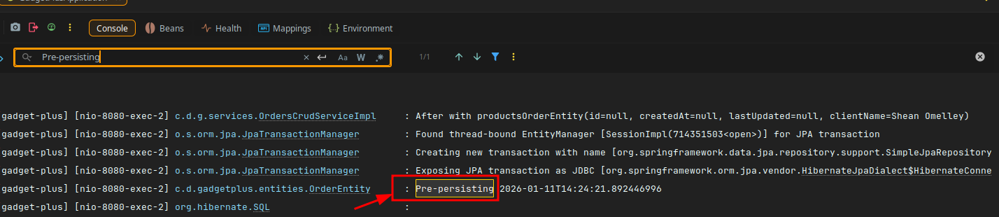
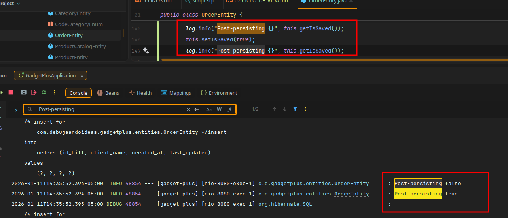
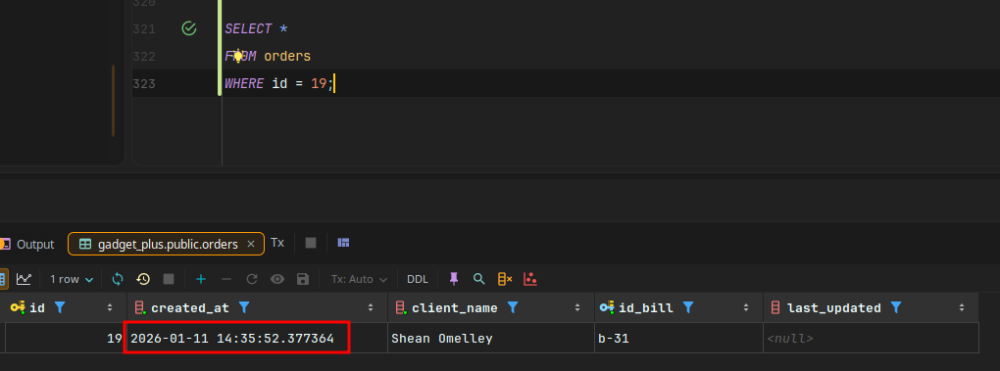
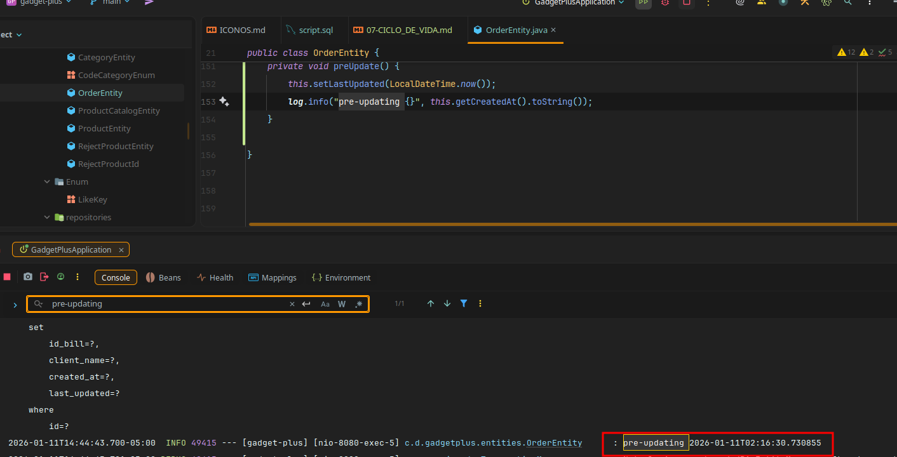
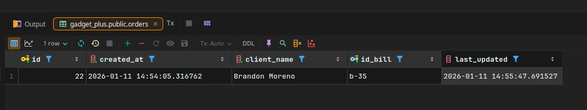

## ⃣📚**Clase 106:ACTUALIZANDO NUESTRA BD****

```sql

ALTER TABLE orders
    ADD COLUMN last_updated TIMESTAMP;
```
- Agregamos la columna `last_updated` a la tabla `orders` para registrar la fecha y hora de la última actualización de cada orden.
```java
    @Column(name = "last_updated", nullable = true)
    private LocalDateTime lastUpdated;
```
---

## ⃣📚**Clase 107:PREPERSIST ⏭️⏭️ ****

- Se hace un agregado ▶️ : en OrderEntity.java
- Ah y se le quita la validacion de creacion localdate no nulo ya que se va a setear automaticamente 
- con el prepersist.

```java
    @Column(name = "created_at", nullable = false)
    private LocalDateTime createdAt;

 // AGREGAMOS CICLO DE VIDAS SIEMPRE SON VOID
    @PrePersist
    private void prePersist() {
        this.setCreatedAt(LocalDateTime.now());
        log.info("Pre-persisting {}", this.getCreatedAt().toString());

    }
```



---
## ⃣📚**Clase 108:POSTPERSIST ⏭️⏭️ ****

- Es la misma logica que el prepersist pero de sentido inverso.
- Se ejecuta justo despues de que se persiste la entidad en la base de datos.
- Se utiliza para realizar acciones adicionales después de que una entidad ha sido guardada, 
- como enviar notificaciones o actualizar registros relacionados.

```java
 @PostPersist
    private void postPersist() {
        log.info("Post-persisting {}", this.getIsSaved());
        this.setIsSaved(true);
        log.info("Post-persisting {}", this.getIsSaved());
    }
```


- Se actualizo el campo isSaved a true despues de persistir la entidad.



## ⃣📚**Clase 109:PreUpdate⏭️⏭️ ****
- Podemos tener una fecha de cuando de creo y cuando se actualizo.
- Se ejecuta justo antes de que una entidad sea actualizada en la base de datos.
- Se utiliza para realizar acciones previas a la actualización, como validar datos o actualizar campos de
- auditoría.
- En este caso vamos a actualizar el campo lastUpdated con la fecha y hora actual cada vez que se actualice la entidad.

```java
  @PreUpdate
    private void preUpdate() {
        this.setLastUpdated(LocalDateTime.now());
        log.info("pre-updating {}", this.getCreatedAt().toString());
    }
```




## ⃣📚**Clase 110:PostUpdate⏭️⏭️ ****

- Se ejecuta justo después de que una entidad ha sido actualizada en la base de datos.
- Se utiliza para realizar acciones adicionales después de la actualización, como enviar notificaciones o
- actualizar registros relacionados.
- En este caso, simplemente vamos a registrar un mensaje en el log indicando que la entidad ha sido actualizada.

```java
    @PostUpdate
    private void postUpdate() {
        this.setLastUpdated(LocalDateTime.now());
        log.info("post-updating {}", this.getCreatedAt().toString());
    }
```